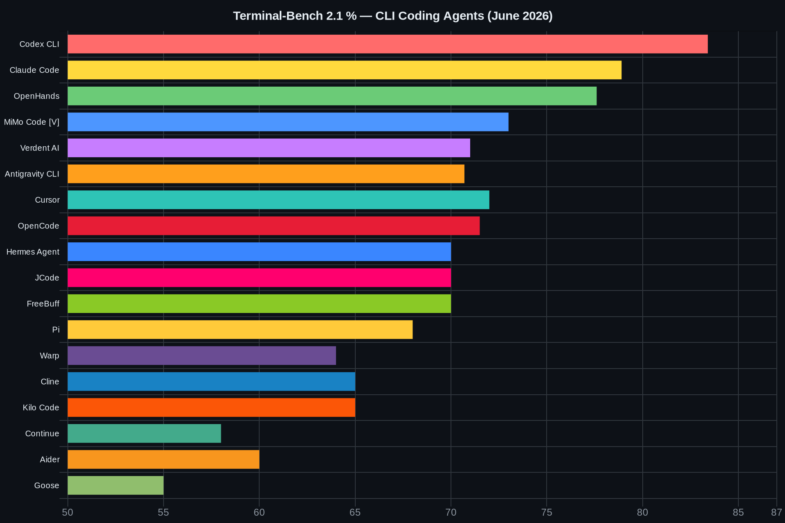
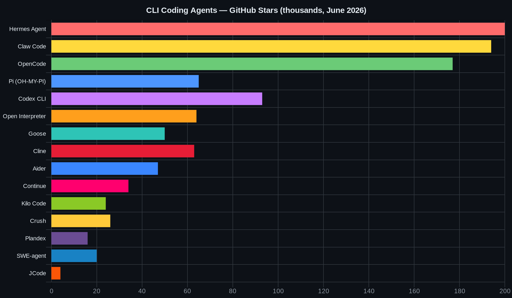
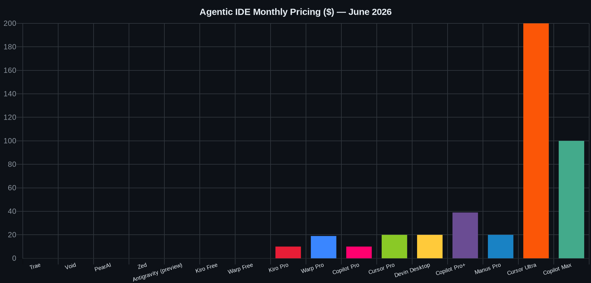

# Agentic Coding Tools — Full Reference (June 2026)

> TB 2.1 = Terminal-Bench 2.1 from tbench.ai. `[est]` = estimated from SWE-bench + community data.

---

## Terminal-Bench 2.1 Rankings



---

## GitHub Stars — Popularity



---

## Part 1 — CLI / Terminal Coding Agents

### Tier 1 — Top Performance

| Agent | By | TB 2.1 | License | Price | Model | BYOK | Stars |
|---|---|---|---|---|---|---|---|
| **Codex CLI** | OpenAI | **83.4%** | Apache 2.0 | ChatGPT Plus $20/mo or API PAYG | GPT-5.5 | Yes | 93K |
| **Claude Code** | Anthropic | **78.9%** | Proprietary | Pro $17 · Max 5x $100 · Max 20x $200 · API PAYG | Opus 4.8 | API only | — |
| **OpenHands** | All-Hands AI | **77.6%** | MIT | Free / cloud plans | Any (LiteLLM 100+ providers) | Yes | 78K |
| **MiMo Code** | Xiaomi | ~73% [V] | MIT | Free (bundled MiMo V2.5 Pro) | MiMo V2.5 Pro | Yes | 5.6K |
| **Verdent AI** | Verdent | ~71% [est] | Proprietary | Credit-based PAYG | Any (Quality/Speed modes) | Yes | — |
| **Antigravity CLI** | Google | ~70.7% | Proprietary | Free preview · Pro $19.99 · Ultra $99.99/mo | Gemini 3.1 Pro | Yes | — |

> **OpenHands** (formerly OpenDevin): 77.6% SWE-bench on open leaderboard — highest for any open-source agent. LiteLLM routes to 100+ providers. LLM-based risk assessment gates high-risk actions.
> **MiMo Code:** Fork of OpenCode. Free MiMo V2.5 Pro (1T param, 42B active). Data routes through Xiaomi/Chinese cloud.
> **Verdent AI:** 76.1% SWE-bench single-attempt production-level. Multi-agent parallel execution. VS Code extension + Verdent Deck standalone app. SEAlign ICSE 2026 Distinguished Paper.

---

### Tier 2 — Open Source Power

| Agent | By | TB 2.1 | License | Price | Stars |
|---|---|---|---|---|---|
| **Hermes Agent** | Nous Research | ~70% [est] | MIT | Free BYOK | 200K |
| **Claw Code** | Community | ~70% [est] | MIT | Free BYOK | 194K |
| **OpenCode** | anomalyco (sst) | ~71.5% [est] | MIT | Free BYOK · Go $10/mo | 177K |
| **Pi (OH-MY-PI)** | Community | ~68% [est] | MIT | Free BYOK | 65K |
| **Open Interpreter** | OpenInterpreter | ~62% [est] | MIT | Free BYOK | 64K |
| **Cline** | cline | ~65% [est] | Apache 2.0 | Free BYOK | 63K |
| **Goose** | Block / Linux Fdn | ~55% [est] | Apache 2.0 | Free BYOK | 50K |
| **Aider** | aider-AI | ~60% [est] | Apache 2.0 | Free BYOK | 47K |
| **Continue** | Continue.dev | ~58% [est] | Apache 2.0 | Free BYOK | 34K |
| **Crush** | Charmbracelet | ~60% [est] | MIT | Free BYOK | 26K |
| **Kilo Code** | kilo.ai | ~65% [est] | MIT | Free BYOK · Teams $15/user | 24K |
| **Qwen Code** | Alibaba | ~65% [est] | Apache 2.0 | Free BYOK | 25.4K |
| **Roo Code CLI** | RooCodeInc | ~62% [est] | MIT | Free BYOK | 24.3K |
| **Plandex** | Plandex | ~58% [est] | AGPL 3.0 | Free BYOK | 15.5K |
| **SWE-agent** | Princeton NLP | ~55% [est] | MIT | Free BYOK | 19.6K |
| **Trae Agent** | ByteDance | ~60% [est] | MIT | Free BYOK | 11.7K |
| **Kimi CLI** | Moonshot AI | ~65% [est] | Apache 2.0 | Free BYOK | 9K |
| **Free Code** | Community | ~70% [est] | MIT | Free BYOK | 8.5K |
| **Claurst** | Community | ~68% [est] | MIT | Free BYOK | 9.8K |
| **gptme** | gptme | ~55% [est] | MIT | Free BYOK | 4.3K |
| **JCode** | 1jehuang / cnjack | ~70% [est] | MIT | Free BYOK | ~4K |
| **Mistral Vibe** | Mistral AI | ~58% [est] | Apache 2.0 | Free BYOK | 4.6K |
| **Nanocoder** | Nano Collective | ~55% [est] | MIT | Free BYOK | 2.1K |
| **Letta Code** | Letta AI | ~55% [est] | MIT | Free BYOK | 2.8K |

---

### Tier 2.5 — Emerging (under 5K stars, worth watching)

| Agent | By | Lang | License | What | Stars |
|---|---|---|---|---|---|
| **Nanocoder** | Nano Collective | TS | MIT | Local-first (Ollama/LM Studio/llama.cpp/MLX), cloud opt-in | ~2K |
| **claw-code-agent** | Community | Python | MIT | Pure-Python Claude Code rewrite, zero deps (from Mar-2026 leak) | ~517 |
| **g3** | Community | Rust | MIT | Tool-running, repo interaction, skills, provider abstraction | ~515 |
| **Coro Code** | Community | — | OSS | Free Claude Code alternative — generate/debug/manage | ~363 |
| **Mini-Kode** | Community | — | MIT | Educational, readable reference implementation | ~304 |
| **zot** | Community | — | OSS | Zero-overhead harness — TUI/JSON/RPC, diffs, skills, guardrails | ~271 |

> ⚠️ **Popularity is volatile in 2026** — before adopting, check the license AND last-commit date. Recent churn: Gemini CLI **retired** (Jun 18), Roo Code **archived itself**, Goose handed to Linux Foundation, OpenCode (165K★) feuded with Anthropic over subscription login.

### Proxy / Router Tools (free + cheaper model access in your existing agent)

| Tool | What it does | Stars |
|---|---|---|
| **[CLIProxyAPI](https://github.com/router-for-me/CLIProxyAPI)** | Claude Code / Codex / Gemini / Grok OAuth → OpenAI-compatible API | 38.5K |
| **[9router](https://github.com/decolua/9router)** | Route Claude Code/Codex/Cursor/Cline/Copilot/Antigravity to free Claude/GPT/Gemini via 40+ providers; taps Kiro/OpenCode-Free/Vertex; auto-fallback | rising |
| **[cc-compatible-models](https://github.com/Alorse/cc-compatible-models)** | Configs + pricing to run Qwen/DeepSeek/MiniMax/Kimi/GLM/MiMo/StepFun in Claude Code | — |
| **[jodavan/claude-code-proxy](https://github.com/jodavan/claude-code-proxy)** | Route each tier to a different provider (GLM for Haiku/Opus), keep Sonnet on your sub — dodges weekly limits | — |
| **[free-claude-code](https://github.com/Rishurajgautam24/free-claude-code)** | Local FastAPI proxy → NIM/OpenRouter/DeepSeek/Ollama/LM Studio; saves quota on trivial requests | — |

> ⚠️ Reverse-engineered — may violate ToS / risk bans. Genuine "free" = routing to other providers' free tiers, not bypassing the Opus paywall. Avoid "keygen/activator" repos (malware). Full detail → [CREDITS.md](./CREDITS.md) Part 4.

---

### Notable Agent Deep Dives

#### Hermes Agent (Nous Research) — 200K stars
Self-improving agent with a closed learning loop. Creates skills from experience, improves them during use, builds a persistent user model across sessions.

- **300+ model support** — any provider via unified interface
- **Automated skill creation** — agent writes its own skills when it encounters new patterns
- **Persistent memory** — user model deepens over time
- **Sandboxed execution** — Unix socket RPC for safe code runs
- **Multi-platform** — Telegram, Slack, Discord, WhatsApp integrations
- **Status:** Fastest-growing agent after Claude Code and Claw Code

#### Claw Code — 194K stars
Clean-room Python/Rust rewrite of Claude Code architecture. Born from the March 2026 Claude Code source leak (oh-my-codex). Fastest repo in GitHub history to 100K stars.

- Drop-in replacement for Claude Code — same UX, any model
- Supports all BYOK providers including local Ollama
- Apache 2.0 → MIT licensed

#### Pi (OH-MY-PI) — 65K stars
By the authors of Flask and Jinja2. Most minimal harness available.

- **System prompt under 1,000 tokens** (vs 7,000–10,000 for most agents)
- **Lazy skills** — only the one-line description lives in context; full instructions load only when invoked
- TypeScript/Rust monorepo, local-first design
- Works with any provider via `pi-builder` wrapper

#### JCode — ~4K stars (fast-rising)
Rust-native. Purpose-built for remote servers over SSH.

| Metric | JCode | Copilot CLI | Cursor Agent | Claude Code |
|---|---|---|---|---|
| Boot time | **14ms** | 1,500ms | 1,900ms | 3,400ms |
| RAM (session) | **27.8MB** | — | — | 386.6MB |
| SSH support | **Yes** | No | No | No |
| Subagent nesting | **3 levels** | — | — | — |

#### Warp
AI-native terminal — not an agent, but agents run inside it. Open-sourced May 28, 2026.

- **Agent Mode** — natural language → shell commands
- **Active AI** — contextual suggestions from shell history, exit codes, recent I/O
- **MCP support** — connect to Linear, Sentry, Postgres, internal docs
- **Cloud Agents (Oz)** — containerized background agents on webhook/schedule
- **Multi-agent hub** — run Claude Code, Codex CLI, Antigravity CLI inside Warp as managed subagents
- **Pricing:** Free · Pro $19/mo · Team $35/mo

---

### Tier 3 — Platform / Enterprise

| Agent | By | TB 2.1 | Price | BYOK |
|---|---|---|---|---|
| **Cursor** | Cursor | ~72% [est] | Free hobby · Pro $20 · Ultra $200/mo | Yes |
| **FreeBuff** | Codebuff / YC | ~70% [est] | Free ad-supported (5hr/day on V4 Flash) | Partial |
| **GitHub Copilot** | Microsoft | ~65% [est] | Free 2K · Pro $10 · Pro+ $39 · Max $100/mo | Partial |
| **Kiro** | AWS | N/A | Free 50cr · Pro $10 · Pro+ $20/mo | Yes |
| **Qwen Code** | Alibaba | N/A | Free BYOK | Yes |
| **Amp** | Sourcegraph | ~68% [est] | Free (no token caps) | Yes |
| **Zencoder** | Zencoder | ~66% [est] | Free tier · Pro $19/mo | Yes |
| **Augment Code** | Augment | ~70% [est] | Pro $50 · Max $200/mo | No |
| **Sweep AI** | Sweep | ~60% [est] | Free OSS · Pro $19/mo | Yes |

**Amp (Sourcegraph)** — zero token caps, broadest codebase indexing engine. Best for mono-repos. CLI + VS Code. Free.

**Zencoder** — Repo-Grokking: analyzes full project structural patterns before generating. Self-improving agentic pipeline. JetBrains + VS Code, 40K+ installs.

**Augment Code** — enterprise-grade Context Engine. Indexes full codebase once, instant queries after. Max tier ($200/mo) rivals Cursor Ultra on large codebases.

**Sweep AI** — turns GitHub issues directly into PRs. AI generates, tests, and self-reviews. JetBrains-first (4.9 stars, 40K installs). Best for automated issue → PR workflow.

> **Gemini CLI RETIRING** — migrate to Antigravity CLI before June 18, 2026.

---

## Part 2 — Agentic IDEs



| IDE | By | Price | Agent Features | Privacy | Notes |
|---|---|---|---|---|---|
| **Cursor** | Cursor | Free · Pro $20 · Ultra $200/mo | 8 parallel agents, BugBot, Background Agents, Design Mode, multi-repo | Encrypted | Cursor 3 "Glass" rebuild Apr 2. $100M+ ARR |
| **Kiro** | AWS | Free 50cr · Pro $10 · Pro+ $20/mo | Spec-driven (requirements→code), Hooks | AWS-hosted | "AI IDE for adults." May 7 launch |
| **Warp** | Warp | Free · Pro $19 · Team $35/mo | Agent Mode, MCP, Cloud Agents (Oz), multi-agent hub | Open-source | Open-source May 28 |
| **Devin Desktop** | Cognition | $20/mo + $2.25/ACU | Devin Local from Jul 1 | Cloud | Formerly Windsurf, rebranded Jun 2 |
| **GitHub Copilot** | Microsoft | Free · Pro $10 · Pro+ $39 · Max $100/mo | Workspace, Coding Agent, BugBot, multi-provider | Microsoft | Usage-based credits since Jun 1 |
| **Antigravity** | Google | Free · Pro $19.99 · Ultra $99.99/mo | Parallel subagents, browser-use | Google | Replaces Gemini CLI |
| **Trae** | ByteDance | Free · Lite $3 · Pro $10 · Ultra $100/mo | SOLO mode, MCP | **5-yr retention, no opt-out** | VS Code fork |
| **Void** | Void | Free | Agent Mode (multi-file, terminal) | **No telemetry, fully local** | Open-source VS Code fork |
| **PearAI** | PearAI | Free BYOK | Full agentic, Continue-based | BYOK = local keys | Open-source VS Code fork |
| **Zed** | Zed Industries | Free | ACP — run any agent natively | Open-source | Open agent ecosystem |
| **Claude Code** | Anthropic | Pro $17 · Max 5x $100 · Max 20x $200 | Terminal + VS Code, MCP, parallel subagents | Anthropic cloud | Best MCP + tool-use |
| **AionUI** | AionUI OSS | Free (Apache 2.0) | Unified desktop dashboard for 20+ CLI agents, built-in agent, Cron scheduler, office editing | 100% local SQLite | 28K+ stars. GUI wrapper for terminal agents |
| **Eigent** | Eigent AI | Free (OSS) · Pro $? | Multi-agent workforce (Browser/Terminal/Document/Multimodal), CAMEL-based, scheduled tasks | Local-first | 14.4K stars. "Open Source Cowork Desktop" |

### Desktop Cowork Platforms — Deep Dive

These aren't IDEs — they're GUI desktops that orchestrate multiple AI agents in parallel, manage context, and run scheduled automations. Think of them as the "operating system layer" above CLI agents.

---

#### AionUI

> *"The best free alternative to proprietary enterprise cowork platforms"*

**GitHub:** github.com/iOfficeAI/AionUi · **Stars:** 28K+ · **License:** Apache 2.0 · **Stack:** Electron + React

**What it does:**
- Auto-detects and integrates 20+ installed CLI tools (Claude Code, OpenCode, Codex, Gemini CLI, Aider, etc.) into one dashboard
- Built-in 24/7 agent — connects to any API (OpenAI, Anthropic, Gemini, Qwen) or runs fully offline via Ollama
- Shared MCP config — configure MCP servers once, all integrated agents inherit them instantly

**Killer features:**
| Feature | Detail |
|---|---|
| Cron Automation | Natural language → cron expression. "Scrape this site every morning at 9 AM" runs unattended |
| Rich File Preview | 30+ coding languages, PDF, HTML, images rendered inline — never leave the app |
| Office Native Editing | Generate/modify `.docx`, `.xlsx`, `.pptx` natively via OfficeCLI engine (incl. PowerPoint Morph transitions) |
| Remote WebUI | Control your desktop agents from phone via local WebUI server. Push notifications to Telegram/Lark/DingTalk |
| Local SQLite | All context stored locally. No cloud upload. Privacy-first. |

**Install:**
```bash
# macOS (Homebrew)
brew install aionui

# Or download binary from GitHub Releases (.dmg / .exe / Linux AppImage)
# https://github.com/iOfficeAI/AionUi/releases
```

**Common issues:**
- CLI tools not detected → paste global npm/python bin path in Settings > Environment PATH
- Cron tasks fail overnight → disable OS sleep mode for 24/7 operation
- WebUI unreachable from phone → allow inbound connections in OS firewall, ensure same Wi-Fi

---

#### Eigent

> *"Your AI Workforce, Ready to Work"*

**GitHub:** github.com/eigent-ai/eigent · **Stars:** 14.4K · **License:** Open-source

**What it does:**
- Multi-agent workforce — spawn specialized agents that communicate and collaborate:
  - **Browser Agent** — web search, research, scraping
  - **Terminal Agent** — shell commands, code execution
  - **Multi-modal Agent** — process images, PDFs, charts
  - **Document Agent** — write and edit files
- Single Agent mode for focused tasks; Workforce mode for complex multi-step work
- Scheduled triggers — recurring workflows with execution logs and success rate tracking
- Agent Folder — all generated files (`.csv`, `.md`, `.html`, `.png`) surfaced in one panel

**Use cases from their demos:**
- Deep-dive research on 26 AI infrastructure companies → structured JSON + HTML report
- Build 10 HTML5 games from a single prompt
- Automate Salesforce deal updates via browser agent
- Turn Excel sales data into an analytics HTML report via Kimi K2.5

**Model support:** GLM-5.1/5.2, Gemini 3.1 Pro, Kimi K2.5, MiniMax M2, OpenAI, Anthropic, local models

---

## Part 3 — Chat / Web Autonomous Agents

| Agent | By | Type | Price | Capability |
|---|---|---|---|---|
| **OpenClaw** | OpenClaw Foundation | Self-hosted personal agent | Free (MIT, BYO LLM key) | **380K+ stars — most-starred self-hosted agent.** Long-running Node service routing 23+ chat channels (WhatsApp/Telegram/Discord/Signal/Slack) to an agent that reads files, runs commands, persists memory. ClawHub skill registry. Founder Peter Steinberger joined OpenAI; foundation now stewards it. ⚠️ Broad system access + untrusted 3rd-party skills = real RCE/malware risk |
| **Manus AI** | Manus (ex-Monica.im) | Autonomous VM agent | Free 300cr/day · Pro $20 · Extended $200/mo | Sandboxed VM. Web browse, code, files, slides. 20 concurrent tasks on Pro |
| **Genspark** | Genspark | All-in-one "Super Agent" | Free ~100–200cr/day (no card) · Plus $24.99 ($19.99/yr, 10K cr) · Pro $249.99 (125K cr) | Orchestrates many frontier models + 80+ tools. AI Slides/Sheets, image+video gen, AI Developer, real phone calls. Chat+image = 0 credits on paid through Dec 31 2026 |
| **Devin** | Cognition | Autonomous SWE | $20/mo + $2.25/ACU | Full tickets end-to-end, PR creation |
| **Relevance AI** | Relevance AI | Enterprise multi-agent | Free 100cr/day · Pro $19/mo · Business custom | 9,000+ integrations, multi-agent teams, production workflows |
| **OpenHands** | All-Hands AI | DevOps agent | Free (cloud plans available) | 77.6% SWE-bench, bash+code+push PRs, 78K stars |
| **SWE-agent** | Princeton NLP | Bug fixing agent | Open-source | Research-grade, SWE-bench optimized, 20K stars |
| **GitHub Copilot Workspace** | Microsoft | PR automation | Included in Copilot | Issue → branch → PR in web UI |
| **Vercel v0** | Vercel | UI generation + deploy | Free · Pro $20/mo | React/Next.js from text, auto-deploys |
| **Bolt.new** | StackBlitz | Full-stack + deploy | Free · Pro $20/mo | In-browser app builder, GitHub push |
| **Lovable** | Lovable | Product builder | Free · Pro $25/mo | React + Supabase, GitHub push |
| **Replit Agent** | Replit | Full-stack + deploy | Core $25/mo | Deploys to Replit infra |
| **Cursor Background Agents** | Cursor | Async parallel | Included in Pro/Ultra | Runs while you work |

---

## Part 4 — AI Chat Interfaces

| Interface | By | Best Model | Free | Price | Standout Feature |
|---|---|---|---|---|---|
| **Claude.ai** | Anthropic | Opus 4.8 / Sonnet 4.6 | Yes (daily cap) | Pro $17/mo | Best reasoning, Artifacts, Projects |
| **ChatGPT** | OpenAI | GPT-5.5 / o3 | Yes | Plus $20/mo | Canvas, code exec, image gen, deep research |
| **Gemini** | Google | Gemini 3.1 Pro | Yes | AI Pro $19.99/mo | Deep Research, Google Workspace |
| **chat.z.ai** | Z.AI / Zhipu | GLM-5.2 (1M ctx) | Yes (generous) | Coding $3/mo | Free. GLM-5.2 MIT open-weight. Developer API free |
| **Grok** | xAI | Grok 4.3 | Yes (on X) | SuperGrok $30/mo | Deep Search, X integration, image gen |
| **Perplexity** | Perplexity | Multiple | Yes | Pro $20/mo | Best for research + citations |
| **aider.chat** | aider-AI | Claude / GPT / local | N/A | Free (BYOK API) | Web frontend for Aider CLI — same BYOK model |
| **Kimi** | Moonshot | Kimi K2.6 | Yes (trial) | Pro $20/mo | 80.2% SWE-bench, 262K ctx, 4000+ tool calls |
| **Mistral Le Chat** | Mistral | Mistral Medium 3.5 | Yes | Pro $14.99/mo | EU-hosted, GDPR, Canvas mode |
| **Manus AI** | Manus | Internal + frontier | Yes (300cr/day) | Pro $20/mo | Autonomous agent, not just chat |

---

## Part 5 — Infrastructure / Orchestration

| Tool | Type | Purpose |
|---|---|---|
| **pi-builder** | Wrapper | Wraps any installed CLI agent (Claude Code, Codex, OpenCode, Aider, Goose, Plandex, SWE-agent, Crush) behind single interface with capability routing, health caching, fallback chains, SQLite |
| **LiteLLM** | Router | OpenAI-compatible proxy for 100+ providers. Used internally by OpenHands |
| **OpenRouter** | Router | 200+ models via single API key. `:free` suffix for free models |
| **MCP** | Protocol | Model Context Protocol — standard for agent↔tool integration. 72,500+ servers (cross-registry, Jun 2026) |
| **A2A (Agent2Agent)** | Protocol | Google's open spec for agent↔agent interop — the companion to MCP (tool access). Native in Google ADK, OpenAgents, VoltAgent |
| **ACP (Zed)** | Protocol | Agent Client Protocol — run any agent natively in Zed editor |
| **CLIProxyAPI** | Proxy | Wraps Claude Code / Codex / Antigravity / Grok Build OAuth sessions → OpenAI-compatible API. Multi-account round-robin load balancing. 38.5K stars. [github.com/router-for-me/CLIProxyAPI](https://github.com/router-for-me/CLIProxyAPI) |

---

## Part 5A — MCP (Model Context Protocol) — Full Reference

> MCP is the USB-C of AI agents — one standard that connects any AI to any tool.

**Origin:** Anthropic, November 2024. Adopted by OpenAI and Google DeepMind early 2025. Donated to Linux Foundation's Agentic AI Foundation December 2025.

**Scale (June 2026):** A cross-registry aggregator counts **72,500+ servers** across the Official Registry, Glama, Smithery, mcp.so and PulseMCP. Glama alone tracks ~37K (split into Official / Claimed / crawled tiers).

**Composite leaderboard (by GitHub stars):** Browser Use (#1, ~100K★) · n8n (~193K★) · Context7/upstash (~58K★ — the only server listed on *every* registry) · GitHub MCP (~28K★, 51 tools) · Toolbox for Databases (googleapis).

> ⚠️ **Vetting matters — registry inclusion ≠ safe.** A scan of 8,000+ public servers found 36.7% with SSRF holes, 43% with unsafe command execution, and 41% in the official registry with **zero auth**. Sandbox and review any community server before giving it production credentials.

### How MCP Works

```
AI Agent (Claude, GPT, Gemini, Cursor, etc.)
        │
        │  MCP Protocol (JSON-RPC 2.0 over stdio/SSE/HTTP)
        ▼
   MCP Server (GitHub / Supabase / Linear / Slack / ...)
        │
        ▼
   External Service / Data Source / Tool
```

Each MCP server exposes **Tools** (callable actions), **Resources** (readable data), and **Prompts** (templates). The agent decides when to call them.

### MCP Clients (What Supports MCP)

| Client | Type | MCP Support |
|---|---|---|
| **Claude Desktop** | Desktop app | Native, full |
| **Claude Code** | CLI agent | Native, full — best MCP integration |
| **Cursor** | IDE | Full MCP support |
| **Windsurf / Devin Desktop** | IDE | Full |
| **VS Code + Copilot** | IDE | Full (2025) |
| **Cline** | VS Code extension | Full |
| **Continue.dev** | VS Code / JetBrains | Full |
| **Zed** | Editor | Via ACP (MCP-compatible) |
| **Warp** | Terminal | Full MCP support |
| **OpenCode** | CLI | Full |

### Best MCP Servers by Category

#### Developer Tools
| Server | Stars | What It Does |
|---|---|---|
| **GitHub MCP** | 20K+ | Most-installed ever. Issues, PRs, code search, repo management from chat |
| **GitLab MCP** | 5K+ | Same for GitLab — MRs, pipelines, issues |
| **Sentry MCP** | 4K+ | Query errors, stack traces, releases from agent |
| **Linear MCP** | 6K+ | Issues, sprints, projects — no more context-switching |
| **Jira MCP** | 4K+ | Atlassian Jira issues and project management |
| **Vercel MCP** | 3K+ | Deployments, domains, env vars |

#### Data & Databases
| Server | Stars | What It Does |
|---|---|---|
| **Supabase MCP** | 8K+ | Postgres queries, auth, storage, edge functions from agent |
| **Neon MCP** | 3K+ | Serverless Postgres, branch creation, query execution |
| **PostgreSQL MCP** | 5K+ | Direct Postgres schema inspection and queries |
| **SQLite MCP** | 4K+ | Local SQLite interaction |
| **Chroma MCP** | 4K+ | Vector DB — semantic document search from agent |

#### Search & Research
| Server | Stars | What It Does |
|---|---|---|
| **Brave Search MCP** | 6K+ | Web search without hitting rate limits |
| **Exa MCP** | 5K+ | Semantic web search — best for research agents |
| **Firecrawl MCP** | 5K+ | Web scraping + structured extraction |
| **Tavily MCP** | 4K+ | Research-optimized search with citations |
| **Fetch MCP** | 8K+ | Read any URL as clean markdown |

#### Productivity & Comms
| Server | Stars | What It Does |
|---|---|---|
| **Slack MCP** | 7K+ | Read/send messages, manage channels, search history |
| **Notion MCP** | 6K+ | Read/write Notion pages and databases |
| **Google Drive MCP** | 4K+ | List, read, upload files |
| **Gmail MCP** | 3K+ | Read, send, search emails |
| **HubSpot MCP** | 3K+ | CRM contacts, deals, notes |

#### Browser & UI
| Server | Stars | What It Does |
|---|---|---|
| **Playwright MCP** | 20K+ | Microsoft-built. Full browser control — navigate, click, screenshot |
| **Puppeteer MCP** | 5K+ | Chrome automation from agent |
| **BrowserBase MCP** | 4K+ | Cloud browser sessions — no local Chromium needed |
| **Stagehand MCP** | 3K+ | Natural-language browser control |

#### Infrastructure
| Server | Stars | What It Does |
|---|---|---|
| **Cloudflare MCP** | 5K+ | DNS, Workers, R2, KV, Pages management |
| **AWS MCP** | 5K+ | EC2, S3, Lambda, CloudWatch from agent |
| **Docker MCP** | 4K+ | Container management — build, run, inspect |
| **Kubernetes MCP** | 3K+ | Pod management, deployments, logs |

**Creative / Design**

| Server | Stars/Scale | What It Does |
|---|---|---|
| **Anthropic Creative Connectors** | 9 official | Claude for Creative Work (Apr 28 2026) — Blender, Adobe CC (50+ tools), Ableton, Autodesk Fusion, SketchUp, Affinity, Resolume, Splice. MCP-based → work in any MCP client, free on all plans |
| **Figma Dev Mode MCP** | official | Figma's own Dev Mode server — pull design context (frames, variables, components) straight into the IDE/agent |
| **Docker Hub MCP** | official | Docker's MCP catalog — discover/run containerized MCP servers in a sandbox |

### MCP Apps (January 26, 2026)

Anthropic launched **MCP Apps** — MCP servers can now render interactive UIs directly inside Claude's chat window. Not just text responses — actual interactive interfaces.

Launch partners: Amplitude, Asana, Box, Canva, Clay, Figma, Hex, Monday.com, Slack, Salesforce.

Example: Ask Claude "show my Linear sprint" → a Kanban board renders inline in the chat.

### Remote MCP (2026 Growth)

Remote MCP runs as hosted endpoints — no local server needed, connect via URL + auth token.

| Provider | Remote MCP URL | Auth |
|---|---|---|
| Vercel | mcp.vercel.com | OAuth |
| Neon | mcp.neon.tech | API key |
| HubSpot | mcp.hubspot.com | OAuth |
| Atlassian | mcp.atlassian.com | OAuth |
| Linear | mcp.linear.app | API key |
| Sentry | mcp.sentry.io | API key |
| Cloudflare | 13 hosted servers (~2,500 API endpoints) | OAuth |

Remote MCP grew from 16 servers (Jan 2026) → 25+ (Apr 2026). All major dev platforms now have remote endpoints. **Cloudflare** ships the widest first-party set — 13 remote servers spanning ~2,500 API endpoints (Workers, R2, KV, DNS, Radar, etc.).

### Build Your Own MCP Server

```python
# Python MCP server — minimal example
from mcp.server import Server
from mcp.server.stdio import stdio_server
from mcp import types

app = Server("my-server")

@app.list_tools()
async def list_tools():
    return [types.Tool(
        name="get_data",
        description="Fetch data from my service",
        inputSchema={"type": "object", "properties": {
            "query": {"type": "string"}
        }}
    )]

@app.call_tool()
async def call_tool(name: str, arguments: dict):
    if name == "get_data":
        return [types.TextContent(type="text", text=f"Result for: {arguments['query']}")]

async def main():
    async with stdio_server() as (read, write):
        await app.run(read, write, app.create_initialization_options())
```

```bash
# Install MCP server in Claude Desktop
# Add to ~/Library/Application Support/Claude/claude_desktop_config.json:
{
  "mcpServers": {
    "github": {
      "command": "npx",
      "args": ["-y", "@modelcontextprotocol/server-github"],
      "env": { "GITHUB_TOKEN": "ghp_..." }
    },
    "supabase": {
      "command": "npx",
      "args": ["-y", "@supabase/mcp-server-supabase"],
      "env": { "SUPABASE_URL": "...", "SUPABASE_KEY": "..." }
    }
  }
}
```

### MCP Discovery

| Resource | URL | Count (Jun 2026) | Best for |
|---|---|---|---|
| Official registry | registry.modelcontextprotocol.io | canonical feed | Programmatic discovery; publish here first |
| Glama catalog | glama.ai/mcp/servers | ~37K | Max coverage + verification tiers |
| mcp.so | mcp.so | ~19.7K | Community/experimental servers |
| Smithery | smithery.ai | ~7K | Clean app-store UX, 1-click + hosted remote |
| PulseMCP | pulsemcp.com | ~18K (hand-reviewed) | Quality-filtered discovery |
| Awesome MCP | github.com/punkpeye/awesome-mcp-servers | — | Curated list |
| MCP Bundles | mcpbundles.com | — | Grouped server packs |

---

## BYOK Setup

Best free combo: **OpenCode + Qwen3-Coder 480B on OpenRouter `:free`** = 78% quality, $0

```bash
OPENROUTER_API_KEY=sk-or-... opencode --model qwen/qwen3-coder-480b:free
```

Best paid combo: **Aider + DeepSeek V4 Pro** = 80.6% quality, $0.87/M out

```bash
OPENAI_BASE_URL=https://openrouter.ai/api/v1 \
OPENAI_API_KEY=sk-or-... \
aider --model openai/deepseek/deepseek-v4-pro
```

SSH remote with JCode:

```bash
ANTHROPIC_API_KEY=sk-ant-... jcode --host user@remote.server
```

---

## Deprecated / Retiring

| Tool | Status | Replace With |
|---|---|---|
| Gemini CLI | Retired June 18 | Antigravity CLI |
| Windsurf | Rebranded June 2 | Devin Desktop |
| Cascade engine | EOL July 1 | Devin Local |
| Amazon Q Developer | Replaced May 2026 | Kiro |

---

## Part 6 — AI Website Builders

AI website builders split into three lanes in 2026: **design-first** (Framer, Webflow), **all-in-one business** (Wix AI, Hostinger, Durable), and **code-first full-stack** (Lovable, Bolt.new, V0, Base44).

### Code-First / Full-Stack Builders

| Tool | URL | Stack Output | Deploys To | Free Tier | Monthly |
|---|---|---|---|---|---|
| **Lovable** | lovable.dev | React + Supabase auth + DB | Lovable CDN / GitHub | 5 projects | $20+ |
| **Bolt.new** | bolt.new | React/Vue/Svelte/Next.js | Netlify / StackBlitz | Limited tokens | $20+ |
| **V0** | v0.dev | React + shadcn/ui + Tailwind | Vercel 1-click | 200 credits/mo | $20+ |
| **Base44** | base44.com | Full-stack (Wix-owned) | Built-in hosting | Yes | $16+ |
| **Create.xyz** | create.xyz | React web apps | Built-in | Yes | $15+ |
| **Replit Agent** | replit.com | Any stack | Replit hosting | Yes | $25+ |

**Lovable** is the most complete for entrepreneurs — generates exportable React code with Supabase auth and DB from a single prompt. Can push to GitHub.

**V0** is the developer pick — produces production-quality React + shadcn/ui components, one-click Vercel deploy. Best for frontend acceleration.

**Base44** (acquired by Wix 2025) — includes built-in database, auth, and hosting. No external services needed. Best all-in-one for internal tools.

### Design-First Builders

| Tool | URL | Best For | Export Code | CMS | Monthly |
|---|---|---|---|---|---|
| **Framer** | framer.com | Marketing sites, SaaS landing pages | No (platform-locked) | Basic | $15+ |
| **Webflow** | webflow.com | Content-heavy, editorial, CMS | Yes (clean HTML/CSS) | Best-in-class | $18+ |
| **Draftly.space** | draftly.space | Cinematic 3D scroll-driven sites | Yes (ZIP + GitHub) | No | Early access |
| **Readdy** | readdy.ai | Quick no-code sites | Partial | No | Free |

**Draftly.space** — 3D cinematic website builder. Full pipeline: pick a preset → describe visual atmosphere → AI generates a cinematic keyframe → converts to 8-second video → extracts 400 frames → builds scroll-reactive parallax site → outputs ZIP (HTML/CSS/JS + Express backend starter). No WebGL, no Three.js — pure native browser scroll with frame interpolation. Works on every device and browser.

Key features:
- **Multi-Video Continuation** — chain multiple videos end-to-end for longer scroll animations
- **Iterative Chat Editing** — change copy, colors, sections via chat without rebuilding
- **Product Injection** — upload product photos, tell AI where to place them in 3D
- **Adjustable FPS** — 10–40 FPS slider controls frame density and scroll speed
- **Preset Gallery** — production-ready presets: Mindloop (newsletter), Power AI (dark hero), Halo (fintech), Targo (logistics), and more

Built in India. Beta. Export: ZIP download with full frontend + Express API backend starter.

**Framer** — pre-Series-A standard for SaaS landing pages. Smooth animations, modern typography, responsive. AI layout generation built in.

### All-in-One / Business Builders

| Tool | URL | Best For | AI Features |
|---|---|---|---|
| **Wix AI** | wix.com | Beginners, small business | AI site generator, ADI |
| **Squarespace AI** | squarespace.com | Portfolios, e-commerce | AI text + layout |
| **Hostinger** | hostinger.com/website-builder | Budget, fast deployment | AI site creator |
| **Durable** | durable.co | Micro-businesses, 30-second sites | Full AI generation |
| **Webstudio** | webstudio.is | Webflow open-source alternative | Visual builder |

### Choosing a Builder

| Use Case | Best Tool |
|---|---|
| SaaS landing page, polished | Framer |
| Full-stack web app + auth + DB | Lovable |
| React components, developer workflow | V0 |
| Max framework flexibility | Bolt.new |
| Content-heavy, SEO-critical | Webflow |
| 3D / cinematic / portfolio | Draftly.space |
| Budget + fast | Hostinger / Durable |
| Internal tools, no-code | Base44 |

> SEO caveat: Most code-first AI builders generate SPAs that are hard for Google to crawl. For SEO-critical sites use Webflow or server-render via Next.js.

---

## Part 7 — Deployment Platforms

Deployment platforms that expose REST APIs for automation — connect via API key, CI/CD pipelines, or CLI.

### Managed PaaS (Hosted)

| Platform | URL | API | Free Tier | Best For | Pricing |
|---|---|---|---|---|---|
| **Vercel** | vercel.com | REST + CLI | Yes (hobby) | Next.js, frontend, edge functions | $20/mo pro |
| **Railway** | railway.app | REST + CLI | $5 credit/mo | Full-stack apps, fastest DX | Usage-based |
| **Render** | render.com | REST API | Yes (750hr/mo) | Reliable backend, auto-scaling | $7/mo+ |
| **Fly.io** | fly.io | `flyctl` CLI + API | No (removed 2024) | Global edge, multi-region | Usage-based |
| **Netlify** | netlify.com | REST API | Yes | Static + Jamstack, serverless fns | $19/mo pro |
| **Heroku** | heroku.com | REST API | No | Legacy, established ecosystem | $5/mo+ |
| **Deno Deploy** | deno.com/deploy | GitHub push | Yes | Deno / TypeScript edge | $10/mo+ |
| **Cloudflare Pages** | pages.cloudflare.com | Wrangler CLI + API | Yes (unlimited) | Static + Workers, global CDN | Free / $5+ |

**Railway** — best developer experience. Code to production in under 60 seconds, no infra thinking. New default for greenfield projects.

**Vercel** — unmatched for Next.js: Edge Functions, ISR, on-demand revalidation, image optimization, Edge Config. One-click deploy from GitHub.

**Fly.io** — best for global multi-region apps needing low latency everywhere. Firecracker VMs, deep networking control. Removed free tier in 2024.

**Render** — the "boring reliable one." Auto-scales, managed PostgreSQL, Redis, background workers. Good for teams that want zero infra ops.

### Self-Hosted PaaS (Run on Your VPS)

| Platform | URL | Stars | API Support | Best For |
|---|---|---|---|---|
| **Coolify** | coolify.io | 40K+ | REST API (full) | Modern Heroku replacement, 280+ services |
| **Dokku** | dokku.com | 29K+ | CLI + plugin API | Minimal, git-push deploy, battle-tested |
| **CapRover** | caprover.com | 14K+ | Experimental REST | Docker Swarm, one-click app store |
| **Dokploy** | dokploy.com | 12K+ | REST API | Docker Compose + Swarm, newer/faster |
| **Kamal** | kamal-deploy.org | 13K+ | SSH-based | Rails-native, Docker deploy via SSH |

**Coolify** — most recommended for 2026. Beautiful UI, REST API with Bearer token auth (root/write/deploy/read permission levels), supports databases, queues, monitoring, AI/vector DB tools. Deploy anything on a $6/mo VPS.

**Dokku** — Unix-first, CLI-driven. Heroku buildpack compatible. Minimal resource overhead. Ideal if you want git-push deploys without a UI.

### Database / Backend-as-a-Service

| Platform | URL | API Key | Type | Free Tier |
|---|---|---|---|---|
| **Supabase** | supabase.com | Yes | Postgres + auth + storage + realtime | Yes (2 projects) |
| **Neon** | neon.tech | Yes | Serverless Postgres, branching | Yes |
| **PlanetScale** | planetscale.com | Yes | MySQL (Vitess), serverless | Yes |
| **Turso** | turso.tech | Yes | SQLite edge (LibSQL) | Yes (500 DBs) |
| **Upstash** | upstash.com | Yes | Redis + Kafka + Vector, serverless | Yes |
| **MongoDB Atlas** | mongodb.com/atlas | Yes | MongoDB, multi-cloud | Yes (512MB) |
| **Fauna** | fauna.com | Yes | Document + relational hybrid | Yes |
| **Xata** | xata.io | Yes | Postgres + search + AI | Yes |

### CI/CD & Automation

| Tool | URL | API | Free For OSS |
|---|---|---|---|
| **GitHub Actions** | github.com/features/actions | REST API | Yes (public repos) |
| **GitLab CI** | gitlab.com | REST API | Yes |
| **Buildkite** | buildkite.com | REST API | No |
| **CircleCI** | circleci.com | REST API | Yes (limited) |
| **Depot** | depot.dev | CLI + API | No | Fast Docker builds (10x faster) |
| **Earthly** | earthly.dev | CLI | Yes | Reproducible builds |

### Deployment via API — Quick Reference

```bash
# Vercel — deploy via API
curl -X POST https://api.vercel.com/v13/deployments \
  -H "Authorization: Bearer $VERCEL_TOKEN" \
  -H "Content-Type: application/json" \
  -d '{"name":"my-app","gitSource":{"type":"github","repoId":"...","ref":"main"}}'

# Railway — trigger deployment
curl -X POST https://backboard.railway.app/graphql/v2 \
  -H "Authorization: Bearer $RAILWAY_TOKEN" \
  -d '{"query":"mutation { deploymentTrigger(input:{serviceId:\"...\"}){id} }"}'

# Coolify — deploy via REST API
curl -X POST https://your-coolify.com/api/v1/deploy \
  -H "Authorization: Bearer $COOLIFY_TOKEN" \
  -d '{"uuid":"app-uuid","force":false}'

# Render — trigger deploy hook
curl -X POST https://api.render.com/deploy/$RENDER_DEPLOY_HOOK_ID?key=$RENDER_DEPLOY_KEY
```

---

## Part 8 — Code Quality & Static Analysis

Tools for automated code review, linting, security scanning, and technical debt tracking.

### Code Quality Platforms

| Tool | URL | Type | Languages | CI Integration | Free For OSS |
|---|---|---|---|---|---|
| **SonarQube** | sonarqube.org | SAST + quality | 30+ | GitHub, GitLab, Jenkins | Community edition |
| **Sonar Cloud** | sonarcloud.io | Hosted SonarQube | 30+ | GitHub Actions native | Yes (public repos) |
| **CodeClimate** | codeclimate.com | Quality + coverage | JS/TS, Ruby, Python | GitHub PR checks | Yes (OSS) |
| **Codacy** | codacy.com | Quality + security | 40+ | GitHub, GitLab, Bitbucket | Yes (OSS) |
| **DeepSource** | deepsource.com | Autofix + quality | 12+ | GitHub, GitLab | Yes (OSS) |
| **Qodana** | jetbrains.com/qodana | JetBrains IDE rules | 60+ | GitHub Actions | Yes (OSS) |
| **Qlty** | qlty.sh | Multi-tool wrapper | 50+ | GitHub PR inline | Yes |

### AI-Powered Code Review

| Tool | URL | How It Works | Free |
|---|---|---|---|
| **CodeRabbit** | coderabbit.ai | AI reviews every PR, line-level comments | Yes (OSS) |
| **Graphite Agent** | graphite.dev | AI stack + review acceleration | No |
| **Greptile** | greptile.com | Codebase-aware AI reviewer | No |
| **Sourcery** | sourcery.ai | Python refactoring + review | Yes (limited) |
| **Sweep AI** | sweep.dev | AI turns issues into PRs | Yes (OSS) |

### Security Scanners (SAST/SCA)

| Tool | URL | Focus | Free |
|---|---|---|---|
| **Snyk Code** | snyk.io | SAST + SCA + container | Yes (limited) |
| **Semgrep** | semgrep.dev | Custom rules, SAST, secrets | Yes (OSS) |
| **Trivy** | trivy.dev | Container + IaC + SBOM | Yes (OSS) |
| **Gitleaks** | gitleaks.io | Secrets scanning in git history | Yes (OSS) |
| **TruffleHog** | trufflesecurity.com | Secrets + credential detection | Yes (OSS) |
| **OWASP Dependency-Check** | owasp.org | SCA, CVE matching | Yes (OSS) |
| **Aikido** | aikido.dev | All-in-one AppSec platform | Yes (limited) |

### Language-Specific Linters

| Language | Tool | Notes |
|---|---|---|
| JavaScript/TypeScript | ESLint + Prettier | Standard combo, 40M+ weekly downloads |
| Python | Ruff | Rust-based, 100x faster than flake8+isort |
| Python | mypy | Static type checking |
| Go | golangci-lint | 50+ linters bundled |
| Rust | Clippy | Built into rustup |
| Java | Checkstyle + SpotBugs | Google/Sun style + bug patterns |
| C/C++ | clang-tidy + cppcheck | LLVM-based analysis |
| Ruby | RuboCop | Style + lint + autocorrect |
| PHP | PHPStan + Psalm | Static analysis |
| Terraform | tflint + tfsec | IaC lint + security |
| Docker | Hadolint | Dockerfile best practices |
| SQL | sqlfluff | Dialect-aware SQL linter |
| Markdown | markdownlint | Consistency for docs |

### Recommended Stack (2026)

```
Code Quality:    SonarCloud (free for OSS) or Codacy
AI Review:       CodeRabbit (free for OSS) on every PR
Security:        Semgrep (SAST) + Trivy (containers) + Gitleaks (secrets)
Linting:         Language-native (Ruff/ESLint/golangci-lint)
Pre-commit:      pre-commit hooks → lint + format + secrets scan
CI Gate:         Quality gate blocks merge if issues > threshold
```

```yaml
# .github/workflows/quality.yml
name: Code Quality
on: [pull_request]
jobs:
  lint:
    runs-on: ubuntu-latest
    steps:
      - uses: actions/checkout@v4
      - name: Run Ruff (Python)
        run: pip install ruff && ruff check .
      - name: Semgrep SAST
        uses: semgrep/semgrep-action@v1
        with:
          config: p/default
      - name: Trivy vulnerability scan
        uses: aquasecurity/trivy-action@master
        with:
          scan-type: fs
          severity: HIGH,CRITICAL
      - name: Gitleaks secrets scan
        uses: gitleaks/gitleaks-action@v2
```

---

## Part 9 — No-Code / Low-Code Agent Builders

Visual platforms for building AI workflows, RAG pipelines, and multi-agent systems without writing infrastructure code.

### Workflow & Automation Builders

| Platform | URL | Stars | Type | Self-Host | Free Tier | Monthly |
|---|---|---|---|---|---|---|
| **n8n** | n8n.io | 150K+ | Workflow automation + AI agents | Yes | Yes (cloud trial) | $24+ |
| **Dify** | dify.ai | 136K+ | LLM app / RAG / chatbot builder | Yes | Yes (200k tokens/mo) | $59+ |
| **Langflow** | langflow.org | 146K+ | Visual agent + RAG builder (Python) | Yes | Yes | $39+ |
| **Flowise** | flowiseai.com | 51K+ | LLM pipeline visual builder | Yes | Yes | $35+ |
| **Activepieces** | activepieces.com | 18K+ | Zapier-like + AI agents | Yes | Yes | $99+ |
| **Stack AI** | stack-ai.com | — | Enterprise no-code AI builder | No | No | $199+ |
| **Zapier AI** | zapier.com | — | AI actions on 7,000+ integrations | No | Yes (limited) | $20+ |
| **Gumloop** | gumloop.com | — | No-code AI agents for non-devs, 130+ integrations | No | Yes | $97+ |
| **Lindy** | lindy.ai | — | No-code AI agents/assistants for non-devs (email, meetings, CRM) | No | Yes (limited) | $49+ |

**n8n** — default for enterprise workflow automation. Visual + code mode. Built-in AI agents, human-in-the-loop steps, TypeScript extensibility. 150K+ stars, most mature.

**Dify** — best for chat-first RAG apps. Built-in knowledge base, multiple model support, app publishing. Simple enough for non-developers.

**Langflow** — Python-first, developer-friendly. Best for RAG pipelines and complex agent graphs. Drag-and-drop + code hybrid.

**Flowise** — LangChain visual. Wire vector store + model + tools in one screen. Perfect for local model setups via Ollama.

**Gumloop** — fastest-rising no-code agent builder. $50M Series B led by Benchmark (Mar 2026, ~$70M total), YC-backed. Customers: Shopify, Ramp, Gusto, Instacart, Opendoor, Samsara. Model-agnostic — the pitch vs n8n is hosted speed + non-technical UX.

**2026 enterprise pattern**: n8n as orchestration layer → Langflow/Flowise as AI reasoning layer.

### AI Agent Frameworks (Code-Level)

| Framework | URL | Stars | Language | Best For |
|---|---|---|---|---|
| **LangChain** | langchain.com | 145K+ | Python/JS | Multi-step agents, RAG, tracing |
| **LlamaIndex** | llamaindex.ai | 40K+ | Python | Data connectors, RAG, knowledge graphs |
| **CrewAI** | crewai.com | 35K+ | Python | Multi-agent role-based teams |
| **AutoGen** | microsoft.github.io/autogen | 45K+ | Python | Microsoft multi-agent conversations |
| **Semantic Kernel** | github.com/microsoft/semantic-kernel | 25K+ | C#/Python/Java | Microsoft enterprise AI orchestration |
| **Haystack** | haystack.deepset.ai | 22K+ | Python | Production RAG, pipelines |
| **DSPy** | dspy.ai | 26K+ | Python | Programmatic LLM optimization |
| **Instructor** | python.useinstructor.com | 12K+ | Python | Structured outputs from LLMs |
| **Pydantic AI** | ai.pydantic.dev | 14K+ | Python | Type-safe agent construction |
| **Mastra** | mastra.ai | 22K+ | TypeScript | **TS leader** — workflows, HITL, Next.js (YC W25, v1.0 Jan 2026) |
| **OpenAI Agents SDK** | openai.github.io/openai-agents-python | — | Python/JS | OpenAI-native handoffs (Swarm successor, model-locked) |
| **Google ADK** | google.github.io/adk-docs | — | Python | Gemini-optimized, A2A interop (can call LangGraph/CrewAI agents) |
| **Microsoft Agent Framework (MAF)** | github.com/microsoft/agent-framework | — | Python/.NET | Unified AutoGen + Semantic Kernel successor. **1.0 GA Apr 2026** — both predecessors now maintenance-only |
| **Agno** (ex-Phidata) | agno.com | 39K+ | Python | High-throughput agent swarms. Most-starred pure-agent framework |
| **VoltAgent** | voltagent.dev | ~2K | TypeScript | Observability-first TS framework — typed tools, MCP + A2A, VoltOps console (addthis claims 26K — unverified, sourced count ~1.5K Apr 2026) |
| **OpenAgents** | github.com/openagents-org/openagents | — | Python | Multi-agent *network* platform — native MCP + A2A, shared browser/workspace, Launcher daemon |
| **Vercel AI SDK** | sdk.vercel.ai | — | TypeScript | Full-stack TS agents, streaming UI |

**Decision guide (2026):** complex stateful Python graphs → **LangGraph** (enterprise default: Klarna, Uber, JPMorgan) · fast multi-agent prototype → **CrewAI** (teams often graduate to LangGraph for checkpointing) · TypeScript → **Mastra** · type-safe Python → **Pydantic AI** · RAG-heavy → **LlamaIndex** · Microsoft/.NET → Microsoft Agent Framework. Pair any with an observability stack (LangSmith / Langfuse / Pydantic Logfire / AgentOps).

### Browser / Web Agents

| Tool | URL | Stars | What It Does |
|---|---|---|---|
| **Browser-Use** | browser-use.com | 86K+ | LLM controls real browser (Playwright-based) |
| **Stagehand** | github.com/browserbase/stagehand | 12K+ | AI web automation with natural language |
| **Skyvern** | skyvern.com | 14K+ | Visual browser agent for form filling / scraping |
| **Vercel agent-browser** | — | 27K+ | AI-native browser control in agent workflows |
| **Playwright MCP** | github.com/microsoft/playwright-mcp | 20K+ | Playwright as MCP tool for agents |

**Browser Use** 89.1% WebVoyager (Python, SOTA) · **Stagehand** MIT, wraps Playwright with act/extract/observe/agent, ~60–70% less boilerplate, caching → near-zero cost on repeat runs (TS) · **Skyvern** vision-first 85.85% WebVoyager, handles CAPTCHA/2FA natively (best for RPA/forms).

> **DOM vs vision:** DOM-driven (Stagehand, Playwright+Claude) is 12–17pt more reliable on common tasks; vision-driven (Anthropic Computer Use, OpenAI CUA) unlocks canvas/image-only/anti-bot UIs. Production pattern: Playwright for the predictable 80%, AI agent for the weird 20%.

---

## Part 10 — Local Model Runners

Run open-weight models entirely on your hardware. No API keys, no data leaving your machine.

### Runtime Tools

| Tool | URL | Stars | UI | GPU | Best For |
|---|---|---|---|---|---|
| **Ollama** | ollama.com | 140K+ | CLI + REST API | CUDA/Metal/ROCm | Default local runtime, widest model library |
| **LM Studio** | lmstudio.ai | 38K+ | Desktop GUI | CUDA/Metal | Beginners, visual model browser, easy GPU offloading |
| **Jan** | jan.ai | 28K+ | Desktop GUI | CUDA/Metal | OpenAI-compatible local server, privacy-first |
| **GPT4All** | gpt4all.io | 74K+ | Desktop GUI | CPU/CUDA | Fully offline, no GPU required |
| **llamafile** | github.com/Mozilla-Ocho/llamafile | 24K+ | Single executable | CPU/CUDA | Single-file distribution, share models as executables |
| **vLLM** | docs.vllm.ai | 50K+ | REST API server | CUDA (multi-GPU) | High-throughput production serving |
| **llama.cpp** | github.com/ggerganov/llama.cpp | 82K+ | CLI | CPU/CUDA/Metal | Raw performance, all quantization levels |
| **Msty** | msty.app | — | Desktop GUI | CUDA/Metal | Beautiful UI, multi-model chats, Ollama companion |

### Best Local Coding Models (June 2026)

| Model | Params | VRAM | SWE-bench | Via |
|---|---|---|---|---|
| **Qwen3-Coder-Next** | 80B (3B active MoE) | 16GB | ~70% | Ollama |
| **Qwen3.6 27B MTP** | 27B | 24GB | ~67% | Ollama / LM Studio |
| **Kimi K2.6** | — | 48GB+ | 80.2% | Ollama |
| **DeepSeek-R1 32B** | 32B | 24GB | ~65% | Ollama |
| **Gemma 4 31B QAT** | 31B | 20GB | ~62% | Ollama |
| **EXAONE 4.5 33B** | 33B | 24GB | ~60% | Ollama |
| **North Mini Code 1.0** | ~7B | 8GB | ~55% | Ollama |
| **Phi-4 Mini** | 3.8B | 4GB | ~48% | Ollama |

**Qwen3-Coder-Next** — best local coding model in 2026. MoE architecture activates only 3B of 80B params — runs on a 16GB laptop, delivers ~70% SWE-bench. Recommended by r/LocalLLaMA.

**Gemma 4 31B QAT** — Google's 4-bit quantized, fits 20GB VRAM, multimodal (understands screenshots, PDFs, diagrams). Good all-rounder.

**EXAONE 4.5 33B** — LG AI Research, open-weight multimodal. Useful for coding workflows where you also need to understand UI layouts and documentation.

**North Mini Code 1.0** — purpose-built for code generation, agentic software engineering, and terminal tasks. Lightweight.

### Quick Setup

```bash
# Ollama — install and run a model
curl -fsSL https://ollama.com/install.sh | sh
ollama run qwen3-coder           # best local coding model
ollama run deepseek-r1:32b       # best local reasoning
ollama serve                     # start API server on :11434

# Use with any OpenAI-compatible client
curl http://localhost:11434/v1/chat/completions \
  -H "Content-Type: application/json" \
  -d '{"model":"qwen3-coder","messages":[{"role":"user","content":"Write a binary search in Python"}]}'

# Flowise connecting to Ollama
# Set Base URL: http://localhost:11434 in Flowise Ollama node
# Full offline AI pipeline: Flowise + Ollama + Qwen3-Coder
```

---

## Part 11 — Social Discovery

Where to find new AI tools before they hit mainstream coverage.

### Reddit Communities

| Subreddit | Focus | Members |
|---|---|---|
| r/LocalLLaMA | Local model testing, Ollama setups, benchmarks | 250K+ |
| r/ChatGPTCoding | Practical AI coding workflows | 120K+ |
| r/ClaudeAI | Claude-specific tips, jailbreaks, agentic use | 180K+ |
| r/artificial | General AI news and discussion | 900K+ |
| r/MachineLearning | Research papers, model releases | 3M+ |
| r/SideProject | Developers sharing AI-built projects | 350K+ |
| r/webdev | AI tool mentions in web development context | 2M+ |

### Twitter/X Accounts to Follow (AI Tools)

| Handle | What They Cover |
|---|---|
| @AnthropicAI | Claude releases, agent SDK updates |
| @OpenAI | GPT/o-series releases |
| @karpathy | AI fundamentals, tool breakdowns |
| @simonw | Practical AI tooling, LLM tricks (Simon Willison) |
| @swyx | AI engineering, tool reviews |
| @GergelyOrosz | Engineering tools, Pragmatic Engineer |
| @hwchase17 | LangChain updates |
| @yoheinakajima | BabyAGI, agent frameworks |
| @amasad | Replit CEO — AI coding tools |

> Notable builders' actual Claude Code setups, skills & workflows → [SKILLS.md](./SKILLS.md#notable-builders-setups-skills--workflows).

### Product Hunt Leaderboards (2026)

| Category | URL | Updated |
|---|---|---|
| AI Coding Agents | producthunt.com/categories/ai-coding-agents | Daily |
| AI Agents | producthunt.com/categories/ai-agents | Daily |
| LLM Developer Tools | producthunt.com/categories/llm-developer-tools | Daily |
| AI Infrastructure | producthunt.com/categories/ai-infrastructure | Daily |

### GitHub Trending Lists

```bash
# Track trending AI repos via GitHub API
curl "https://api.github.com/search/repositories?q=topic:llm+topic:agent&sort=stars&order=desc&per_page=20"

# Curated awesome lists to watch:
# github.com/caramaschiHG/awesome-ai-agents-2026     (340+ tools, 20+ categories)
# github.com/bradAGI/awesome-cli-coding-agents        (CLI agents + harnesses)
# github.com/PierrunoYT/awesome-ai-dev-tools          (IDEs, plugins, productivity)
# github.com/kyrolabs/awesome-agents                  (open-source agents)
```

---

## Part 12 — AI Video Generation (June 2026)

| Tool | URL | Best For | Pricing | Notes |
|---|---|---|---|---|
| **Veo 3.1** | labs.google.com/veo | Best overall quality | $0.35/sec | Google DeepMind. Strongest all-round fidelity |
| **Runway Gen-4** | runwayml.com | Marketing, brand consistency | $0.40/sec | Reference image controls, Gen-4 Turbo fast mode |
| **Kling 3.0 Omni** | klingai.com | Native audio + lip-sync | **$0.07/sec** | 5-language lip-sync, audio timeline. 65% cheaper than Sora was |
| **Pika 2.0** | pika.art | Social creators | $8/mo+ | Pikaffects, Pikaswaps, Pikaformance lip-sync |
| **Luma Dream Machine** | lumalabs.ai | Fast generations | $0.30/sec | Ray2 model — good motion physics |
| **HeyGen** | heygen.com | Talking head / avatar | $29/mo | Corporate training, multilingual lip-sync |
| **Synthesia** | synthesia.io | Enterprise video + avatars | $30/mo | 140+ languages, SOC 2, GDPR |
| **Wan 2.2** | wan.video | Open-source | Free/self-host | Alibaba open-weight video model |
| **Seedance** | seedance.ai | Action + detail | $0.25/sec | Baidu. Strong motion at low cost |

> **Sora discontinued** — OpenAI ended Sora web/app April 26, 2026. API ends Sep 24, 2026. Migrate to Veo, Kling, or Runway.

### Choosing a Video Tool

| Use Case | Best Tool |
|---|---|
| Highest visual quality | Veo 3.1 |
| Brand marketing, consistency | Runway Gen-4 |
| Cheapest quality option | Kling 3.0 ($0.07/sec) |
| Social media, effects | Pika 2.0 |
| Corporate avatar video | HeyGen / Synthesia |
| Open-source self-host | Wan 2.2 |

---

## Part 13 — AI Music Generation (June 2026)

| Tool | URL | Best For | Commercial License | Free Tier | Monthly |
|---|---|---|---|---|---|
| **Suno v5** | suno.com | Best quality, full songs | Restricted (personal) | 50 credits/day | $10+ |
| **Udio** | udio.com | Inpainting, section edits | UMG-licensed (2026) | Yes | $10+ |
| **ElevenLabs Music** | elevenlabs.io/music | Commercial + voice | ✅ Clean (licensed dataset) | No | $22+ |
| **Stable Audio 2** | stability.ai/stable-audio | Sound design, instrumentals | ✅ Clean (AudioSparx) | Yes | $20+ |
| **Loudly** | loudly.com | Background music | ✅ Royalty-free | Yes | $9+ |
| **Mubert** | mubert.com | Streaming / live | ✅ Royalty-free | Yes | $14+ |
| **Boomy** | boomy.com | Quick release | Partial | Yes | $10+ |

**Suno v5** — ELO 1,293, highest audio fidelity. $2.45B valuation, $300M ARR, 2M paid subscribers. Best for quality-first non-commercial use.

**Udio** — unique inpainting: regenerate specific track sections without affecting the rest. UMG settlement Oct 2025 → joint licensed platform 2026. Cleanest rights story after ElevenLabs.

**ElevenLabs Music** — trained exclusively on licensed music (Merlin Network, Kobalt). Best pick for anything client-facing, monetized, or commercial.

**Stable Audio 2** — best for instrumental beds and sound design. AudioSparx-licensed dataset, clear commercial framework.

### Licensing Decision Tree

```
Is this commercial / client-facing / monetized?
├── YES → ElevenLabs Music or Stable Audio 2 (clean licensing)
└── NO (personal / non-commercial)
    ├── Want highest quality? → Suno v5
    ├── Need to edit specific sections? → Udio
    └── Just need background music? → Loudly / Mubert
```

---

## Part 14 — AI UI / Design Tools (June 2026)

Tools for generating UI screens, wireframes, prototypes, and converting designs to code.

### UI Generation

| Tool | URL | Input | Output | Best For | Free |
|---|---|---|---|---|---|
| **Figma AI** | figma.com | Text prompt | Editable Figma frames | Teams already on Figma | Figma plan |
| **Google Stitch** | stitch.withgoogle.com | Text / image / voice / sketch | UI screens + code export (HTML/CSS/Tailwind/Vue/Flutter/SwiftUI) | Free. Best all-round for mobile+web | Yes — 350/mo standard, 50/mo pro |
| **Uizard** | uizard.io | Text / sketch | Multi-screen prototypes | Rapid ideation, PMs | Yes |
| **Visily** | visily.ai | Text / screenshot | Wireframes + components | Non-designer teams | Yes |
| **Galileo AI** | usegalileo.com | Text prompt | High-fidelity designs | Figma-integrated | $19/mo |
| **Relume** | relume.io | Text prompt | Webflow/Figma sitemaps | Agency website structures | $38/mo |
| **Motiff** | motiff.com | Text prompt | Design + auto-layout | Figma competitor with AI | Yes |

### Design to Code

| Tool | URL | From | To | Notes |
|---|---|---|---|---|
| **Locofy** | locofy.ai | Figma / Adobe XD | React, Next.js, Vue, Flutter | Production-quality output |
| **Anima** | animaapp.com | Figma | React / HTML | 4M+ designers |
| **Builder.io** | builder.io | Figma / screenshots | Any framework | Visual CMS + code export |
| **DhiWise** | dhiwise.com | Figma | Flutter, React Native, React | Mobile-first |
| **Tempo** | tempolabs.ai | Figma | React | In-editor visual editing |

### AI-Assisted Design (Within Existing Tools)

| Tool | Integration | AI Feature |
|---|---|---|
| **Figma AI** | Figma native | Generate layers, rename, auto-annotate |
| **Framer AI** | Framer native | Layout generation from text |
| **Adobe Firefly** | Adobe CC | Generative fill, text-to-vector |
| **Canva AI** | Canva native | Magic Design, Dream Lab, text-to-image |

### Google Stitch — Deep Dive

> *"Design at the speed of AI"* — stitch.withgoogle.com (Beta, Google Labs)

**Origin:** Google acquired Galileo AI (May 2025) and rebranded it as Google Stitch, powered by Gemini.

**Two modes:**
| Mode | Model | Speed | Best For |
|---|---|---|---|
| Standard | Gemini 2.5 Flash | Fast | Quick drafts, layout exploration |
| Experimental | Gemini 2.5 Pro | Slower | Image-to-UI, complex flows, richer output |

**Free tier:** 350 standard + 50 experimental generations/month. No card. Google account only.

**Key features:**
| Feature | Detail |
|---|---|
| Text-to-UI | Describe any screen in plain English → high-fidelity design |
| Image-to-UI | Upload screenshot, wireframe, or sketch → polished design |
| Voice Canvas (Mar 2026) | Speak your brief. AI interviews you, critiques canvas, makes live updates |
| Multi-screen (5 screens) | Generate 5 interconnected screens simultaneously with consistent design language |
| Interactive prototyping | Connect screens, define transitions, click Play to preview full user journey |
| Code export | HTML, CSS, Tailwind, Vue.js, Angular, Flutter widgets, SwiftUI — 6 frameworks |
| Figma export | One-click with auto-layout + components intact |
| Design system import | Upload color palettes, typography, spacing, component libraries |
| Web publish (2026) | Direct deploy to live URL via Netlify from Stitch |
| Agent Log | Step-by-step transparency — see exactly what the AI did |

**Ecosystem integrations:**
- → **Antigravity IDE** — install Stitch Skills in your workspace, generate and redesign UI with natural language
- → **Google AI Studio** — add backend logic and API connections to static Stitch designs
- → **Figma** — export with layout preserved

**Limitations:**
- No granular element editing inside Stitch (regenerate or use Figma)
- UI-only — no presentations, social graphics, marketing materials
- Google Labs experimental — long-term availability uncertain

### Workflow (2026 Standard)

```
1. Brief → Google Stitch (text/voice → 5 screens, free)
         OR Uizard/Visily (wireframe in minutes)
2. Prototype → Stitch Interactive Prototyping (connect screens, Play preview)
3. Export → Figma (refine, component library) or Direct Code (HTML/Vue/Flutter)
4. Code → V0 / Bolt.new (iterate with AI in the browser)
5. Deploy → Vercel / Netlify (1-click from V0 or Stitch)
```

