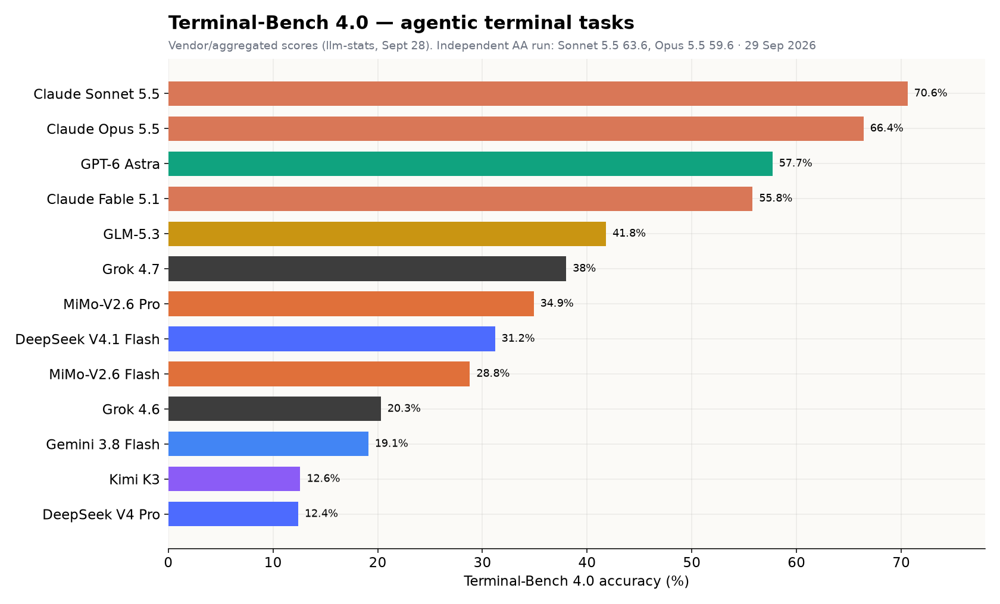
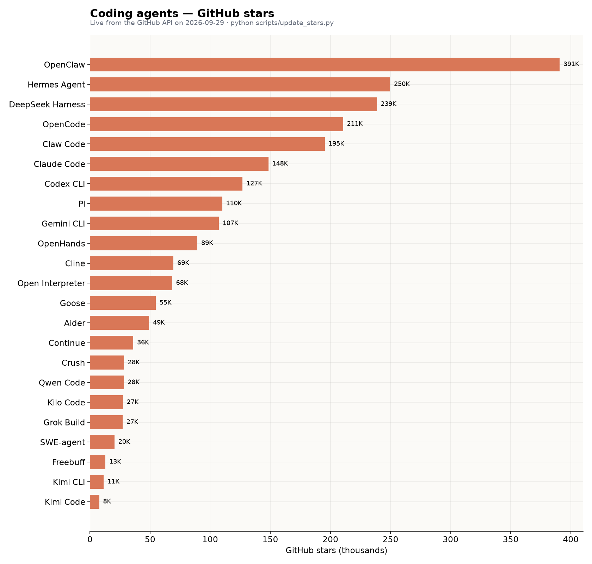
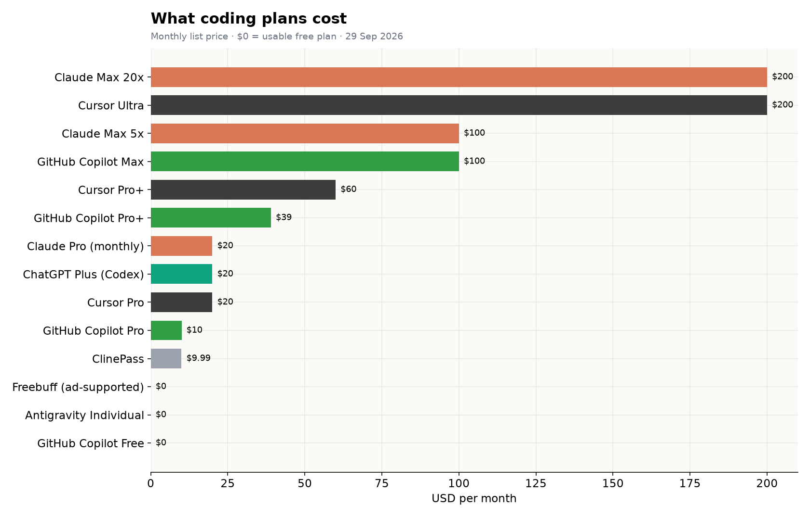

# 🤖 Agents — CLI Agents, IDEs, Chat Apps, MCP & Tooling (verified 29 September 2026)

<p align="center"><a href="./README.md">🏠 Home</a> · <a href="https://yash-awasthi.github.io/ToolkitArchive/">🔎 Explorer</a> · <a href="https://yash-awasthi.github.io/ToolkitArchive/benchmarks.html">📊 Benchmarks</a> · <a href="./NEWS.md">📰 News</a> · <a href="./STUDENTS.md">🎓 $0 guide</a> · <a href="./FREE-ACCESS.md">🆓 Free AI</a></p>

> [!NOTE]
> Every price was read from the vendor's live pricing page and every star count comes from the GitHub
> API on 29 Sep 2026. Terminal-Bench rows measure an **agent + model + effort** configuration, not an
> agent on its own.

> [!WARNING]
> **Changed since the last pass:** **Roo Code** and **Void** are archived · **Flowise** repo archived (Aug 2026) · **Plandex**, **Trae Agent**, **Sweep** (open-source repo) and **GPT4All** have gone quiet · **ZCode** uploaded users' repos — don't use it · **Gemini CLI** free/Pro access ended June 18 → Antigravity CLI · **Cursor** is owned by SpaceX · **Kiro** is now Pro $20 / Pro+ $40 / Pro Max $100 / Power $200 · **Devin** Pro $20 (Max $200) · **Warp** Build $18 · **Qoder** is no longer free (2-week trial, Pro $20).

**Contents:** [Terminal-Bench 4.0](#terminal-bench-40) · [CLI agents](#part-1--cli--terminal-coding-agents) · [IDEs](#part-2--agentic-ides--desktop-apps) · [Autonomous agents](#part-3--autonomous--web-agents) · [Chat apps](#part-4--ai-chat-apps) · [Infrastructure](#part-5--infrastructure--protocols) · [MCP](#part-5a--mcp-model-context-protocol) · [BYOK recipes](#byok-recipes) · [Deprecated](#deprecated--retiring) · [Deploy & CI](#part-7--deployment--cicd) · [Code quality](#part-8--code-quality-ai-review--security) · [Frameworks](#part-9--agent-builders-frameworks--browser-agents) · [Local runners](#part-10--local-model-runners) · [Social discovery](#part-11--social-discovery)

---

## Terminal-Bench 4.0



TB 2.1 is saturated (top models land at 88–91% in vendor runs), so labs now report **Terminal-Bench 4.0**: 66 tasks, flat 8-hour timeout, calibrated CPU/memory. The official tbench.ai board renders client-side and couldn't be read, so two secondary sources are shown.

| Model | TB 4.0 — vendor/aggregated (llm-stats, Sept 28) | TB 4.0 — independent (Artificial Analysis, mini-swe-agent) |
|---|---|---|
| Claude Sonnet 5.5 | **70.6%** | **63.6%** |
| Claude Opus 5.5 | 66.4% | 59.6% |
| Claude Mythos 5.1 | 60.9% | — (trusted access only) |
| GPT-6 Astra | 57.7% | — |
| Claude Fable 5.1 | 55.8% | — |
| Claude Opus 5 | 51.8% | — |
| Claude Fable 5 | 44.5% | — |
| GLM-5.3 | 41.8% | — |
| Grok 4.7 | 38.0% | — |
| GPT-5.6 Sol | 37.3% | — |
| MiMo-V2.6-Pro | 34.9% | — |
| DeepSeek V4.1 Flash | 31.2% | — |
| MiMo-V2.6-Flash | 28.8% | — |
| Gemini 3.8 Flash | 19.1% | — |

> Compare within a column, never across. Every benchmark and the head-to-head verdict: [benchmarks.html](https://yash-awasthi.github.io/ToolkitArchive/benchmarks.html).

<details>
<summary><b>Older: Terminal-Bench 2.1 official leaderboard snapshot (17 Aug 2026)</b></summary>

| Rank | Agent + model | Effort | Accuracy |
|---|---|---|---|
| 1 | Claude Code + Fable 5 | xhigh | 83.8% ± 1.2% |
| 2 | Codex + GPT-5.5 | xhigh | 83.1% ± 1.1% |
| 3 | Terminus 2 (reference agent) + Fable 5 | high | 80.4% ± 1.2% |
| 4 | Cursor CLI + Grok 4.5 | high | 79.3% ± 1.5% |
| 5 | Claude Code + Opus 4.8 | high | 78.9% ± 1.3% |

</details>

---

## Part 1 — CLI / Terminal Coding Agents



> [!TIP]
> Every agent below supports the open **Agent Skills** standard or MCP. Skills, plugins and install commands: [SKILLS.md](./SKILLS.md). Free models to plug in: [FREE-ACCESS.md](./FREE-ACCESS.md).

### Commercial agents

| Agent | By | Free | Paid | Models | ⭐ (live) |
|---|---|---|---|---|---|
| ★ **Claude Code** | Anthropic | — (needs Pro or API) | Pro $17/mo annual ($20 monthly) · Max 5x $100 · Max 20x $200 · API | Opus 5.5 default; Sonnet 5.5, Fable 5.1 | 148K |
| ★ **Codex CLI** | OpenAI | ChatGPT Free (limited Codex, GPT-6 Luna) | ChatGPT Plus / Pro · API | GPT-6 Sol / Astra / Luna | 127K |
| **Grok Build** | SpaceXAI | Free tier | Heavier tiers | Grok 4.7 | 27K (harness) |
| **Muse Code** | Meta | Beta | Meta Model API ($1.25/$4.25 for Spark 1.3) | Muse Spark 1.3 | — |
| **Antigravity CLI** | Google | Free Individual plan (weekly agent limits) | Google AI Pro $19.99 · Ultra $99.99 | Gemini 3.8 Flash, 3.1 Pro, Claude 4.6 | — |
| **Freebuff** | Codebuff (YC) | **Free, ad-supported**: 100 Freebucks/day (DeepSeek V4.1 Flash 6 h, GPT-6 Luna 5 h, GLM-5.3 Flash 20 h…) | — | Rotating free models | 13K |
| **Verdent** | Verdent | Free mode | Lite $5 · Starter $19 · Pro $59/mo | Parallel agents, BYOK | — |
| **Amp** | Sourcegraph | Hobby free (all features, bring your own ChatGPT/other subscriptions) | Individual $20/mo | Multi-model | — |
| **MiMo Code** | Xiaomi | Free with MiMo models | — | MiMo (OpenCode fork) | 14K |

### Open-source agents (free, bring your own key)

| Agent | Licence | ⭐ (live) | Notes |
|---|---|---|---|
| ★ **OpenCode** | MIT | 211K | Best harness for free models — any OpenAI-compatible key, 75+ providers, Zen free models. Optional **OpenCode Go** $10/mo (Go Plus $40) for cheap hosted models; Black tier higher |
| **Hermes Agent** (Nous) | MIT | 250K | Self-improving: writes its own skills, persistent user model; v0.21 adds desktop app, Bot Mode, A2A |
| **DeepSeek Harness** (`dsh`) | MIT | 239K | "Everything is a plugin"; the harness behind DeepSeek's own benchmark runs |
| **Claw Code** | MIT | 195K | Python/Rust rewrite of the Claude Code architecture, any model |
| **Pi** | MIT | 110K | Minimal harness, <1K-token system prompt, lazy skills |
| **OpenHands** | MIT | 89K | Autonomous dev agent; free open source + free individual cloud tier |
| ★ **Cline** | Apache 2.0 | 69K | VS Code/JetBrains/CLI + **Cline Desktop**; free for individuals (pay inference) + rotating **free models**; ClinePass $9.99/mo |
| **Open Interpreter** | Apache 2.0 | 68K | Runs code locally to do tasks |
| **Goose** (Linux Foundation) | Apache 2.0 | 55K | Extensible local agent |
| **Aider** | Apache 2.0 | 49K | Git-native pair programmer (last release May 2026) |
| **CodeWhale** | MIT | 41K | Rust TUI agent built for DeepSeek V4 (also OpenAI and others) |
| **Continue** | Apache 2.0 | 36K | IDE extension + CLI, custom assistants |
| **Crush** (Charm) | Source-available (see repo) | 28K | Terminal agent with LSP |
| **Qwen Code** | Apache 2.0 | 28K | Gemini-CLI fork for Qwen models |
| **Kilo Code** | MIT | 27K | Free for individuals + `kilo-auto/free` router; Teams $15/user |
| **SWE-agent** (Princeton) | MIT | 20K | Research agent for GitHub issues |
| **JCode** | MIT | 20K | Rust agent for remote servers over SSH (project's own benchmark: 14 ms boot) |
| **Kimi Code CLI** | Apache 2.0 | 11K | Moonshot's agent, pairs with Kimi K3 (v2.1, Sept 23) |
| **Claurst** | GPL-3.0 | 10K | Rust Claude Code-style agent |
| **Mistral Vibe** | Apache 2.0 | 5K | Mistral's CLI agent |
| **gptme** | MIT | 4.4K | Minimal terminal agent |
| **Letta Code** | Apache 2.0 | 3.5K | Memory-first coding agent |
| **Nanocoder** | See repo | 2.5K | Local-first (Ollama, LM Studio, llama.cpp, MLX) |
| ~~Roo Code~~ · ~~Plandex~~ · ~~Trae Agent~~ | — | 24K · 16K · 12K | Archived / no commits since Oct 2025 / Feb 2026 — don't start new projects on them |

### Platform / enterprise agents

| Agent | Free | Paid | Link |
|---|---|---|---|
| **Cursor** (SpaceX) | Hobby: limited agent requests + Composer | Pro $20 · Pro+ $60 · Ultra $200 · Teams $40/user | cursor.com/pricing |
| **GitHub Copilot** | 2,000 completions/mo, Haiku 4.5, GPT-5 mini, agent mode, CLI | Pro $10 · Pro+ $39 · Max $100 | github.com/features/copilot/plans |
| **Kiro** (AWS) | 50 credits/mo incl. Claude Sonnet 4.5 + open models | Pro $20 · Pro+ $40 · Pro Max $100 · Power $200 | kiro.dev/pricing |
| **Augment Code** | — | Standard $20 · Business $100 | augmentcode.com/pricing |
| **Zencoder** | 7-day Pro trial | Pro $40/user (annual) | zencoder.ai/pricing |
| **Sweep** (JetBrains plugin) | Trial: 1,000 autocompletes + $5 API credit | Basic $10 · Pro $20 · Ultra $60 | sweep.dev |

### Proxy / router tools

| Tool | What | ⭐ (live) |
|---|---|---|
| **OmniRoute** | Self-hosted gateway: one OpenAI-compatible endpoint over 340 providers (90+ with free tiers), quota-aware fallback. ⚠️ CVE-2026-49352 reported — you hand it your keys | 71K |
| **CLIProxyAPI** | Claude Code / Codex / Gemini / Grok OAuth → OpenAI-compatible API | 53K |
| **9router** | Route agents to 40+ providers' free tiers with fallback | 30K |
| **TokenRouter** | Hosted 300+ model gateway; some `:free` IDs | — |
| **cc-compatible-models** | Configs to run Chinese open models in Claude Code | 31 |

> [!CAUTION]
> Subscription proxies are reverse-engineered and can get accounts banned. Avoid "keygen/activator" repos — malware. See [CREDITS.md](./CREDITS.md#part-4--subscription-as-api).

---

## Part 2 — Agentic IDEs & Desktop Apps



| IDE / app | By | Free | Paid | Notes |
|---|---|---|---|---|
| ★ **Cursor** | SpaceX | Hobby (limited) | Pro $20 · Pro+ $60 · Ultra $200 · Teams $40 | Two usage pools: first-party (Grok, Composer) and third-party models |
| ★ **VS Code + GitHub Copilot** | Microsoft | Copilot Free | Pro $10 · Pro+ $39 · Max $100 | Local agent sandboxing (preview), auto model tiers |
| ★ **Antigravity** | Google | Free Individual (weekly agent limits) | Google AI Pro $19.99 · Ultra $99.99 | Replaced Gemini CLI's free tier |
| **Codex app / IDE extension** | OpenAI | ChatGPT Free (limited) | ChatGPT plans | Cloud agent, PR workflow |
| **Claude Code / desktop** | Anthropic | — | Pro $17 · Max $100 / $200 | Terminal, IDE, desktop, web, Slack, CI |
| **Kiro** | AWS | 50 credits/mo | Pro $20 → Power $200 | Spec-driven development, hooks |
| **Zed** | Zed Industries | 2,000 edit predictions/mo; unlimited with your own keys or external agents | Pro $10 ($5 tokens incl.) · Business $30/seat | Open source; runs any agent via ACP |
| **Devin Desktop** (ex-Windsurf) | Cognition | Light agent quota, unlimited Tab | Pro $20 · Max $200 · Teams $80 + $40/seat | windsurf.com → devin.ai |
| **Warp** | Warp | Free terminal (limited AI) | Build $18 · Max $180 · Business $45/user | Open source; runs Claude Code/Codex inside |
| **Qoder** | Alibaba | 2-week trial (300 credits), BYOK | Pro $20 · Pro+ $60 · Ultra $200 | No longer free |
| **Trae** | ByteDance | — | Lite $3 · Pro $10 · Pro+ $30 · Ultra $100 | ⚠️ 5-year data retention, no opt-out |
| **Cline Desktop** | Cline | Free, open source (beta) | ClinePass $9.99 | Imports Claude Code/Codex sessions; Kimi K3 free inside |
| **LM Studio Bionic** | LM Studio | Free (local) | Bionic+ $20/mo | Local agent for code and documents |
| **AionUI** | iOfficeAI | Free (Apache 2.0, 33K★) | — | One desktop over 20+ CLI agents, cron, office file editing |
| **Eigent** | Eigent AI | Free, open source (15K★) | — | Multi-agent "workforce" desktop (browser, terminal, docs) |
| **PearAI** | PearAI | Free (BYOK) | — | VS Code fork (last commit Jun 2026) |
| ~~Void~~ | — | — | — | **Archived June 2026** |
| ~~ZCode~~ ⛔ | Z.ai | — | — | **Do not use** — silently uploaded users' repos (Sept 18). See [NEWS.md](./NEWS.md) |

---

## Part 3 — Autonomous & Web Agents

| Agent | Type | Free | Paid | Notes |
|---|---|---|---|---|
| ★ **OpenClaw** | Self-hosted personal agent (391K★) | Free (MIT, your key) | — | Routes WhatsApp/Telegram/Discord/Slack to an agent with files, commands, memory. ⚠️ Broad system access + third-party skills = real malware risk |
| **Manus** | Cloud VM agent | 300 credits/day | Standard $12 · Extended $40/mo | Browse, code, slides |
| **Genspark** | "Super Agent" | 100 credits/day | Plus (10K credits) · Pro (125K credits) | Slides, sheets, calls, image/video |
| **Devin** | Autonomous engineer | Light quota | Pro $20 · Max $200 | Ticket → PR |
| **OpenHands** | Open-source dev agent | Free | Enterprise | See Part 1 |
| **ChatGPT Work** | OpenAI agent (replaced Agent mode) | All plans on desktop | — | Multi-hour tasks with approvals |
| **Cursor Background Agents** | Async agents | In paid plans | — | Run while you work |
| **Relevance AI** | Enterprise multi-agent | — | Enterprise | Custom pricing |

App builders (Bolt, Lovable, v0, Replit) → [FRONTEND.md](./FRONTEND.md).

---

## Part 4 — AI Chat Apps

| App | Best model (Sept 2026) | Free | Paid | Standout |
|---|---|---|---|---|
| **Claude** | Opus 5.5 / Fable 5.1 (paid) · Sonnet 5 (free) | ✅ | Pro $17/mo annual · Max from $100 | Artifacts, Projects, Claude Design, Cowork |
| **ChatGPT** | GPT-6 Astra / Sol · GPT-6 Luna free | ✅ (unlimited Luna text, limited images/Codex) | Go · Plus · Pro | Scheduled Tasks, ChatGPT Work, Codex. **Free for US K-12 teachers until June 2027** |
| **Gemini** | Gemini 3.8 Flash · 3.1 Pro | ✅ | AI Plus $4.99 · AI Pro $19.99 · Ultra $99.99 | Deep Research, Gems, NotebookLM; free AI Pro year for US college students |
| **Kimi** | Kimi K3 | ✅ (Adagio) | Plus $15 · Pro $31 · Max $79/mo | 2.8T open-weight flagship |
| **Qwen Chat** | Qwen 3.8-Max | ✅ | — | Free Max-class model |
| **chat.z.ai** | GLM-5.3 | ✅ | GLM Coding Plan from $18/mo | Web chat free; API paid |
| **Grok** | Grok 4.7 | ✅ (on X / grok.com) | SuperGrok (see grok.com/plans) | X integration |
| **Perplexity** | Multiple | ✅ | Pro (students $10/mo) · Computer plans | Cited research, Comet browser |
| **Mistral Le Chat** | Mistral models | ✅ ($10/mo API credit included) | Pro $14.99 (**students $5.99**) | EU-hosted |

Feature-by-feature guide to Claude, ChatGPT and Gemini: [USAGE.md](./USAGE.md).

---

## Part 5 — Infrastructure & Protocols

| Tool | Type | Purpose |
|---|---|---|
| **MCP** | Protocol | Agent ↔ tool standard (2026-07-28 spec = "MCP 2.0"), Linux Foundation |
| **A2A** | Protocol | Agent ↔ agent interop (Google ADK, Hermes, VoltAgent, OpenAgents) |
| **ACP** | Protocol | Agent Client Protocol — run any agent inside Zed and other editors |
| **Agent Skills** | Standard | Portable `SKILL.md` folders — see [SKILLS.md](./SKILLS.md) |
| **OpenRouter** | Router | One key for hundreds of models; `:free` variants |
| **LiteLLM** (60K★) | Router | OpenAI-compatible proxy for 100+ providers |
| **google/ax + Agent Executor** | Runtime | Durable, resumable, sandboxed agent runs |

---

## Part 5A — MCP (Model Context Protocol)

> [!NOTE]
> **MCP 2.0 (2026-07-28 spec):** stateless, cacheable, routable transports; Sampling deprecated; OAuth hardening. Target it for new servers. **Claude Plugins** (Sept 2026) are now the main way to ship MCP servers + skills to Claude users.

> [!WARNING]
> Registry listing ≠ safe. Scans of public servers keep finding SSRF, unsafe command execution and missing auth. Sandbox community servers and never give them production credentials.

```
AI agent (Claude Code / Cursor / Codex / …)
   │  MCP (JSON-RPC over stdio / streamable HTTP)
   ▼
MCP server (GitHub / Supabase / Playwright / …)  →  the real service
```

### MCP clients

Claude Code, Claude apps, Codex, Cursor, VS Code + Copilot, Cline, Continue, Zed (via ACP), Warp, OpenCode, Antigravity, Devin Desktop, LM Studio — all support MCP.

### Popular MCP servers (⭐ live, 29 Sep 2026)

| Server | ⭐ | What it does |
|---|---|---|
| **modelcontextprotocol/servers** (reference: Fetch, Filesystem, Git, Memory…) | 91K | Official reference servers |
| **Context7** (Upstash) | 63K | Up-to-date library docs for agents |
| **Chrome DevTools MCP** | 53K | Performance traces, network, console in your real Chrome |
| **Playwright MCP** | 38K | Browser automation (now inside Playwright) |
| **GitHub MCP** | 33K | Issues, PRs, code search, Actions |
| **MCP Toolbox for Databases** (Google) | 17K | Postgres, MySQL, BigQuery, Spanner… |
| **Figma Context MCP** (community) · official Figma MCP | 16K · — | Design context; official server can now write to the canvas |
| **AWS MCP** (awslabs) | 9.7K | AWS services |
| **Firecrawl MCP** | 7.5K | Scrape, crawl, search |
| **Exa MCP** | 5.1K | Semantic web search |
| **Notion MCP** | 4.7K | Pages and databases |
| **Cloudflare MCP** | 4.3K | Workers, R2, DNS… (plus hosted remote servers) |
| **Supabase MCP** | 2.9K | Postgres, auth, storage, functions |
| **Tavily MCP** | 2.4K | Search + extraction |
| **Kubernetes MCP** | 2.1K | Cluster management |
| **Slack MCP** (community) | 1.8K | Channels, messages, search |
| **Brave Search MCP** | 1.5K | Web search |
| **Atlassian MCP** | 1.1K | Jira + Confluence |
| **Sentry MCP** | 0.9K | Errors and releases |
| **Neon MCP** | 0.6K | Serverless Postgres, branches |
| ~~Browserbase MCP~~ | 3.4K | **Archived** — use Stagehand or Playwright MCP |

Design, browsing, memory and dev-workflow MCPs added this month (Paper, 21st.dev, shadcn, Serena, Agent-Reach…) → [SKILLS.md](./SKILLS.md#new-skills-plugins--mcps--sept-2026-wave).

### Add a server

```bash
# Claude Code
claude mcp add github -- npx -y @modelcontextprotocol/server-github
claude mcp add --transport http context7 https://mcp.context7.com/mcp

# Any client that uses a JSON config (Claude Desktop, Cursor, Cline…)
{
  "mcpServers": {
    "github": { "command": "npx", "args": ["-y", "@modelcontextprotocol/server-github"], "env": { "GITHUB_TOKEN": "ghp_..." } }
  }
}
```

### Build your own (Python)

```python
from mcp.server.fastmcp import FastMCP

mcp = FastMCP("my-server")

@mcp.tool()
def get_data(query: str) -> str:
    """Fetch data from my service"""
    return f"Result for: {query}"

if __name__ == "__main__":
    mcp.run()
```

### Where to find servers

| Directory | Best for |
|---|---|
| registry.modelcontextprotocol.io (7.3K★ repo) | Official registry — publish here first |
| github.com/punkpeye/awesome-mcp-servers (96K★) | Largest curated list |
| glama.ai/mcp/servers · smithery.ai · pulsemcp.com · mcp.so | Searchable catalogs, hosted/remote servers |
| Claude plugin directory · claudemarketplaces.com | Plugins bundling MCP + skills |

---

## BYOK Recipes

```bash
# Free: OpenCode + Token Harbor free model (OpenAI-compatible)
# add a provider in opencode.json (see FREE-ACCESS.md), then pick deepseek-v4.1-flash:free

# Free: OpenCode + OpenRouter free model
OPENROUTER_API_KEY=sk-or-... opencode   # then /models → any ":free" model

# Cheap: Aider + DeepSeek V4.1 Flash ($0.60/M out off-peak)
OPENAI_BASE_URL=https://api.deepseek.com OPENAI_API_KEY=sk-... aider --model openai/deepseek-flash

# Local: any agent → Ollama's OpenAI-compatible endpoint at http://localhost:11434/v1
```

---

## Deprecated / Retiring

| Tool | Status | Use instead |
|---|---|---|
| Gemini CLI (free, AI Pro/Ultra) | Stopped serving June 18, 2026; paid API keys only | Antigravity CLI |
| ZCode (Z.ai) | Silent repo uploads (Sept 18) | Any other agent; GLM via API / OpenCode / Cline |
| Roo Code · Void | Archived | Cline / Kilo Code · Zed / VS Code |
| Flowise | Repo archived Aug 2026 | Langflow / n8n |
| Windsurf | Rebranded to Devin Desktop (June 2) | Devin Desktop |
| DeepSeek V4 Flash | Retired Sept 10 | DeepSeek V4.1 Flash (`deepseek-flash`) |
| OpenAI Sora | App closed Apr 26; API shut down Sept 24 | Gemini Omni Flash / Kling 4.0 / Veo 3.1 |
| Google Imagen | Shut down Aug 17 | Nano Banana 2 (Gemini 3.1 Flash Image) |
| InstantDB cloud | Acquired by OpenAI; closes Aug 31, 2027 | Self-host / Convex / Supabase |
| Mocha · Motiff | Shut down / discontinued | See [FRONTEND.md](./FRONTEND.md) |

---

## Part 6 — Website & App Builders → moved

AI app builders, UI design generators, design-to-code and no-code site builders now live in one verified place: **[FRONTEND.md](./FRONTEND.md)** (Bolt, Lovable, v0, Google Stitch, Claude Design, Framer, Webflow, Draftly.space and more).

---

## Part 7 — Deployment & CI/CD

Managed hosting (Vercel, Cloudflare, Netlify, Render, Railway, Fly.io, Sevalla, Zeabur, Koyeb…) with verified free tiers is in **[BACKEND.md → Hosting](./BACKEND.md#part-3--hosting--deploy--paas)**. This part covers self-hosted PaaS, CI/CD and deploy APIs.

### Self-Hosted PaaS (run on your own VPS)

| Platform | ⭐ Stars (live) | What | Cost | Link |
|---|---|---|---|---|
| ★ **Coolify** | 62K | Heroku/Vercel-style UI, REST API, 280+ one-click services | Free self-hosted (all features) · Cloud $5/mo | coolify.io |
| **Dokploy** | 38K | Docker Compose + Swarm, fast UI | Self-host free · Cloud from $4.50/mo per server | dokploy.com |
| **Dokku** | 32K | Git-push PaaS, Heroku buildpacks, CLI-driven | Free (Dokku Pro from $10/mo) | dokku.com |
| **CapRover** | 15K | Docker Swarm, one-click app store, automatic HTTPS | Free | caprover.com |
| **Kamal** (Basecamp) | 15K | Deploy Docker containers to any server over SSH | Free | kamal-deploy.org |

### CI/CD

| Tool | Free tier (29 Sep 2026) | Paid | Link |
|---|---|---|---|
| ★ **GitHub Actions** | Free for public repos; included minutes on private | Per-minute | github.com/features/actions |
| **GitLab CI** | Free tier (400 compute minutes/mo, 5 users/group) | Premium $29/user/mo | gitlab.com/pricing |
| **CircleCI** | **6,000 build minutes/mo**, 5 active users; OSS up to 400K credits/mo | Performance $15/mo | circleci.com/pricing |
| **Buildkite** | Up to 5 users, 10 concurrent jobs, 2,000 Linux vCPU min | Pro $30/active user/mo | buildkite.com/pricing |
| **Depot** | 7-day trial | Developer $20/mo | depot.dev/pricing |
| ~~Earthly~~ | Repo inactive since Oct 2025 | — | github.com/earthly/earthly |

### Deploy via API — quick reference

```bash
# Vercel
curl -X POST https://api.vercel.com/v13/deployments \
  -H "Authorization: Bearer $VERCEL_TOKEN" -H "Content-Type: application/json" \
  -d '{"name":"my-app","gitSource":{"type":"github","repoId":"...","ref":"main"}}'

# Railway (GraphQL)
curl -X POST https://backboard.railway.app/graphql/v2 \
  -H "Authorization: Bearer $RAILWAY_TOKEN" \
  -d '{"query":"mutation { deploymentTrigger(input:{serviceId:\"...\"}){id} }"}'

# Coolify
curl -X POST https://your-coolify.com/api/v1/deploy \
  -H "Authorization: Bearer $COOLIFY_TOKEN" -d '{"uuid":"app-uuid","force":false}'

# Render deploy hook
curl -X POST "https://api.render.com/deploy/$RENDER_DEPLOY_HOOK_ID?key=$RENDER_DEPLOY_KEY"
```

---

## Part 8 — Code Quality, AI Review & Security

### Code quality platforms

| Tool | Free tier (29 Sep 2026) | Paid | Link |
|---|---|---|---|
| ★ **SonarQube Cloud** | Free up to 50K lines of code (private too) | Team $34/mo | sonarcloud.io/pricing |
| **Qlty** | Free $0; **free for K-12 & universities** | Pro $20/contributor/mo | qlty.sh/pricing |
| **Code Climate** | 1,000 analysis minutes + 100 AI autofixes/mo; free for schools | Pro $20/contributor/mo | codeclimate.com/pricing |
| **Codacy** | Free forever for open source | Paid plans | codacy.com/pricing |
| **DeepSource** | 14-day trial + $50 AI review credits | Team $24/user/mo | deepsource.com/pricing |
| **Qodana** (JetBrains) | Free for open source; 30-day trial | Standard $5/developer | jetbrains.com/qodana |

### AI code review

| Tool | Free | Paid | Link |
|---|---|---|---|
| ★ **CodeRabbit** | 14-day trial; free education plan for public repos | Essentials $24/mo | coderabbit.ai/pricing |
| **Greptile** | Free for 1 developer (50 credits/mo); free for MIT/Apache non-commercial projects | Pro $30/seat/mo | greptile.com/pricing |
| **Graphite** | Hobby free | Starter $20/user/mo | graphite.dev/pricing |
| **Sourcery** | Free forever for public repos | Pro $12/dev/mo | sourcery.ai/pricing |
| **Claude Code / Codex / Copilot review** | Built into those agents (`/review`, PR review) | Your plan | — |

### Security scanners

| Tool | ⭐ (live) | Free | Link |
|---|---|---|---|
| ★ **Semgrep** | 17K | Community Edition free | semgrep.dev |
| ★ **Trivy** | 38K | Open source (containers, IaC, SBOM) | trivy.dev |
| ★ **Gitleaks** | 30K | Open source secrets scanner | gitleaks.io |
| **TruffleHog** | 28K | Open source; Enterprise paid | trufflesecurity.com |
| **Snyk** | — | Free plan (SCA, SAST, IaC, container) | snyk.io/pricing (Team $25/mo) |
| **Aikido** | — | Developer: free forever, 2 users | aikido.dev/pricing (Basic $350/mo) |
| **OWASP Dependency-Check** | — | Open source SCA | owasp.org/www-project-dependency-check |

### Language linters (all free & open source)

| Language | Tool |
|---|---|
| JavaScript / TypeScript | ESLint + Prettier, or Biome |
| Python | Ruff (lint + format), mypy / pyright (types) |
| Go | golangci-lint |
| Rust | Clippy |
| Java | Checkstyle + SpotBugs |
| C / C++ | clang-tidy + cppcheck |
| Ruby | RuboCop |
| PHP | PHPStan / Psalm |
| Terraform | tflint + Trivy (tfsec merged into Trivy) |
| Docker | Hadolint |
| SQL | sqlfluff |
| Markdown | markdownlint |

```yaml
# .github/workflows/quality.yml — free for public repos
name: Code Quality
on: [pull_request]
jobs:
  lint:
    runs-on: ubuntu-latest
    steps:
      - uses: actions/checkout@v4
      - run: pip install ruff && ruff check .
      - uses: semgrep/semgrep-action@v1
        with: { config: p/default }
      - uses: aquasecurity/trivy-action@master
        with: { scan-type: fs, severity: "HIGH,CRITICAL" }
      - uses: gitleaks/gitleaks-action@v2
```

---

## Part 9 — Agent Builders, Frameworks & Browser Agents

### No-code / low-code workflow builders

| Platform | ⭐ (live) | Free tier (29 Sep 2026) | Paid | Link |
|---|---|---|---|---|
| ★ **n8n** | 206K | Community Edition free self-hosted | Cloud Starter $20/mo (50% off for startups <20 staff) | n8n.io/pricing |
| ★ **Dify** | 157K | Sandbox: 200 message credits, 5 apps; self-host free | Paid cloud plans | dify.ai/pricing |
| ★ **Langflow** | 155K | Free (open source + cloud) | — | langflow.org |
| **Activepieces** | 25K | **100 credits/day, free forever**, no card | Plus $20/mo | activepieces.com/pricing |
| **Zapier** | — | 100 tasks/mo (AI steps use the same tasks) | Professional $19.99/mo | zapier.com/pricing |
| **Stack AI** | — | 500 runs/mo, 2 projects | Enterprise | stack-ai.com/pricing |
| **Gumloop** | — | 14-day trial | Pro $37/mo | gumloop.com/pricing |
| **Lindy** | — | 7-day trial | Plus $29.99/mo | lindy.ai/pricing |
| **AgentCrafters.ai** | — | Plain-English agents on 36 everyday tools (early-stage) | — | agentcrafters.ai |
| ~~Flowise~~ | 55K | **Repository archived (Aug 2026)** — migrate to Langflow or n8n | — | github.com/FlowiseAI/Flowise |

### Code-level agent frameworks

| Framework | ⭐ (live) | Language | Best for |
|---|---|---|---|
| **LangChain** / **LangGraph** | 147K / 42K | Python, JS | Stateful agent graphs — the enterprise default |
| **Dify** / **Langflow** | see above | — | Visual + code |
| **CrewAI** | 59K | Python | Role-based multi-agent teams (cloud: 50 executions/mo free) |
| **LlamaIndex** | 52K | Python | Data connectors, RAG, document parsing (cloud: 10K credits free) |
| **Agno** | 42K | Python | High-throughput agents; control plane free |
| **DSPy** | 38K | Python | Programmatic prompt/weight optimisation |
| **OpenAI Agents SDK** | 30K | Python, JS | OpenAI-native handoffs, tools, tracing |
| **Mastra** | 28K | TypeScript | TS workflows + HITL (cloud free: 100K events) |
| **Vercel AI SDK** | 27K | TypeScript | Full-stack TS agents, streaming UI |
| **Haystack** | 27K | Python | Production RAG pipelines (v3.2) |
| **Google ADK** | 22K | Python | Gemini-optimised, A2A interop; pairs with google/ax runtime |
| **Pydantic AI** | 20K | Python | Type-safe agents, durable workflows |
| **Instructor** | 14K | Python | Structured outputs |
| **Microsoft Agent Framework** | 14K | Python, .NET | Successor to AutoGen + Semantic Kernel (1.0 GA Apr 2026) |
| **VoltAgent** | 11K | TypeScript | Observability-first TS framework, MCP + A2A |
| **OpenAgents** | 4K | Python | Multi-agent networks, MCP + A2A |
| AutoGen · Semantic Kernel | 61K · 29K | Python/.NET | Maintenance mode → use Microsoft Agent Framework |

**Decision guide:** stateful Python graphs → LangGraph · fast multi-agent prototype → CrewAI · TypeScript → Mastra or Vercel AI SDK · type-safe Python → Pydantic AI · RAG-heavy → LlamaIndex · Microsoft/.NET → Microsoft Agent Framework. Trace everything with Langfuse / Logfire (see [MEDIA.md](./MEDIA.md#part-5--llmops-observability--evals--gateways)).

### Browser / web agents

| Tool | ⭐ (live) | Free | Link |
|---|---|---|---|
| ★ **Browser Use** | 117K | Open source; cloud $15 free credits, then model cost + 20% | browser-use.com |
| ★ **Playwright MCP / CLI** | 38K | Free (ships inside Playwright) | github.com/microsoft/playwright-mcp |
| **Vercel agent-browser** | 43K | Free CLI | agent-browser.dev |
| **Stagehand v3** (Browserbase) | 25K | Free SDK | stagehand.dev |
| **Skyvern** | 23K | 5,000 credits free | skyvern.com/pricing (Hobby $29/mo) |
| **Browser Harness** · **Agent-Reach** · **Chrome DevTools MCP** | 18K · 86K · 53K | Free | see [SKILLS.md](./SKILLS.md#browsing--web-access-for-agents) |

> DOM-driven tools (Playwright, Stagehand, agent-browser) are cheaper and more reliable on normal sites; vision/computer-use agents handle canvas-only or anti-bot pages. Common pattern: Playwright for the predictable 80%, an agent for the rest.

---

## Part 10 — Local Model Runners

Run open-weight models on your own hardware — no API keys, no data leaving your machine.

| Tool | ⭐ (live) | UI | Free / paid | Best for |
|---|---|---|---|---|
| ★ **Ollama** | 182K | CLI + REST API | Local free · cloud models with starter credits · Pro $20/mo ($60 usage) | Default local runtime; OpenCode/Cline integration |
| ★ **llama.cpp** | 130K | CLI | Free | Raw performance, every quantisation |
| ★ **LM Studio** + **Bionic** agent | closed source | Desktop | Free (local + Bionic agent) · Bionic+ $20/mo | Beginners; Bionic codes and works on documents locally |
| **vLLM** | 93K | REST server | Free | High-throughput GPU serving |
| **Jan** | 45K | Desktop | Free, open source | Privacy-first local server |
| **SGLang** | 37K | REST server | Free | Fast structured serving |
| **llamafile** (Mozilla.ai) | 26K | Single executable | Free | Ship a model as one file |
| **Msty** | — | Desktop | Free to start; Studio paid | Multi-model chat UI |
| ~~GPT4All~~ | 77K | Desktop | Repo inactive since May 2025 | Use Jan or LM Studio instead |

### Best Local Coding Models (Sept 2026)

| Model | Size | Runs on | Coding scores (vendor) | Licence |
|---|---|---|---|---|
| **Qwen3.8-27B** (Aug 14) | 27B dense, vision, 262K ctx | One 24 GB GPU at 4-bit (~56 GB at BF16) | Terminal-Bench 2.1 73.0 · SWE-bench Pro 61.7 · LiveCodeBench v6 90.3 | Apache 2.0 |
| **Laguna XS 2.1** (Poolside, Jul 2) | 33B MoE, 3B active | Laptop / single GPU (BF16, FP8, NVFP4, INT4 builds) | SWE-bench Verified 70.9 | OpenMDW-1.1 |
| **Qwen3.6 27B** | 27B dense | One 24 GB GPU at 4-bit | SWE-bench Verified 77.2 | Apache 2.0 |
| **Qwen3.8-Flash-Next** (Aug 26) | 125B MoE, 6B active | Workstation / multi-GPU | SWE-bench Pro 62.5 · Toolathlon 73.5 | Open weights (Qwen 4 architecture preview) |
| **Laguna S 2.1** (Poolside, Jul 21) | 118B MoE, 8B active, 1M ctx | Workstation | Terminal-Bench 2.1 70.2 · DeepSWE 40.4 | OpenMDW-1.1 |
| **Gemma 4 31B** | 31B dense | One 24 GB GPU at 4-bit | AIME 2026 89.2 · MMLU-Pro 85.2 | Gemma licence |

**Pick:** 24 GB GPU → **Qwen3.8-27B**; laptop → **Laguna XS 2.1**; big workstation → **Qwen3.8-Flash-Next**.

```bash
# Ollama — install, pull a model from ollama.com/library, serve an OpenAI-compatible API on :11434
curl -fsSL https://ollama.com/install.sh | sh
ollama pull <model>          # pick the current tag for Qwen3.8 / Laguna / Gemma on ollama.com/library
ollama serve
curl http://localhost:11434/v1/chat/completions -H "Content-Type: application/json" \
  -d '{"model":"<model>","messages":[{"role":"user","content":"Write a binary search in Python"}]}'
# Then add http://localhost:11434/v1 as an OpenAI-compatible provider in OpenCode or Cline.
```

---

## Part 11 — Social Discovery

Where new tools show up before mainstream coverage. Treat everything found this way as a lead — verify price, availability and safety before relying on it (this archive checks every lead against a live page or repo before adding it).

### Reddit

| Subreddit | Focus |
|---|---|
| r/LocalLLaMA | Local models, quantisation, benchmarks |
| r/ClaudeAI · r/ClaudeCode | Claude and Claude Code tips, plugins |
| r/codex · r/ChatGPTCoding | Codex and general AI coding workflows |
| r/hermesagent | Free-API audits and agent setups |
| r/singularity | Model leaks and release rumours |
| r/MachineLearning | Research papers |
| r/SideProject · r/webdev | Things people built with AI |

### X / Twitter

| Handle | Covers |
|---|---|
| @AnthropicAI · @OpenAI · @GoogleDeepMind · @deepseek_ai · @Kimi_Moonshot · @Alibaba_Qwen | Official release announcements |
| @karpathy | AI fundamentals |
| @simonw | Practical LLM tooling (Simon Willison) |
| @swyx | AI engineering |
| @GergelyOrosz | Engineering industry (Pragmatic Engineer) |
| @hwchase17 | LangChain / agents |
| @kimmonismus · @testingcatalog | Leaks and early feature sightings (rumours — verify) |

### Trackers & lists

| Resource | What |
|---|---|
| producthunt.com/categories/ai-coding-agents · /ai-agents | Daily launches |
| trendshift.io · ossinsight.io/trending/ai | GitHub trending with history |
| llm-stats.com/ai-news · artificialanalysis.ai | Model releases and independent benchmarks |
| github.com/bradAGI/awesome-cli-coding-agents | CLI agents and harnesses |
| github.com/caramaschiHG/awesome-ai-agents-2026 | Broad agent tool list |

```bash
# Trending AI-agent repos via the GitHub API
curl "https://api.github.com/search/repositories?q=topic:llm+topic:agent&sort=stars&order=desc&per_page=20"
```

---

## Parts 12–14 — Video, Music, UI Design → moved

Video and music generation (with verified prices and the current image/video arena leaderboards) are in **[MEDIA.md](./MEDIA.md)**. AI UI/design tools, Google Stitch and design-to-code are in **[FRONTEND.md](./FRONTEND.md)**.
