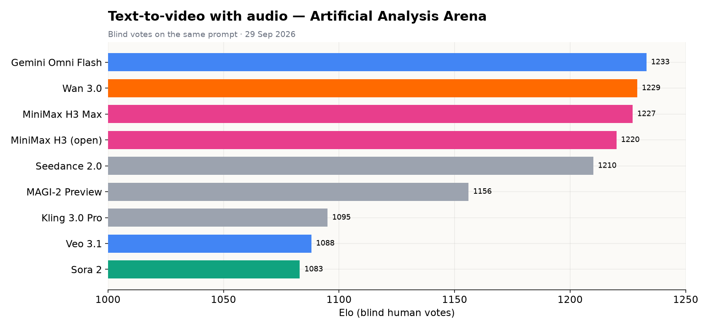

# 🎬 Media — Image, Voice, Video, Music, LLMOps & Docs (verified 29 September 2026)

<p align="center"><a href="./README.md">🏠 Home</a> · <a href="./MODELS.md#whos-actually-best--head-to-head-across-34-benchmarks">📊 Benchmarks</a> · <a href="./NEWS.md">📰 News</a> · <a href="./STUDENTS.md">🎓 $0 guide</a> · <a href="./FREE-ACCESS.md">🆓 Free AI</a></p>

> [!NOTE]
> Free/open-source first, then paid tools. Every free tier and price was read from the vendor's
> live pricing page on 29 Sep 2026; leaderboards are the Artificial Analysis and LMArena arenas.

> [!WARNING]
> **Changed since the last pass:** **Kling 4.0** launched Sept 28 (Flash now, full model in October) · **FLUX 3** (image+video+audio) in early access · **Stable Audio 3.0** ships open weights · **Midjourney V8.2** is the default · **Sora** API shut down Sept 24 · **Imagen** shut down Aug 17 · **Helicone** acquired by Mintlify (maintenance mode) · **Traceloop** joined ServiceNow.

**Contents:** [Free / open-source](#free--open-source-media-sept-2026) · [Leaderboards](#image--video-leaderboards-29-sep-2026) · [Image](#part-1--image-generation-paid--freemium) · [Voice](#part-2--voice--audio-tts--stt) · [Video](#part-3--video-generation-paid--freemium) · [Music](#part-4--music-generation) · [LLMOps](#part-5--llmops-observability--evals--gateways) · [Docs](#part-6--docs--devrel--knowledge)

---

## Free / open-source media (Sept 2026)

> Everything here runs locally for free or has a real free tier. Checked 29 Sep 2026. Local models
> need a GPU for speed (small TTS models run on CPU). Licences differ — check before commercial use.

### Voice / TTS (ElevenLabs replacements)

| Tool | Why | Runs on | Licence |
|---|---|---|---|
| ★ **Qwen3-TTS** (Alibaba, Jan 2026) | Lowest word-error rate in 6 of 10 languages vs ElevenLabs Multilingual v2 | GPU | Open weights |
| ★ **Chatterbox** (Resemble AI) | 63.8% of listeners preferred it over ElevenLabs in a blind test; voice cloning | GPU / fast CPU | MIT |
| ★ **Kokoro** | 82M params, runs on CPU, good default voices | CPU | Apache 2.0 |
| **Breeze TTS 2** | Voice cloning + voice design + direction; AA TTS arena Elo 1215 | GPU | Open |
| **F5-TTS · GPT-SoVITS · OpenVoice** | Clone a voice from a few seconds of audio | GPU | Open |
| **Kyutai Pocket TTS · Hume TADA · Mistral Voxtral** | See Part 2 below (CPU/browser, MIT, open-weight) | — | — |
| ★ **VoiceStudio** | Desktop app: 16 TTS engines, 646 languages, voice cloning, video dubbing, local speech-to-text. Trended Sept 2026 (+3K★ in a day) | Local | Open source |
| **VibeVoice-Realtime-0.5B** (Microsoft) | Streaming TTS, ~300 ms to first audio — for voice agents | GPU | Open |
| **Moonshine v2** | Real-time speech recognition on small devices | CPU/edge | Open |
| **Whisper** / Groq Whisper | Speech-to-text, free locally or on Groq's free tier | CPU/GPU | MIT |

### Music (Suno replacements)

| Tool | Why | Licence |
|---|---|---|
| ★ **ACE-Step 1.5** + **ace-step-ui** (github.com/fspecii/ace-step-ui) | Full songs with vocals, local and unlimited, polished UI | Open |
| **YuE2 · DiffRhythm** | Lyrics-to-song | Open |
| **Stable Audio Open · MusicGen · Bark** | Instrumentals, SFX, royalty-safe | Open (check each) |

> Honest take: open music models still trail Suno v5 on most prompts. For Suno itself, use its free daily credits (non-commercial).

### Video from code

**Remotion** + its agent skills (`npx skills add remotion-dev/skills`) — describe a video, the agent writes React, Remotion renders it. Free for individuals.

### Video (Veo / Runway / Kling replacements)

| Tool | Why | Needs |
|---|---|---|
| ★ **LTX-2.3** (Lightricks) | 4K + audio, Apache 2.0. **LTX-2.5** (Aug 2026) adds world-model features | Consumer GPU |
| ★ **Wan 2.7** (Alibaba) | Leads its own benchmark; strong motion | GPU |
| **HunyuanVideo 1.5** (Tencent) | ~75 s per clip on one RTX 4090 | High-end GPU |
| **Runway free plan** | 125 one-time credits in the browser, no GPU | Account |

> OpenAI's Sora API shut down Sept 24, 2026. Current closed-model rankings are in the video leaderboard below.

## Image & video leaderboards (29 Sep 2026)

Interactive charts: [benchmarks.html](./benchmarks.html) → "Image generation" / "Video generation".

| Text-to-image arena | Text-to-video arena |
|:--:|:--:|
|  |  |

| Rank | Text-to-image (Artificial Analysis Elo) | Text-to-image (LMArena) | Image editing (AA) |
|---|---|---|---|
| 1 | GPT Image 2.5 Sunburst — 1194 | GPT Image 2.5 Sunburst — 1424 | GPT Image 2.5 Sunburst — 1181 |
| 2 | GPT Image 2.5 Flare — 1190 | GPT Image 2.5 Flare — 1401 | GPT Image 2.5 Flare — 1159 |
| 3 | GPT Image 2 — 1170 | GPT Image 2 — 1383 | MAI-Image-2.6 — 1133 |
| 4 | Grok Imagine Image 2.0 — 1153 | MAI-Image-2.6 — 1335 | MAI-Image-2.6-Flash — 1124 |
| 5 | MAI-Image-2.6 — 1147 | Reve 2.1 — 1302 | GPT Image 2 — 1122 |
| 6 | Nano Banana 2 — 1123 | Grok Imagine Image 2.0 — 1301 | Muse Image (Meta) — 1117 |
| 7 | Muse Image (Meta) — 1111 | Muse Image — 1276 | MAI-Image-2.5 — 1113 |
| Best open | Qwen-Image-2.1 — 1033 | Qwen-Image-2.1 — 1228 | Qwen-Image-2.1 — 1070 |

- **Best quality:** GPT Image 2.5 (in ChatGPT free) — but ~$211 per 1,000 images on the API.
- **Best value:** Muse Image ($10/1k), MAI-Image-2.6-Flash ($19.5/1k), MAI-Image-2.6 ($39/1k).
- **Best open-weight:** Qwen-Image-2.1 (non-commercial licence).

| Rank | Text-to-video with audio (AA Elo) | $/min |
|---|---|---|
| 1 | Gemini Omni Flash — 1233 | $6 |
| 2 | Wan 3.0 (Alibaba) — 1229 | $12 |
| 3 | MiniMax H3 Max — 1227 | $2.40 |
| 4 | **MiniMax H3 — 1220 (open-weight)** | $7.80 |
| 5 | Seedance 2.0 — 1210 | $9.07 |
| 6 | MAGI-2 Preview (Sand.ai) — 1156 | soon |
| … | Kling 3.0 Pro 1095 · Veo 3.1 1088 · Sora 2 1083 | |

> Veo 3.1 and Kling 3.0 — the archive's old "best video" picks — have been overtaken by Gemini Omni Flash, Wan 3.0, MiniMax H3 and Seedance 2.0. MiniMax H3 is the best open-weight video model.

### Images

| Tool | Why | Licence |
|---|---|---|
| **Gemini / ChatGPT free tiers** | Best free quality in a browser. ChatGPT now runs **GPT Image 2.5** (Sept 8) on free and paid: `@Sketch` turns drawings into images, ~50% lower latency. API variants: Flare (fast) and Sunburst (precise edits) | — |
| ★ **Qwen-Image-2.1** (Sept 20) | 7B, native transparent PNGs, generate + edit in one model | Non-commercial |
| **FLUX (dev/schnell) · SD 3.5** | Mature local ecosystems (ComfyUI) | Varies |

---

---

## Part 1 — Image Generation (paid & freemium)

| Tool | Best for | Free | Cheapest paid | API | Link |
|---|---|---|---|---|---|
| ★ **GPT Image 2.5** (OpenAI) | #1 on both image arenas; `@Sketch`, posters, precise edits | ChatGPT free (limited, slower) | ChatGPT Go/Plus · API Flare / Sunburst | ✅ | [openai.com](https://openai.com) |
| ★ **Nano Banana 2** (Gemini 3.1 Flash Image) | Fast, cheap, strong edits; replaced Imagen (shut down Aug 17) | Free in Gemini app / AI Studio | Gemini API token pricing | ✅ | [ai.google.dev/gemini-api/docs/pricing](https://ai.google.dev/gemini-api/docs/pricing) |
| **Midjourney V8.2** | Aesthetics (V8.2 default since Jul 24) | None | Basic $10 · Standard $30 · Pro $60 · Mega $120 /mo | ❌ | [docs.midjourney.com](https://docs.midjourney.com) |
| **FLUX 3** (Black Forest Labs) | New multimodal model (image, video, audio) — early access | FLUX schnell/Klein open weights locally | Pay per generation, no subscriptions | ✅ | [bfl.ai](https://bfl.ai) |
| **MAI-Image-2.6** (Microsoft) | #3–5 on image arenas, ~$39 per 1K images | — | API (Foundry / OpenRouter) | ✅ | [microsoft.ai](https://microsoft.ai) |
| **Muse Image** (Meta) | Top-7 arena quality at ~$10 per 1K images | Meta AI app | Meta Model API | ✅ | [meta.ai](https://meta.ai) |
| **Ideogram** | Text inside images | Weekly slow credits for eligible accounts | Plus $15/mo | ✅ | [ideogram.ai/pricing](https://ideogram.ai/pricing) |
| **Recraft** | Vectors / SVG, brand systems | 3 generations per style/day, no commercial use | Basic $10/mo | ✅ | [recraft.ai/pricing](https://recraft.ai/pricing) |
| **Leonardo AI** | Game & concept art | 150 tokens/day | Essential $12/mo | ✅ | [leonardo.ai/pricing](https://leonardo.ai/pricing) |
| **Krea** | Real-time generation | 5,000 units/mo | Basic $5.25/mo (commercial licence on all plans) | ✅ | [krea.ai/pricing](https://krea.ai/pricing) |
| **Magnific** (Freepik rebranded, 2026) | Many image/video models in one subscription + upscaler | Limited | Premium $7.25/mo | ✅ | [magnific.com/pricing](https://www.magnific.com/pricing) |
| **Adobe Firefly** | Commercially safe, Creative Cloud | Free daily generations | Standard $9.99/mo · Pro $19.99/mo | ✅ | [adobe.com/products/firefly/plans.html](https://www.adobe.com/products/firefly/plans.html) |
| **Stable Diffusion / SD3.5** | Local, fully free | Open weights | — | self-host | [stability.ai](https://stability.ai) |

---

## Part 2 — Voice & Audio (TTS · STT)

| Tool | What | Free | Cheapest paid | Link |
|---|---|---|---|---|
| ★ **ElevenLabs** | Best-known TTS + voice cloning + music | 10K credits/mo, 3 Studio projects | Starter $6/mo · Creator $22/mo | [elevenlabs.io/pricing](https://elevenlabs.io/pricing) |
| **Hume AI** | Expressive TTS + speech-to-speech; **TADA** open-weight model (MIT) | 10K characters/mo | Starter $3/mo | [hume.ai/pricing](https://hume.ai/pricing) |
| **Cartesia** (Sonic) | Ultra-low-latency TTS for agents | 20K credits/mo + $1 agent credit | Pro $5/mo | [cartesia.ai/pricing](https://cartesia.ai/pricing) |
| **Inworld TTS** | Game/NPC voices, voice direction | Up to 70 min TTS | Creator $25/mo | [inworld.ai/pricing](https://inworld.ai/pricing) |
| **Mistral Voxtral** | Open-weight TTS/STT (CC BY-NC weights) | Le Chat free plan includes $10/mo API credit | Le Chat Pro $14.99/mo (**students $5.99**) | [mistral.ai/pricing](https://mistral.ai/pricing) |
| **Kyutai Pocket TTS** | 100M-param TTS that runs on CPU / in the browser | Open weights | — | [kyutai.org](https://kyutai.org) |
| **MAI-Voice / MAI-Transcribe** (Microsoft) | TTS and speech-to-text | — | API (Foundry / OpenRouter) | [microsoft.ai](https://microsoft.ai) |
| **OpenAI Realtime** | Speech-to-speech voice agents | ChatGPT free voice (limited) | API usage | [openai.com](https://openai.com) |
| **Deepgram** | Fast speech-to-text | **$200 credit**, no card | Pay as you go | [deepgram.com/pricing](https://deepgram.com/pricing) |
| **AssemblyAI** | STT + audio intelligence | Free: up to 185 h pre-recorded / 333 h streaming | Universal-2 from $0.15/h | [assemblyai.com/pricing](https://assemblyai.com/pricing) |
| **Whisper** (OpenAI) | Open-weight STT (110K★) | Free self-host | — | [github.com/openai/whisper](https://github.com/openai/whisper) |
| **Groq Whisper** | Whisper at LPU speed | Free tier (see [FREE-ACCESS.md](./FREE-ACCESS.md)) | Pay as you go | [console.groq.com](https://console.groq.com) |

---

## Part 3 — Video Generation (paid & freemium)

| Tool | Best for | Free | Cheapest paid | Link |
|---|---|---|---|---|
| ★ **Gemini Omni Flash** (Google) | #1 video-with-audio arena | Gemini app (limited) | API ≈ $0.10/second | [ai.google.dev/gemini-api/docs/pricing](https://ai.google.dev/gemini-api/docs/pricing) |
| ★ **Kling 4.0** (Kuaishou, **Sept 28**) | Native 30-second clips, 4K 10-bit HDR, 10 keyframes, 15 references; Flash live now, full model in October | — | Standard $10/mo · Pro $20/mo | [kling.ai](https://kling.ai) |
| **Wan 3.0 / 2.7** (Alibaba) | #2 arena; Wan 2.x open weights | Open weights (2.x) | API | [wan.video](https://wan.video) |
| **MiniMax H3** | #3–4 arena, **open weights** | Open weights | ~$7.80/min API | [minimax.io](https://minimax.io) |
| **Seedance 2.0** (ByteDance) | Strong motion | — | Via Dreamina / API | [dreamina.capcut.com](https://dreamina.capcut.com) |
| **Veo 3.1** (Google) | Cinematic quality | Gemini app (limited) | Gemini API | [ai.google.dev/gemini-api/docs/pricing](https://ai.google.dev/gemini-api/docs/pricing) |
| **Runway** | Marketing, references, editing | 125 one-time credits | Standard $12/mo · Pro $28/mo | [runway.com/pricing](https://runway.com/pricing) |
| **Luma** (Dream Machine / Ray) | Fast generation | — | Plus $30/mo | [lumalabs.ai/pricing](https://lumalabs.ai/pricing) |
| **Pika** | Social effects | Credit packs only | Starter $10/mo | [pika.art/pricing](https://pika.art/pricing) |
| **HeyGen** | Talking-head avatars | 3 videos/mo up to 1 min | Creator $29/mo | [heygen.com/pricing](https://heygen.com/pricing) |
| **Synthesia** | Enterprise avatar video, 140+ languages | Basic $0 (1,200 credits/mo) | Starter $19/mo ($14 billed yearly) | [synthesia.io/pricing](https://synthesia.io/pricing) |
| ~~Sora~~ | App closed Apr 26; API shut down Sept 24, 2026 | — | — | — |

> Open-source video to run yourself: see [Free / open-source media](#free--open-source-media-sept-2026) above.

---

## Part 4 — Music Generation

| Tool | Best for | Free | Cheapest paid | Commercial use | Link |
|---|---|---|---|---|---|
| ★ **Suno** (v5) | Best full songs | 50 credits/day, no downloads, no commercial rights | Pro $8/mo · Premier $24/mo | Paid plans | [suno.com/pricing](https://suno.com/pricing) |
| **Udio** | Section inpainting and edits | 10 credits/day (100/mo) | Standard $10/mo · **student discount** | Paid plans | [udio.com/pricing](https://udio.com/pricing) |
| **ElevenLabs Music** | Licensed training data — safest for client work | Shares ElevenLabs credits | Starter $6/mo | ✅ | [elevenlabs.io](https://elevenlabs.io) |
| **Stable Audio 3.0** (Stability) | Full songs up to 6 min, **open weights**, DAW plugin | Open weights | Solo $12/mo (web app) | ✅ (check licence) | [stability.ai/stable-audio](https://stability.ai/stable-audio) |
| **Mubert** | Streaming / background | 25 tracks/mo non-commercial | Creator $11.69/mo | Pro plan | [mubert.com/render/pricing](https://mubert.com/render/pricing) |
| **Loudly** | Rights-cleared background music | Try all models free | See site | ✅ | [loudly.com](https://loudly.com) |
| **Boomy** | Quick releases | 25 song saves, no downloads | $9.99/mo | Paid plans | [boomy.com/pricing](https://boomy.com/pricing) |
| **ACE-Step 1.5** | Local, unlimited, open source | Free | — | Check licence | [github.com/fspecii/ace-step-ui](https://github.com/fspecii/ace-step-ui) |

```
Commercial / client work?  → ElevenLabs Music · Stable Audio 3.0 · Loudly
Personal, best quality?    → Suno
Edit parts of a song?      → Udio
$0 and unlimited?          → ACE-Step 1.5 locally
```

---

## Part 5 — LLMOps: Observability · Evals · Gateways

| Tool | What | Licence | Free tier | Paid | Link |
|---|---|---|---|---|---|
| ★ **Langfuse** | Tracing + prompts + evals (ClickHouse-owned) | MIT | Hobby 50K units/mo; **unlimited self-host**; discounts for students/OSS | Core $29/mo | [langfuse.com/pricing](https://langfuse.com/pricing) |
| ★ **Pydantic Logfire** | Tracing (Pydantic AI, OTel) | — | **10M records/mo**, no card | Team $49/mo | [pydantic.dev/logfire](https://pydantic.dev/logfire) |
| **Laminar** | Agent-first, OTel-native tracing | Apache 2.0 | 1 GB data, 1 project | Starter $30/mo | [laminar.sh/pricing](https://laminar.sh/pricing) |
| **Braintrust** | Evals | Closed | $10 credits, 1 GB, 10K scores/mo | Usage | [braintrust.dev/pricing](https://braintrust.dev/pricing) |
| **Arize Phoenix / AX** | Evals + OTel | ELv2 | Phoenix self-host free; AX Free 25K spans | AX Pro $50/mo | [arize.com/phoenix](https://arize.com/phoenix/) |
| **Confident AI** (DeepEval, 18K★) | Eval-first | OSS core | 2 seats, 5 test runs/week | Starter $200/mo | [confident-ai.com/pricing](https://confident-ai.com/pricing) |
| **Portkey** | Gateway, multi-provider routing | MIT | 10K logs/mo | Production $49/mo | [portkey.ai/pricing](https://portkey.ai/pricing) |
| **Maxim AI** | Agent simulation + monitoring | OSS + closed | Free OSS | Enterprise | [getmaxim.ai](https://getmaxim.ai) |
| **W&B Weave** | Tracing + evals in W&B | Apache 2.0 | Free tier | W&B plans | [wandb.ai/weave](https://wandb.ai/weave) |
| **AgentOps** | Agent tracing & replay (5.8K★) | MIT | Free tier | See site | [agentops.ai](https://agentops.ai) |
| **LangSmith** | Tracing for LangChain/LangGraph | Closed | See site | See site | [smith.langchain.com](https://smith.langchain.com) |
| **Opik** (Comet) | Tracing + evals | Apache 2.0 | Free OSS | Comet plans | [comet.com/opik](https://comet.com/opik) |
| **OpenLLMetry / Traceloop** (now ServiceNow) | OTel instrumentation | Apache 2.0 | Free: 50K spans/mo | Enterprise | [traceloop.com](https://traceloop.com) |
| **Helicone** (acquired by Mintlify — maintenance mode) | 1-line gateway/proxy | Apache 2.0 | 10K requests/mo | Pro $79/mo | [helicone.ai](https://helicone.ai) |

---

## Part 6 — Docs / DevRel / Knowledge

| Tool | What | Free | Paid | Link |
|---|---|---|---|---|
| ★ **Docusaurus** | Open-source docs framework (Meta) | Free | — | [docusaurus.io](https://docusaurus.io) |
| ★ **Fern** | Docs + SDKs from OpenAPI | **Free forever**: 10 members, 1,000 pages, 250 AI credits/mo, custom domain | Enterprise | [buildwithfern.com/pricing](https://buildwithfern.com/pricing) |
| **Mintlify** | AI-native docs | First month of credits free | Starter ~$123/mo | [mintlify.com/pricing](https://mintlify.com/pricing) |
| **GitBook** | Docs + AI search | $0 per site | Premium $65/site/mo | [gitbook.com/pricing](https://gitbook.com/pricing) |
| **Context7** | Up-to-date library docs for agents (MCP) | Free (63K★) | — | [github.com/upstash/context7](https://github.com/upstash/context7) |
| **Kapa AI** | AI assistant grounded in your docs + hosted MCP | 14-day trial | Growth (contact) | [kapa.ai/pricing](https://kapa.ai/pricing) |
| **Inkeep** | AI answers over your docs | None | Pro $29/mo | [inkeep.com](https://inkeep.com) |
| **Swimm** | Code-coupled docs | None | Contact sales | [swimm.io](https://swimm.io) |
