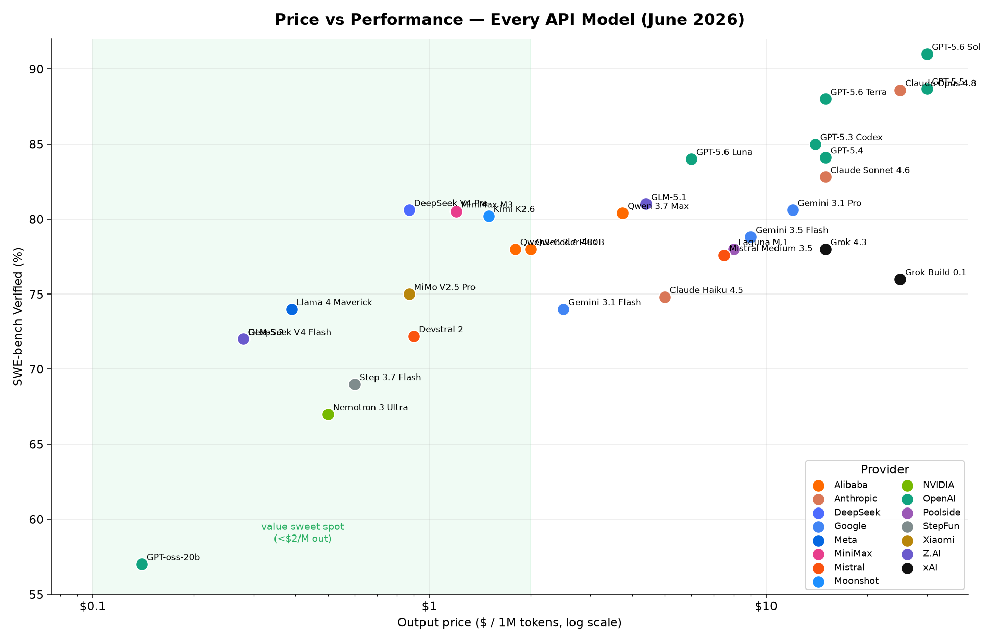
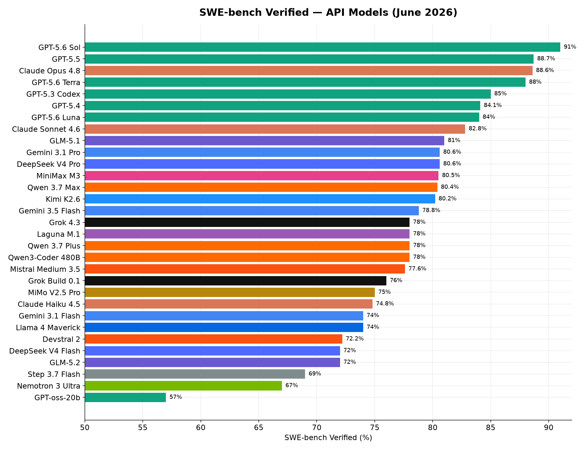
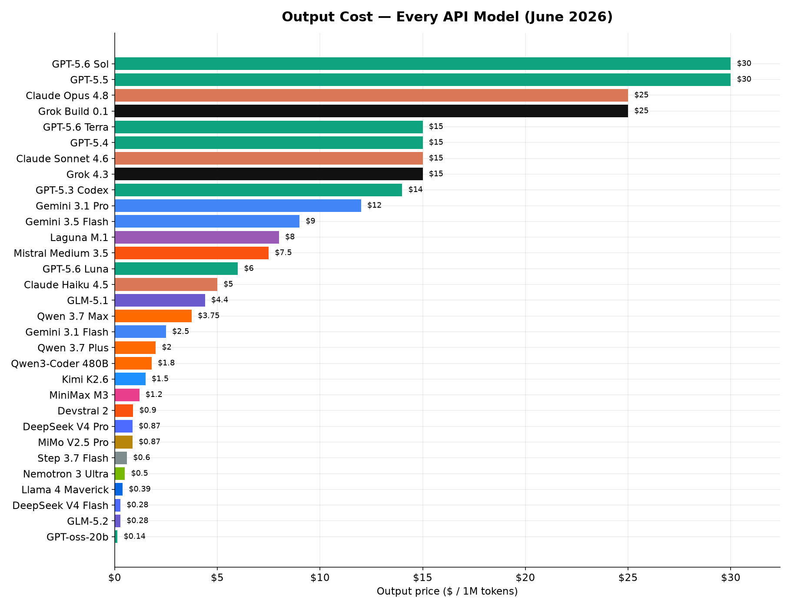
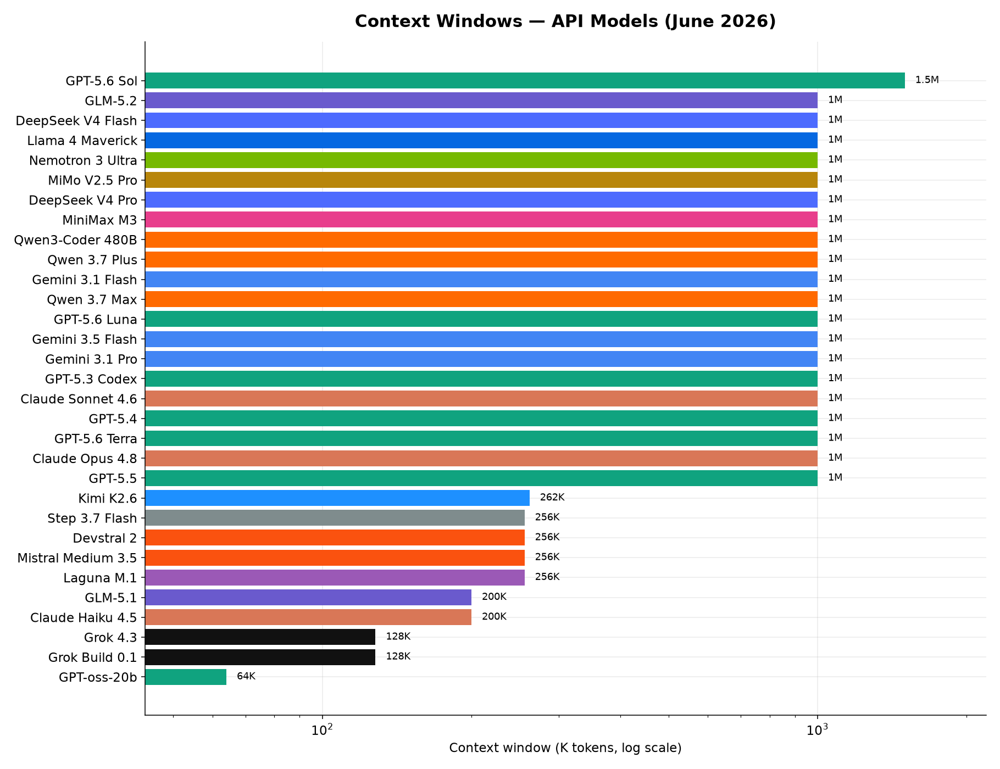
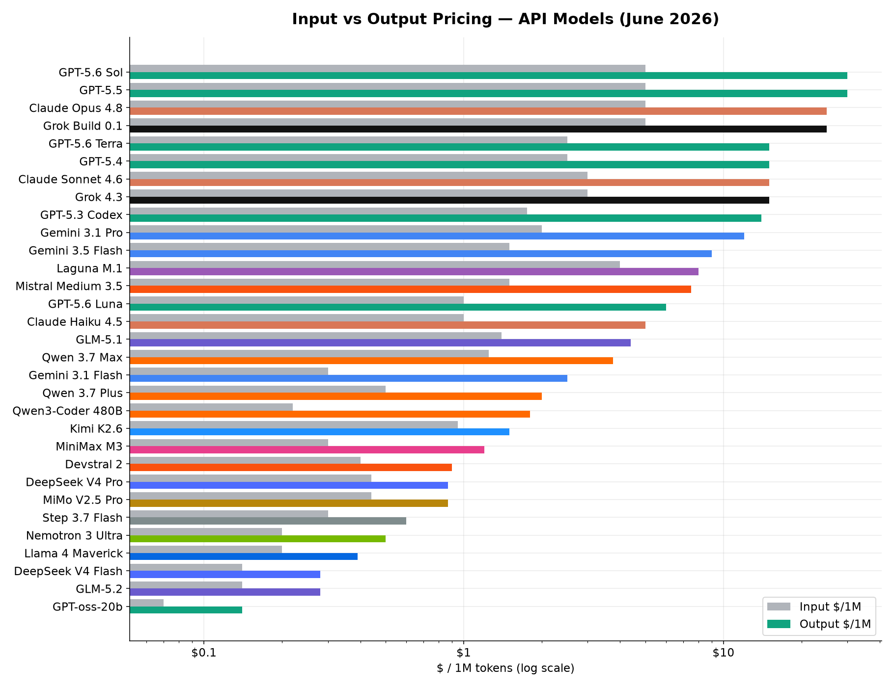
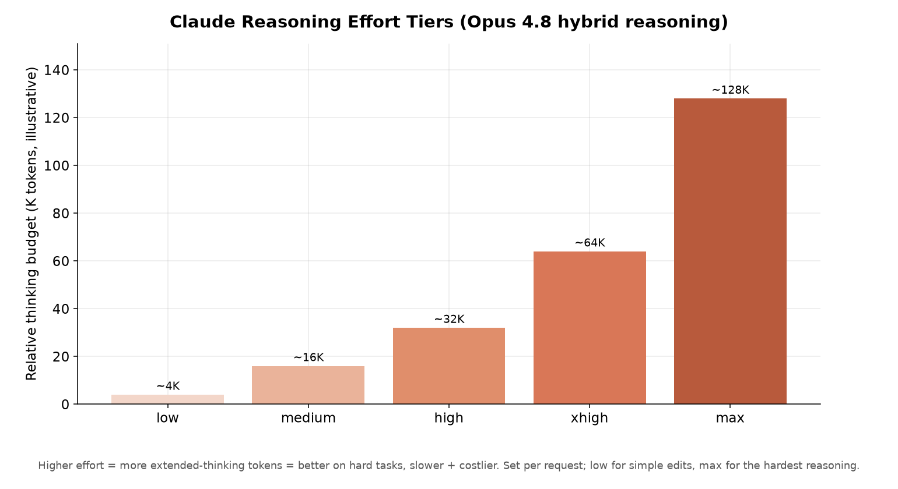
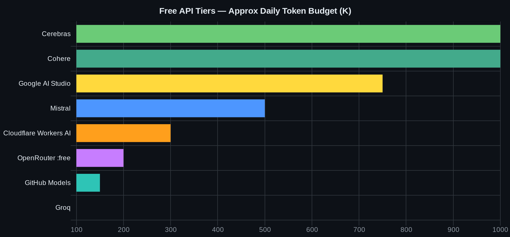

# 🧰 ToolkitArchive — The Vibe-Coding Archive (June 2026)

> One consolidated archive of **everything for vibe coding** — frontend builders, backends, databases, CLI agents, AI models, MCP, automation, media gen, and every way to get **free AI keys, credits, and freebies** on the internet.

 

> ✅ **Verified June 27, 2026.** Prices, free-tier limits, and star counts drift fast — re-check vendor pages before relying on a number.

---

## Map

| Stage | File | Contents |
|---|---|---|
| 🎨 **Build the frontend** | [FRONTEND.md](./FRONTEND.md) | AI app/UI builders, design-to-code, no-code sites, OSS self-hostable — free tiers |
| 🗄️ **Build the backend** | [BACKEND.md](./BACKEND.md) | BaaS, serverless DBs, hosting/deploy, auth, vector DBs, glue — **free-tier limits** |
| 🧠 **Pick the model** | [MODELS.md](./MODELS.md) | 31 API models (incl. GPT-5.6 Sol/Terra/Luna) + upcoming, pricing, context, proxy routes (data-driven) |
| 🆓 **Get it free** | [FREE-ACCESS.md](./FREE-ACCESS.md) · [CREDITS.md](./CREDITS.md) | 22+ free API tiers · credit-stacking, student/startup, sub-as-API, free GPU |
| 🤖 **Run agents** | [AGENTS.md](./AGENTS.md) | CLI agents (+emerging/proxy), IDEs, **MCP** (72K+ servers), frameworks, browser agents, automation, deploy, code-quality |
| 🎬 **Media & ops** | [MEDIA.md](./MEDIA.md) | Image/voice gen, LLMOps (observability/eval/gateways), docs |
| ⚡ **Skills & MCP** | [SKILLS.md](./SKILLS.md) | What MCP is, how to use Skills per IDE/CLI, skill repos (incl. [Claude-skill — 1,374 skills](https://github.com/Yash-Awasthi/Claude-skill)) |
| 📚 **Source repos** | [REFERENCES.md](./REFERENCES.md) | Runnable tools + proxy/router projects + merged awesome-lists |

> 📊 Charts + model tables are generated from [`data/models.json`](./data/models.json) → `python3 charts/gen_charts.py`.

---

## 📊 Every API Model — Charts

| | |
|:--:|:--:|
| **Price vs Performance** | **SWE-bench Verified** |
|  |  |
| **Output Cost** | **Context Windows** |
|  |  |
| **Input vs Output Pricing** | **Claude Reasoning Effort** |
|  |  |

> **Claude effort** (low → medium → high → xhigh → max): more extended-thinking tokens = better on hard tasks, slower + costlier. `low` for simple edits, `max` for the hardest reasoning (budgets illustrative).
> **Sweet spot:** 80%+ SWE-bench at under $2/M output (DeepSeek V4 Pro, MiniMax M3, Kimi K2.6).

---

## CLI Agent Rankings — Terminal-Bench 2.1

---

## CLI Agent Popularity — GitHub Stars

---

## Agentic IDE Pricing

---

## Free API Daily Token Budget

---

## Quick Reference

### 🆓 Zero-Dollar Vibe Stack
| Layer | Pick | Free |
|---|---|---|
| Build | Bolt.new (1M tokens/mo) or Dyad/bolt.diy + free key | $0 |
| Frontend host | Cloudflare Pages | unlimited bandwidth |
| Backend | Supabase (Postgres+Auth, 50K MAU) / PocketBase | $0 |
| DB extra | Neon / Turso / Xata (10GB) | $0 |
| Auth | WorkOS (1M MAU) / Supabase Auth | $0 |
| Edge fns | Cloudflare Workers (100K req/day) | $0 |
| LLM key | Groq + Cerebras + Google AI Studio + OpenRouter `:free` | $0 |
| Email / pay | Resend (3K/mo) / Stripe (no monthly) | $0 |

### 💰 Top Freebies (stack them)
| Freebie | Value | Where |
|---|---|---|
| Cloud trials | GCP $300 + AWS $300 + Azure $200 + Oracle $300 = **~$1,100** | [CREDITS.md](./CREDITS.md) |
| GitHub Student Pack | Copilot Pro + Azure $100 + DO $200 + Mongo $50 | education.github.com/pack |
| Startup credits | Google AI-First **$350K** · AWS GenAI $300K · Azure $150K | [CREDITS.md](./CREDITS.md) |
| Free GPU | Kaggle 30h/wk + Colab + Modal $30/mo | [CREDITS.md](./CREDITS.md) |
| Sub-as-API | Reuse Copilot/Claude sub via CLIProxyAPI | [CREDITS.md](./CREDITS.md) |
| Free frontier in Claude Code | Kiro OAuth → Claude 4.5 + GLM-5 + MiniMax (via 9router) | [REFERENCES.md](./REFERENCES.md) |
| Best free model | Qwen3-Coder 480B on OpenRouter `:free` (78% SWE-bench) | [FREE-ACCESS.md](./FREE-ACCESS.md) |

### Best model for performance
| Model | SWE-bench | Out $/1M | Context |
|---|---|---|---|
| GPT-5.6 Sol | ~91% [est] | $30 | 1.5M |
| GPT-5.5 | 88.7% | $30 | 1M |
| Claude Opus 4.8 | 88.6% | $25 | 1M |

> GPT-5.6 (Sol/Terra/Luna) is a gated preview (~20 orgs) as of Jun 26 — GA "coming weeks". SWE-bench est (OpenAI published Terminal-Bench).

### Best value (sweet spot)
| Model | SWE-bench | Out $/1M | Savings vs GPT-5.5 |
|---|---|---|---|
| DeepSeek V4 Pro | 80.6% | $0.87 | 34x cheaper |
| MiniMax M3 | 80.5% | $1.20 | 25x cheaper |
| Kimi K2.6 | 80.2% | $1.50 | 20x cheaper |
| MiMo V2.5 Pro | 75.0% | $0.87 | 34x cheaper |

### Best free model
**Qwen3-Coder 480B** on OpenRouter `:free` — 78% SWE-bench, 1M context, no card

### Best CLI agents
| Need | Agent | Stars |
|---|---|---|
| Max performance | Codex CLI (83.4%) | 93K |
| Best open-source | Hermes Agent (self-improving) | 200K |
| Fastest growing | Claw Code (Claude Code rewrite) | 194K |
| Privacy + offline | OpenCode (MIT, 75+ providers) | 177K |
| SSH / remote | JCode (Rust, 14ms boot) | ~4K |
| Free bundled model | MiMo Code (MiMo V2.5 Pro) | 5.6K |
| Minimal / fast | Pi (< 1K token system prompt) | 65K |
| AI-native terminal | Warp (open-source, MCP, cloud agents) | — |
| Best autonomous | OpenHands (77.6% SWE-bench) | 78K |

### Best agentic IDEs
| Need | IDE | Price |
|---|---|---|
| Best overall | Cursor Pro | $20/mo |
| Spec-driven / AWS | Kiro | $10/mo |
| Fully free | Trae / PearAI / Void | Free |
| Open ecosystem | Zed (ACP protocol) | Free |
| Unified GUI for all CLI agents | AionUI (28K★) | Free (Apache 2.0) |
| Multi-agent workforce desktop | Eigent (14.4K★) | Free (OSS) |

### Best autonomous agents (chat/web)
| Need | Tool | Price |
|---|---|---|
| Full autonomous tasks | Manus AI | Free / $20/mo |
| Enterprise multi-agent | Relevance AI | Free / $19/mo |
| Free GLM-5 chat | chat.z.ai | Free |
| Code + UI + deploy | Bolt.new / Lovable | Free / $20/mo |

### Best website builders
| Use Case | Tool | Price |
|---|---|---|
| Full-stack SaaS (React + DB + auth) | Lovable | $20/mo |
| React components + 1-click Vercel | V0 | Free / $20/mo |
| Max framework flexibility | Bolt.new | Free / $20/mo |
| Polished marketing site | Framer | $15/mo |
| CMS + editorial content | Webflow | $18/mo |
| 3D / cinematic portfolio | Draftly.space | Early access |
| Internal tools no-code | Base44 | $16/mo |

### Best deployment platforms
| Use Case | Platform | API |
|---|---|---|
| Next.js + edge functions | Vercel | REST |
| Fastest DX, any stack | Railway | REST + GraphQL |
| Reliable managed backend | Render | REST |
| Multi-region global | Fly.io | flyctl CLI |
| Self-hosted on VPS | Coolify | REST (Bearer) |
| Git-push minimal | Dokku | CLI |

### Best code quality tools
| Purpose | Tool | Free OSS |
|---|---|---|
| SAST + quality platform | SonarCloud | Yes |
| AI PR review (every commit) | CodeRabbit | Yes |
| Secrets scanning | Gitleaks / TruffleHog | Yes |
| Container + IaC vuln scan | Trivy | Yes |
| Python linting (fast) | Ruff | Yes |
| JS/TS linting | ESLint + Prettier | Yes |
| Multi-language SAST rules | Semgrep | Yes |

### Opus 4.8 free access
- **claude.ai** — daily cap on free plan
- **Anthropic API trial** — $5/90 days → console.anthropic.com
- **AWS Bedrock** new account — $300 credits/90 days
- **Notion Business trial** — 30 days unlimited

---

## Key Developments — June 2026

| Date | Event |
|---|---|
| Jun 26 | GPT-5.6 Sol/Terra/Luna preview — gated to ~20 orgs (US-gov cyber review) |
| Jun 12 | Fable 5 (95% SWE-bench) suspended — US export controls |
| Jun 16 | Z.AI releases GLM-5.2 — 1M ctx, MIT, free on chat.z.ai |
| Jun 11 | MiMo Code released — Xiaomi, OpenCode fork, free MiMo V2.5 Pro |
| Jun 2 | Windsurf → Devin Desktop; Cascade EOL July 1 |
| Jun 1 | GitHub Copilot → usage-based AI Credits ($0.01/credit) |
| May 28 | Warp goes open-source (MIT/AGPL dual license) |
| May 28 | Claude Opus 4.8 released — 1M ctx, hybrid reasoning |
| May 7 | Kiro launched — AWS spec-driven IDE |
| May 2 | Verdent AI ships — 76.1% SWE-bench, multi-agent parallel |
| Apr 27 | Meta's $2B Manus AI acquisition blocked by China antitrust |
| Apr | Hermes Agent (Nous Research) trends — 200K stars |
| Apr | JCode trends — Rust SSH agent, +670 stars/day |
| Apr | Claw Code hits 194K stars — fastest repo to 100K in history |
| Mar | Claude Code source leak → Claw Code fork created |
| May 19 | Gemini CLI retired → Antigravity CLI |

---

## Benchmark Notes

| Label | Meaning | Trust |
|---|---|---|
| `[open]` | Published on SWE-bench Verified / tbench.ai | High |
| `[V]` | Vendor-reported own scaffold | Medium — 10-20pt above Scale SEAL |
| `[C]` | Closed, no public leaderboard | Low — directional |
| `[est]` | Community estimated | Low — directional |

Scale SEAL standardized (June 2026): GPT-5.4 xHigh **59.1%** · Opus 4.6 **51.9%** · Haiku 4.5 **39.5%**
