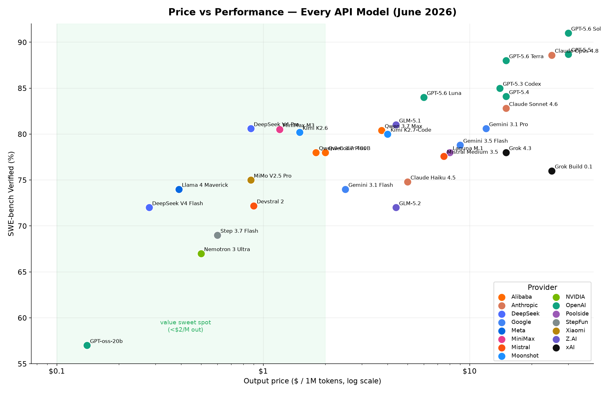
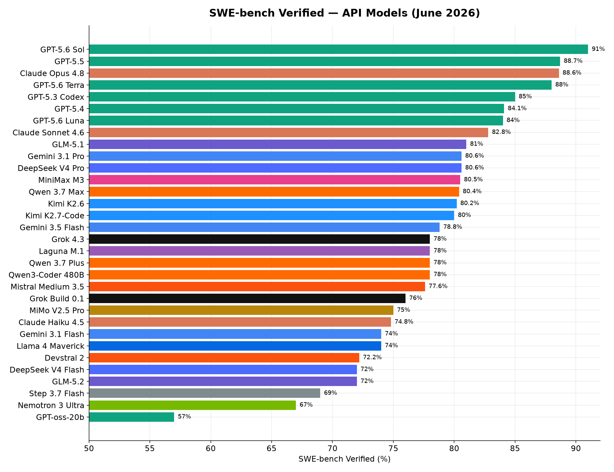
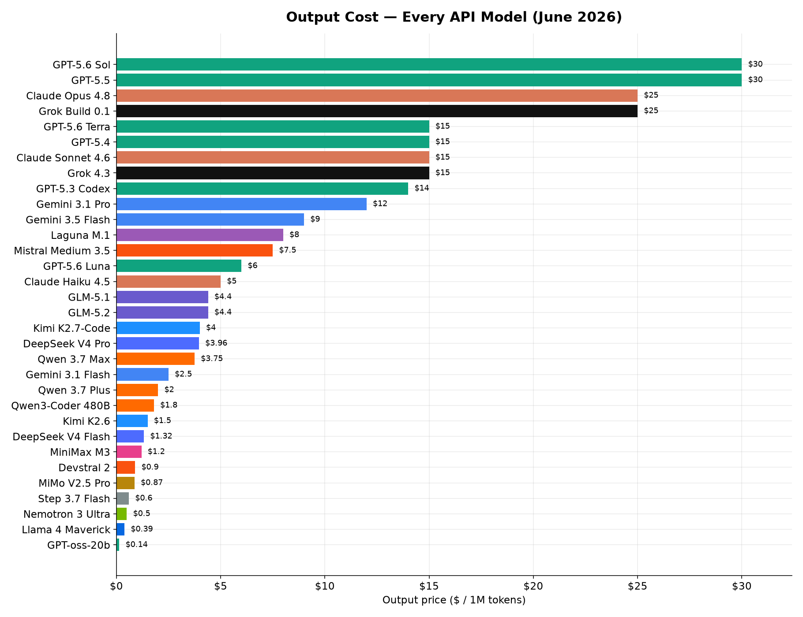
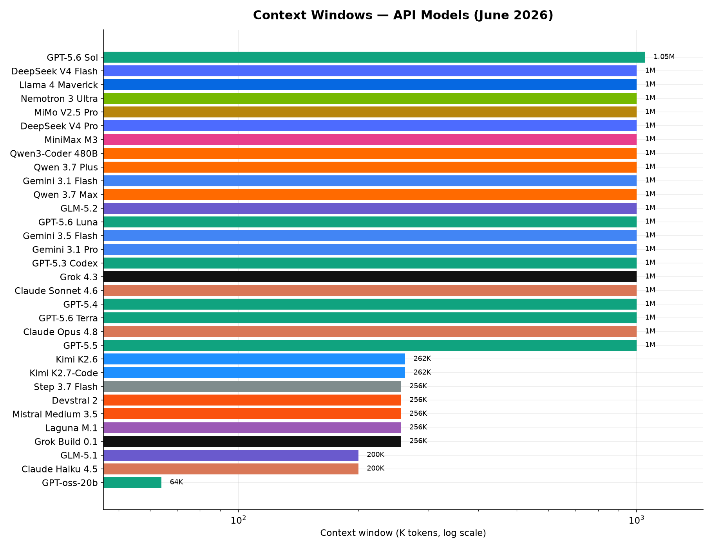
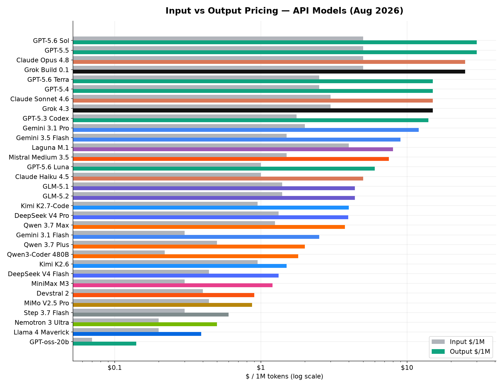
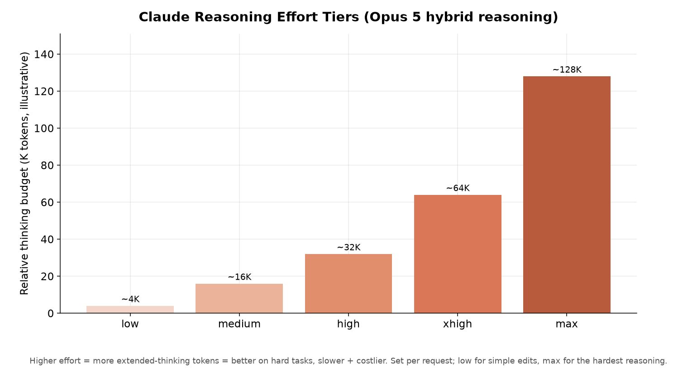
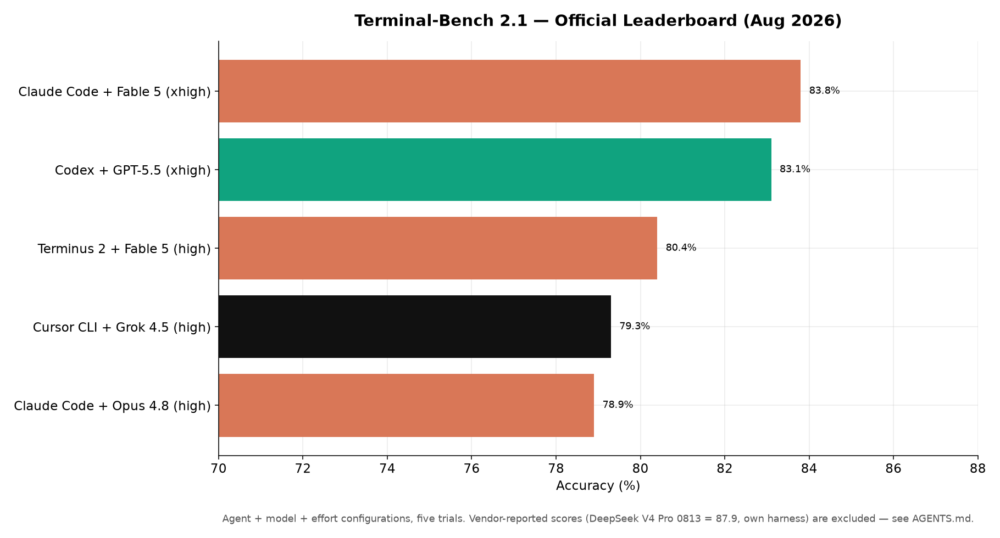
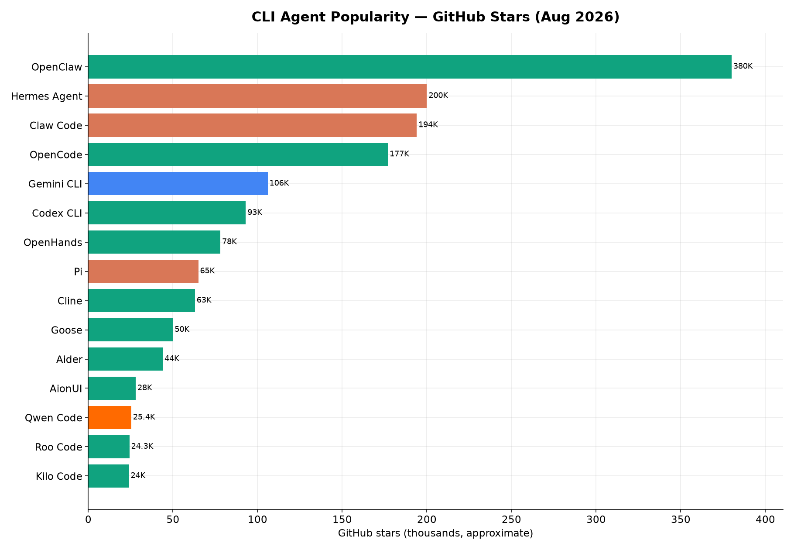
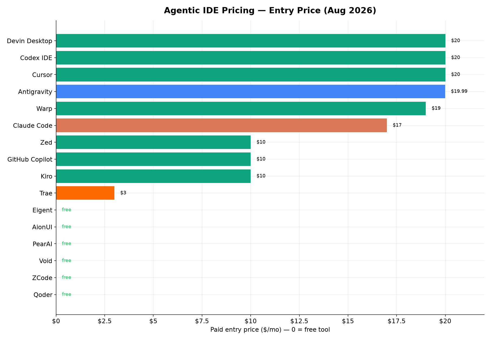
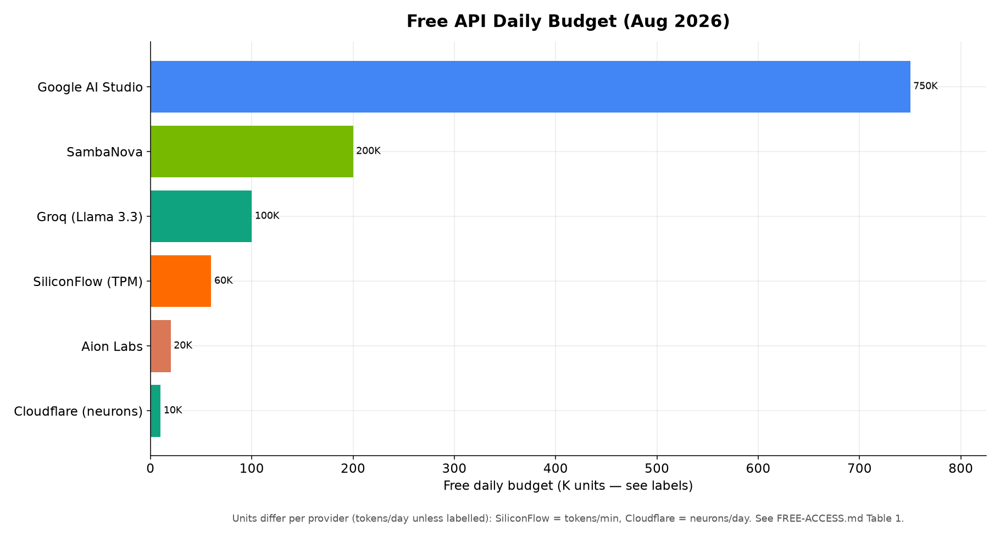

# 🧰 ToolkitArchive — The Vibe-Coding Archive (re-checked 17 August 2026)

> One consolidated archive of **everything for vibe coding** — frontend builders, backends, databases, CLI agents, AI models, MCP, automation, media gen, and every way to get **free AI keys, credits, and freebies** on the internet.

 

> ✅ **Re-checked Aug 17, 2026** (prior passes: June 27 and Aug 16, 2026). This pass added the August free-AI wave surfaced on Reddit/Instagram and verified live (aerolink.lat, OmniRoute, NaraRouter, LongCat-2.0, GoRouter, Tokeness, OpenRouter Fusion), upgraded AgentRouter/Bluesminds from unverified to caveated, and refreshed models/benchmarks: DeepSeek V4 Pro GA + new peak/off-peak pricing (Aug 13/16), Qwen 3.8-Max (Aug 2), Gemini 3.7 Flash (Aug 13), Grok 4.6 + SpaceXAI rebrand (Aug 12), Claude Opus 5 / Sonnet 5 pricing, GPT-5.6 GA (Jul 9), Gemini 3.5 Pro still unreleased. Not every figure in every file was independently re-fetched this pass — where a number is carried over from an earlier pass, the file says so. Prices, free-tier limits, and star counts drift fast regardless — re-check vendor pages before relying on a number.

---

## Map

| Stage | File | Contents |
|---|---|---|
| 🎨 **Build the frontend** | [FRONTEND.md](./FRONTEND.md) | AI app/UI builders, design-to-code, no-code sites, OSS self-hostable — free tiers |
| 🗄️ **Build the backend** | [BACKEND.md](./BACKEND.md) | BaaS, serverless DBs, hosting/deploy, auth, vector DBs, glue — **free-tier limits** |
| 🧠 **Pick the model** | [MODELS.md](./MODELS.md) | 32 API models (incl. GPT-5.6 Sol/Terra/Luna) + upcoming, pricing, context, proxy routes (data-driven) |
| 🆓 **Get it free** | [FREE-ACCESS.md](./FREE-ACCESS.md) · [CREDITS.md](./CREDITS.md) ([provider trust status](./CREDITS.md#part-6--provider-trust-status)) | 22+ free API tiers · credit-stacking, student/startup, sub-as-API, free GPU |
| 🤖 **Run agents** | [AGENTS.md](./AGENTS.md) | CLI agents (+emerging/proxy), IDEs, **MCP** (72K+ servers), frameworks, browser agents, automation, deploy, code-quality |
| 🎬 **Media & ops** | [MEDIA.md](./MEDIA.md) | Image/voice gen, LLMOps (observability/eval/gateways), docs |
| ⚡ **Skills & MCP** | [SKILLS.md](./SKILLS.md) | What MCP is, how to use Skills per IDE/CLI, skill repos (start at [anthropics/skills](https://github.com/anthropics/skills)) |
| 📚 **Source repos** | [REFERENCES.md](./REFERENCES.md) | Runnable tools + proxy/router projects + merged awesome-lists |

> 📊 **All charts are generated** — model charts from [`data/models.json`](./data/models.json), agent/IDE/free-tier charts from [`data/extra_charts.json`](./data/extra_charts.json) → `python3 charts/gen_charts.py`. The "32 API models" count above is the length of the `models` array — update it whenever an entry is added or removed there, and keep `extra_charts.json` in sync with the AGENTS.md/FREE-ACCESS.md tables it mirrors.

---

## 📊 Every API Model — Charts

| | |
|:--:|:--:|
| **Price vs Performance** | **SWE-bench Verified** |
|  |  |
| **Output Cost** | **Context Windows** |
|  |  |
| **Input vs Output Pricing** | **Claude Reasoning Effort** |
|  |  |

> **Claude effort** (low → medium → high → xhigh → max): more extended-thinking tokens = better on hard tasks, slower + costlier. `low` for simple edits, `max` for the hardest reasoning (budgets illustrative).
> **Sweet spot:** 80%+ SWE-bench at under $2/M output (MiniMax M3, Kimi K2.6, MiMo V2.5 Pro — DeepSeek V4 Pro moved out on its Aug 16 GA pricing).

---

## CLI Agent Rankings — Terminal-Bench 2.1



---

## CLI Agent Popularity — GitHub Stars



---

## Agentic IDE Pricing



---

## Free API Daily Budget



> Generated from [`data/extra_charts.json`](./data/extra_charts.json), which mirrors
> [FREE-ACCESS.md](./FREE-ACCESS.md) Table 1 (17 Aug 2026). Units differ per provider — the labels
> on the chart say which is which (tokens/day unless marked; SiliconFlow = tokens/min, Cloudflare =
> neurons/day).

---

## Quick Reference

### 🆓 Zero-Dollar Vibe Stack
| Layer | Pick | Free |
|---|---|---|
| Build | Bolt.new (1M tokens/mo) or Dyad/bolt.diy + free key | $0 |
| Frontend host | Cloudflare Pages | unlimited bandwidth |
| Backend | Supabase (Postgres+Auth, 50K MAU) / PocketBase | $0 |
| DB extra | Neon / Turso / Xata (10GB) | $0 |
| Auth | WorkOS (1M MAU) / Supabase Auth | $0 |
| Edge fns | Cloudflare Workers (100K req/day) | $0 |
| LLM key | Groq + Cerebras + Google AI Studio + OpenRouter `:free` | $0 |
| Skills | anthropics/skills + obra/superpowers (→ [SKILLS.md](./SKILLS.md)) | $0 |
| Email / pay | Resend (3K/mo) / Stripe (no monthly) | $0 |

### 💰 Top Freebies (stack them)
| Freebie | Value | Where |
|---|---|---|
| Cloud trials | GCP $300 + AWS $300 + Azure $200 + Oracle $300 = **~$1,100** | [CREDITS.md](./CREDITS.md) |
| GitHub Student Pack | Copilot Pro + Azure $100 + DO $200 + Mongo $50 | education.github.com/pack |
| Startup credits | Google AI-First **$350K** · AWS GenAI $300K · Azure $150K | [CREDITS.md](./CREDITS.md) |
| Free GPU | Kaggle 30h/wk + Colab + Modal $30/mo | [CREDITS.md](./CREDITS.md) |
| Sub-as-API | Reuse Copilot/Claude sub via CLIProxyAPI | [CREDITS.md](./CREDITS.md) |
| Free frontier in Claude Code | Kiro OAuth → Claude 4.5 + GLM-5 + MiniMax (via 9router) | [REFERENCES.md](./REFERENCES.md) |
| Free-AI wave (Aug 2026) | OmniRoute ~1.5B tokens/mo pooled · NaraRouter 5-7M/day · aerolink $35/wk | [FREE-ACCESS.md](./FREE-ACCESS.md) |
| Best free model | Qwen3-Coder 480B on OpenRouter `:free` (78% SWE-bench) | [FREE-ACCESS.md](./FREE-ACCESS.md) |

### Best model for performance
| Model | SWE-bench | Out $/1M | Context |
|---|---|---|---|
| GPT-5.6 Sol | ~91% [est] | $30 | 1.05M |
| GPT-5.5 | 88.7% | $30 | 1M |
| Claude Opus 4.8 | 88.6% | $25 | 1M |

> Claude **Opus 5** (current flagship, Jul 24, $5/$25, 1M ctx) has no public SWE-bench yet — the 88.6% above is Opus 4.8's published score, closest available. GPT-5.6 (Sol/Terra/Luna) went GA on **Jul 9, 2026** across ChatGPT, Codex, and the API. SWE-bench figures are estimates; OpenAI published Terminal-Bench for the family.

### Best value (sweet spot)
| Model | SWE-bench | Out $/1M | Savings vs GPT-5.5 |
|---|---|---|---|
| MiniMax M3 | 80.5% | $1.20 | 25x cheaper |
| Kimi K2.6 | 80.2% | $1.50 | 20x cheaper |
| MiMo V2.5 Pro | 75.0% | $0.87 | 34x cheaper |
| DeepSeek V4 Pro | 80.6% | $1.98–3.96 | 7.6-15x cheaper (GA pricing, Aug 16) |

### Best free model
**Qwen3-Coder 480B** on OpenRouter `:free` — 78% SWE-bench, 1M context, no card

### Best CLI agents
| Need | Agent | Stars |
|---|---|---|
| Max performance | Codex CLI (83.1% TB 2.1) | 93K |
| Best open-source | Hermes Agent (self-improving) | 200K |
| Fastest growing | Claw Code (Claude Code rewrite) | 194K |
| Privacy + offline | OpenCode (MIT, 75+ providers) | 177K |
| SSH / remote | JCode (Rust, 14ms boot) | ~4K |
| Free bundled model | MiMo Code (MiMo V2.5 Pro) | 5.6K |
| Minimal / fast | Pi (< 1K token system prompt) | 65K |
| AI-native terminal | Warp (open-source, MCP, cloud agents) | — |
| Best autonomous | OpenHands (77.6% SWE-bench) | 78K |
| Best new OSS harness | DeepSeek Harness (MIT, plugin-everything, Aug 14) | rising |

### Best agentic IDEs
| Need | IDE | Price |
|---|---|---|
| Best overall | Cursor Pro | $20/mo |
| Spec-driven / AWS | Kiro | $10/mo |
| Fully free | Trae / PearAI / Void | Free |
| Open ecosystem | Zed (ACP protocol) | Free |
| Unified GUI for all CLI agents | AionUI (28K★) | Free (Apache 2.0) |
| Multi-agent workforce desktop | Eigent (14.4K★) | Free (OSS) |

### Best autonomous agents (chat/web)
| Need | Tool | Price |
|---|---|---|
| Full autonomous tasks | Manus AI | Free / $20/mo |
| Enterprise multi-agent | Relevance AI | Free / $19/mo |
| Free GLM-5 chat | chat.z.ai | Free |
| **Free GLM-5.3 coding (new)** | **ZCode** (free since Aug 16–17; only place GLM-5.3 runs) | Free |
| Code + UI + deploy | Bolt.new / Lovable | Free / $20/mo |

### Best website builders
| Use Case | Tool | Price |
|---|---|---|
| Full-stack SaaS (React + DB + auth) | Lovable | $20/mo |
| React components + 1-click Vercel | V0 | Free / $20/mo |
| Max framework flexibility | Bolt.new | Free / $20/mo |
| Polished marketing site | Framer | $15/mo |
| CMS + editorial content | Webflow | $18/mo |
| 3D / cinematic portfolio | Draftly.space | Early access |
| Internal tools no-code | Base44 | $16/mo |

### Best deployment platforms
| Use Case | Platform | API |
|---|---|---|
| Next.js + edge functions | Vercel | REST |
| Fastest DX, any stack | Railway | REST + GraphQL |
| Reliable managed backend | Render | REST |
| Multi-region global | Fly.io | flyctl CLI |
| Self-hosted on VPS | Coolify | REST (Bearer) |
| Git-push minimal | Dokku | CLI |

### Best code quality tools
| Purpose | Tool | Free OSS |
|---|---|---|
| SAST + quality platform | SonarCloud | Yes |
| AI PR review (every commit) | CodeRabbit | Yes |
| Secrets scanning | Gitleaks / TruffleHog | Yes |
| Container + IaC vuln scan | Trivy | Yes |
| Python linting (fast) | Ruff | Yes |
| JS/TS linting | ESLint + Prettier | Yes |
| Multi-language SAST rules | Semgrep | Yes |

### 🤖 Agentic systems stack (the 2026 recipe)

> How the pieces of this archive assemble into a complete agentic setup — IDE, agent, skills,
> tool access, routing, sandbox, and how to judge it. Each layer links to its full file.

| Layer | Pick | Free? | File |
|---|---|---|---|
| IDE | Cursor Pro · Kiro · **Qoder (free)** · Codex IDE · Trae · Zed | Free–$20/mo | [AGENTS.md](./AGENTS.md) Part 2 |
| CLI agent | Claude Code · Codex CLI · OpenCode · **DeepSeek Harness (OSS)** | Free BYOK + free tiers | [AGENTS.md](./AGENTS.md) Part 1 |
| Skills | anthropics/skills + obra/superpowers (lazy-loaded, open standard) | $0 | [SKILLS.md](./SKILLS.md) |
| Tool access (MCP) | GitHub/Playwright/Context7 servers + remote MCP (Vercel, Cloudflare) | $0 | [AGENTS.md](./AGENTS.md) Part 5A |
| Model routing | OmniRoute (self-host) / free-llm-gateway pool 340+ providers; OpenRouter `:free` | $0 | [FREE-ACCESS.md](./FREE-ACCESS.md) |
| Sandbox / eval | E2B · Daytona · Vercel Sandbox; Langfuse / AgentOps for tracing | $0–$30/mo credits | [BACKEND.md](./BACKEND.md) Part 1A · [MEDIA.md](./MEDIA.md) Part 3 |
| Judge it | TB 2.1 for agents (official snapshot) · SWE-bench for models (harness-aware) | — | [AGENTS.md](./AGENTS.md) · [MODELS.md](./MODELS.md) |

### Opus 5 free access (corrected Aug 17)
- **claude.ai** — free plan is **Sonnet 5, not Opus**; Opus 5 needs Pro/Max ($17+/mo)
- **Anthropic API trial** — $5/90 days → console.anthropic.com (covers Opus 5)
- **AWS Bedrock** new account — $300 credits/90 days, model `anthropic.claude-opus-5`
- **Notion Business trial** — 30 days unlimited (unverified this pass)

---

## Key Developments — July–August 2026

| Date | Event |
|---|---|
| Jul 9 | **GPT-5.6 Sol/Terra/Luna GA** — ChatGPT, Codex, and API |
| Jul 21 | Gemini 3.6 Flash + 3.5 Flash-Lite + 3.5 Flash Cyber |
| Jul 24 | Claude Opus 5 — $5/$25 (same as Opus 4.8) |
| Jul 31 | DeepSeek V4 Flash official (0731) — TB 2.1 82.7 (own harness) |
| Aug 2 | Qwen 3.8-Max — 2.4T MoE, $2/$6, 1M ctx |
| Aug 5 | **Meta Muse Code** — Meta's first coding agent (terminal, beta, multi-agent), powered by Muse Spark 1.2 |
| Aug 12 | Qwen 3.8 open weights (text-only); Grok 4.6 ($2/$6); xAI → SpaceXAI |
| Aug 13 | **DeepSeek V4 Pro GA** (TB 2.1 87.9, own harness); **Gemini 3.7 Flash** ($0.75/$3.75 thru 2026) |
| Aug 14 | **GLM-5.3** (Z.AI) — same GLM-5.2 base, post-training only, ~750B; free on ZCode since Aug 16–17; open weights ~2 weeks |
| Aug 16 | DeepSeek peak/off-peak API pricing takes effect (off-peak = half) |
| Aug 2026 | Free-AI wave: OmniRoute (29K★, ~1.5B tok/mo), NaraRouter (5-7M tok/day), aerolink ($35/wk), LongCat-2.0 free quotas — see [FREE-ACCESS.md](./FREE-ACCESS.md) |
| Watch | Gemini 3.5 Pro — still not GA as of Aug 12 (missed June, Jul 17, and a rumored Aug 12 date) |

## Key Developments — June 2026

| Date | Event |
|---|---|
| Jun 26 | GPT-5.6 Sol/Terra/Luna preview — gated to ~20 orgs (US-gov cyber review) |
| Jun 12 | Fable 5 (95% SWE-bench) suspended — US export controls |
| Jun 16 | Z.AI releases GLM-5.2 — 1M ctx, MIT, free on chat.z.ai |
| Jun 11 | MiMo Code released — Xiaomi, OpenCode fork, free MiMo V2.5 Pro |
| Jun 2 | Windsurf → Devin Desktop; Cascade EOL July 1 |
| Jun 1 | GitHub Copilot → usage-based AI Credits ($0.01/credit) |
| May 28 | Warp goes open-source (MIT/AGPL dual license) |
| May 28 | Claude Opus 4.8 released — 1M ctx, hybrid reasoning |
| May 7 | Kiro launched — AWS spec-driven IDE |
| May 2 | Verdent AI ships — 76.1% SWE-bench, multi-agent parallel |
| Apr 27 | Meta's $2B Manus AI acquisition blocked by China antitrust |
| Apr | Hermes Agent (Nous Research) trends — 200K stars |
| Apr | JCode trends — Rust SSH agent, +670 stars/day |
| Apr | Claw Code hits 194K stars — fastest repo to 100K in history |
| Mar | Claude Code source leak → Claw Code fork created |
| ~~May 19~~ | ~~Gemini CLI retired → Antigravity CLI~~ — corrected: the repo is live with a free tier, this claim was unverified aggregator noise, see [AGENTS.md](./AGENTS.md) Part 1 |

---

## In plain words — what changed the week of Aug 10–17, 2026

Quick, intuition-first digest. Details + sources live in the file each row points to.

- **A new frontier model every ~3 days.** This week alone: Grok 4.6 (Aug 12), DeepSeek V4 Pro GA (Aug 13), Gemini 3.7 Flash (Aug 13), GLM-5.3 (Aug 14). The archive's [MODELS.md](./MODELS.md) now reflects all of them — Gemini 3.7 Flash is the new free-tier workhorse on Google AI Studio, and DeepSeek V4 Pro's GA pricing (peak/off-peak, Aug 16) is roughly 3-4x the old preview price but still the cheapest way to get near-frontier quality. [MODELS.md](./MODELS.md)
- **GLM-5.3 is the free coding deal of the week.** Z.AI shipped it Aug 14 as the same GLM-5.2 base with post-training only (~750B — a third of Kimi K3), and it's free right now on **ZCode**, Z.AI's desktop coding agent (the only place it runs until the API and open weights land in ~2 weeks). Vendors claim it tops Kimi K3 and approaches Fable 5 on coding benchmarks — treat as a claim until independent runs. Also: **Zed gives students Zed Pro free for 12 months with $10/mo AI credit** (zed.dev/education, GitHub 30+ days + edu email) — already in [CREDITS.md](./CREDITS.md) Part 2.
- **Fresh from the Instagram/Reddit sweep (17 Aug):** **OrcaRouter** — MIT OpenRouter alternative with free dev credits (no card), free BYOK, voucher drops + student credits + hackathon grants — added to the aggregators table. **findaicredits.com** — directory of free AI credits/coupons — added to Useful Repos. **oxaam.com** — was already caveated in CREDITS.md Part 6; this pass it was upgraded to scam-flagged after r/Scams / r/isthisascam / r/AI_Agents threads — do not put a real login into it.
- **Meta finally shipped a coding agent.** **Muse Code** (beta, Aug 5, CNBC + research.meta.ai) — terminal-based, multi-agent by default, one-command install on macOS/Linux, powered by the new **Muse Spark 1.2** (also on the Meta Model API, tiered pricing). No TB 2.1/SWE-bench published yet — added as ⚠️ beta in [AGENTS.md](./AGENTS.md) Part 1. And **MCP 2.0 (the 2026-07-28 spec)** landed — stateless/cacheable/routable transports, Sampling deprecated — new integrations should target it ([AGENTS.md](./AGENTS.md) Part 5A).
- **"Free AI" now means a router, not a single model.** The August wave — OmniRoute (~1.5B free tokens/mo pooled), NaraRouter (5-7M tokens/day), aerolink ($35/wk credits), LongCat-2.0 free quotas — is one gateway in front of many free tiers. Stack two or three and you effectively never pay for hobby coding. Caveats included; read the rows. [FREE-ACCESS.md](./FREE-ACCESS.md)
- **DeepSeek's "thinking" is now tunable + faster.** V4 Pro/Flash GA adds low/high/max thinking effort (pick max only for the hard stuff) and native Responses-API/Codex support. DSpark (speculative decoding, Jun 27) makes the same model 50-600% faster to serve — grab the weights on HuggingFace. [MODELS.md](./MODELS.md)
- **Two watch items:** Gemini 3.5 Pro still hasn't shipped (missed June, Jul 17, and a rumored Aug 12 date) — Google is shipping Flash iterations instead. And most "free credits" gateways (AgentRouter, Bluesminds, aerolink) are un-audited resellers: great for testing, not production. [MODELS.md](./MODELS.md) · [FREE-ACCESS.md](./FREE-ACCESS.md)

---

## Benchmark Notes

| Label | Meaning | Trust |
|---|---|---|
| `[open]` | Published on SWE-bench Verified / tbench.ai | High |
| `[V]` | Vendor-reported own scaffold | Medium — 10-20pt above Scale SEAL |
| `[C]` | Closed, no public leaderboard | Low — directional |
| `[est]` | Community estimated | Low — directional |

Scale SEAL standardized (June 2026): GPT-5.4 xHigh **59.1%** · Opus 4.6 **51.9%** · Haiku 4.5 **39.5%**

---

## Keeping This Archive Honest

### Provider trust tiers

Every provider mentioned in this archive falls into one of four tiers. The full breakdown, with the actual providers in each tier, lives in [CREDITS.md Part 6](./CREDITS.md#part-6--provider-trust-status); the rule itself has also been applied to entries in [FREE-ACCESS.md](./FREE-ACCESS.md), [BACKEND.md](./BACKEND.md), and [AGENTS.md](./AGENTS.md).

| Tier | Meaning |
|---|---|
| **Clean** | Confirmed real and doing what it claims — safe to read as a plain fact anywhere in this archive |
| **Caveat** | Real, but with a rough edge (a disputed number, a pooled-login/ToS risk, a claim only sourced to one side) — the entry carries a one-line warning, read it before relying on the row |
| **Unverified** | Not independently confirmed — kept out of the plain tables, listed only in its own section, never a source of a plain fact |
| **Kept out** | A confirmed scam, or a name shared by unrelated companies that hasn't been disambiguated — excluded from the archive entirely, except as a warning |

A provider only earns a plain, unqualified entry once it's confirmed both real and doing what it claims — a real product with a rough edge still gets the caveat sentence, never a silent plain entry.

### Link check

`scripts/link_check.py` walks every markdown file in the repo, pulls every URL out of it, and checks each one (HEAD, falling back to GET on a 405 or 4xx/5xx) concurrently. Run it with:

```bash
pip install requests
python3 scripts/link_check.py
```

It prints dead links (4xx/5xx, timeout, or connection error) and redirected links, grouped by the file that references them, and exits with status 1 if anything is dead. Known placeholder URLs used as fill-in-the-blank examples (`your-coolify.com`, `localhost:PORT`, and similar) are ignored by pattern instead of being reported as dead. It only checks that a link resolves — it does not check whether the page behind it still says what this archive claims it says; that's still a manual re-check against the trust tiers above.
