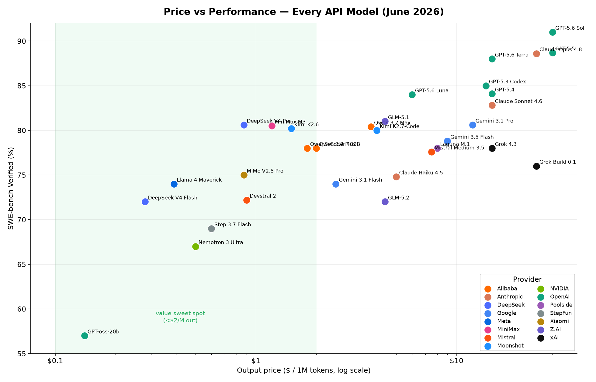
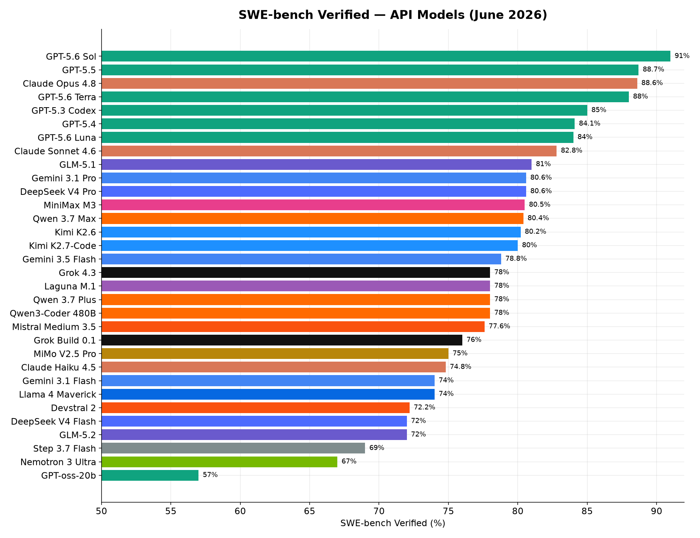
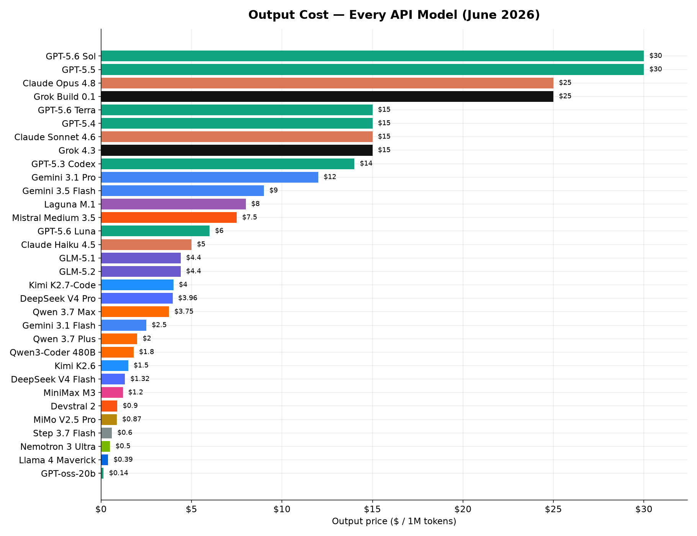
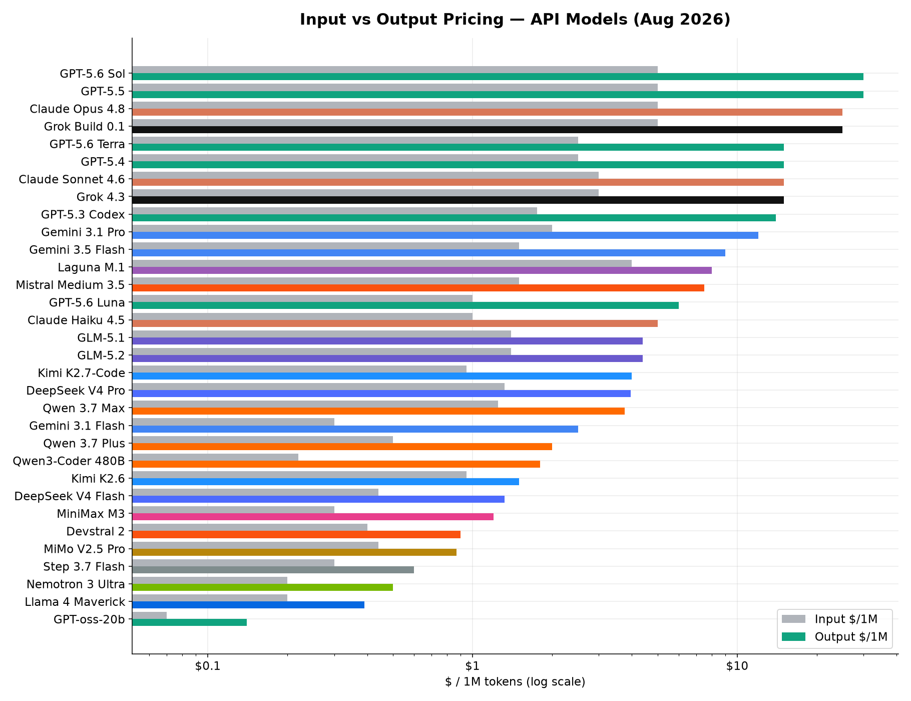
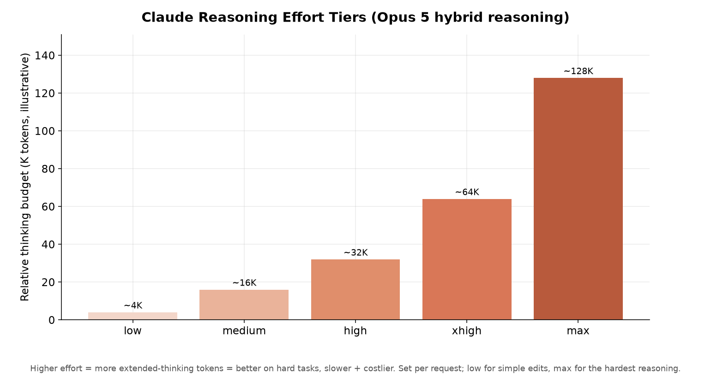
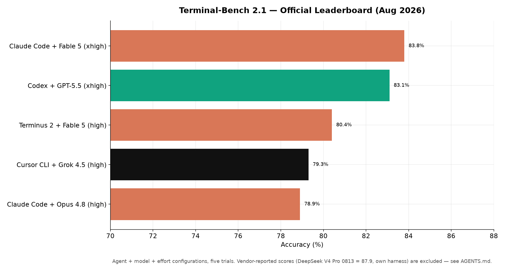
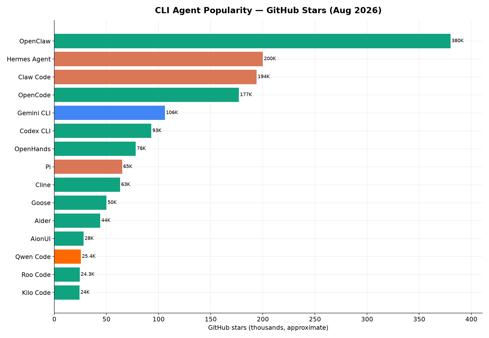
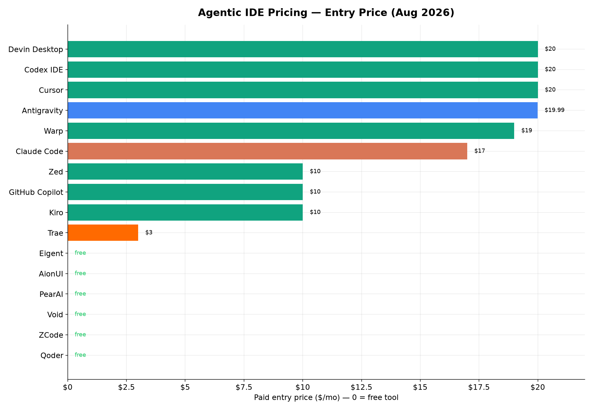
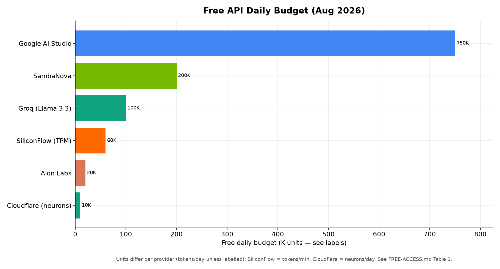

# 🧰 ToolkitArchive — The Vibe-Coding Archive (re-checked 29 September 2026)

> One consolidated archive of **everything for vibe coding** — frontend builders, backends, databases, CLI agents, AI models, MCP, automation, media gen, and every way to get **free AI keys, credits, and freebies** on the internet.

 

> 🎓 **Students / zero budget:** start at [STUDENTS.md](./STUDENTS.md). ⛔ Avoid aerolink.lat and lumosel.vip — they bill for Claude but serve Qwen/DeepSeek.
>
> 🔄 **29 Sep 2026 pass:** the September model wave (Claude Opus 5.5 / Sonnet 5.5 / Fable 5.1, GPT-6 Astra / Sol / Luna, Grok 4.7, Gemini 3.8 Flash, DeepSeek V4.1 Flash, MiMo-V2.6, Muse Spark 1.3), Terminal-Bench 4.0, the new free wave (Cline free models, Freebuff, OpenRouter free list, TokenRa stealth models), typed decision models (Jev, laya-mlx), a **ZCode security warning**, and a fix to the Gemini CLI retirement. Start with [NEWS.md](./NEWS.md); per-benchmark rankings are in [benchmarks.html](./benchmarks.html).
>
> ✅ **Re-checked Aug 17, 2026** (prior passes: June 27 and Aug 16, 2026). This pass added the August free-AI wave surfaced on Reddit/Instagram and verified live (aerolink.lat, OmniRoute, NaraRouter, LongCat-2.0, GoRouter, Tokeness, OpenRouter Fusion), upgraded AgentRouter/Bluesminds from unverified to caveated, and refreshed models/benchmarks: DeepSeek V4 Pro GA + new peak/off-peak pricing (Aug 13/16), Qwen 3.8-Max (Aug 2), Gemini 3.7 Flash (Aug 13), Grok 4.6 + SpaceXAI rebrand (Aug 12), Claude Opus 5 / Sonnet 5 pricing, GPT-5.6 GA (Jul 9), Gemini 3.5 Pro still unreleased. Not every figure in every file was independently re-fetched this pass — where a number is carried over from an earlier pass, the file says so. Prices, free-tier limits, and star counts drift fast regardless — re-check vendor pages before relying on a number.

---

## Map

| Stage | File | Contents | Freshness |
|---|---|---|---|
| 🎓 **Students / $0** | [STUDENTS.md](./STUDENTS.md) | Free alternative to every paid tool, the $0 stack, student programs, scam list | ✅ 29 Sep 2026 |
| 🛠️ **Use AI well** | [USAGE.md](./USAGE.md) | Claude / ChatGPT / Gemini power features (scheduled tasks, Projects, Gems, NotebookLM), skills/plugins/MCP how-to, token-efficiency guide | ✅ 29 Sep 2026 |
| 🎨 **Build the frontend** | [FRONTEND.md](./FRONTEND.md) | AI app/UI builders, design-to-code, no-code sites, OSS self-hostable — free tiers | ⏳ June-era (Part 1 ✅ 17 Aug) |
| 🗄️ **Build the backend** | [BACKEND.md](./BACKEND.md) | BaaS, serverless DBs, hosting/deploy, auth, vector DBs, glue — **free-tier limits** | ⏳ June-era (1A + a few rows Aug 16) |
| 📰 **What changed** | [NEWS.md](./NEWS.md) · [benchmarks.html](./benchmarks.html) | Sept 2026 releases, security alerts, corrections · interactive per-benchmark rankings (open in a browser) | ✅ 29 Sep 2026 |
| 🧠 **Pick the model** | [MODELS.md](./MODELS.md) | Current lineup (Sept 2026) + 32-model Aug reference table, typed decision models, pricing, context, proxy routes | ✅ 29 Sep 2026 (Table 1 = Aug snapshot) |
| 🆓 **Get it free** | [FREE-ACCESS.md](./FREE-ACCESS.md) · [CREDITS.md](./CREDITS.md) ([provider trust status](./CREDITS.md#part-6--provider-trust-status)) | Sept free wave + 28 no-card tiers + hidden gems + aggregators · credit-stacking, student/startup, sub-as-API, free GPU | ✅ 29 Sep 2026 (CREDITS Parts 1–5 ⏳ June-era) |
| 🤖 **Run agents** | [AGENTS.md](./AGENTS.md) | CLI agents (+emerging/proxy), IDEs, Terminal-Bench 4.0, **MCP** (72K+ servers), frameworks, browser agents, automation, deploy, code-quality | ✅ 29 Sep 2026 (Parts 6–14 ⏳ June-era) |
| 🎬 **Media & ops** | [MEDIA.md](./MEDIA.md) | **Free/open TTS, music, video, image (Sept 2026)**, paid image/voice gen, LLMOps, docs | ✅ free-media section 29 Sep · rest ⏳ June-era |
| ⚡ **Skills & MCP** | [SKILLS.md](./SKILLS.md) | **Skill/plugin directories + 60-second install**, what MCP is, skills per IDE/CLI, skill repos | ✅ directory 29 Sep · rest ⏳ June-era |
| 📚 **Source repos** | [REFERENCES.md](./REFERENCES.md) | Runnable tools + proxy/router projects + merged awesome-lists | ✅ 17 Aug 2026 |

> **Freshness legend:** ✅ = re-checked 29 Sep 2026 (or 17 Aug where the row says so) · ⏳ = June-2026 content, treated as unverified until its own pass (reasons vary: never refreshed, or only link/count fixes). Every file carries a matching banner at its top. plan.md is the living status doc — it logs every pass and the still-open verify list.

> 📊 **All charts are generated** — model charts from [`data/models.json`](./data/models.json), agent/IDE/free-tier charts from [`data/extra_charts.json`](./data/extra_charts.json) → `python3 charts/gen_charts.py`. The "32 API models" count above is the length of the `models` array — update it whenever an entry is added or removed there, and keep `extra_charts.json` in sync with the AGENTS.md/FREE-ACCESS.md tables it mirrors.

---

## 📊 Every API Model — Charts

> These charts plot **SWE-bench Verified**, which Vals retired on Sept 1, 2026, so they stop at the August lineup. For September models use [benchmarks.html](./benchmarks.html) (Terminal-Bench 4.0, FrontierCode, CursorBench, GDPval and 20 more, sorted per benchmark).

| | |
|:--:|:--:|
| **Price vs Performance** | **SWE-bench Verified** |
|  |  |
| **Output Cost** | **Context Windows** |
|  |  |
| **Input vs Output Pricing** | **Claude Reasoning Effort** |
|  |  |

> **Claude effort** (low → medium → high → xhigh → max): more extended-thinking tokens = better on hard tasks, slower + costlier. `low` for simple edits, `max` for the hardest reasoning (budgets illustrative).
> **Sweet spot:** 80%+ SWE-bench at under $2/M output (MiniMax M3, Kimi K2.6, MiMo V2.5 Pro — DeepSeek V4 Pro moved out on its Aug 16 GA pricing).

---

## CLI Agent Rankings — Terminal-Bench 2.1



---

## CLI Agent Popularity — GitHub Stars



---

## Agentic IDE Pricing



---

## Free API Daily Budget



> Generated from [`data/extra_charts.json`](./data/extra_charts.json), which mirrors
> [FREE-ACCESS.md](./FREE-ACCESS.md) Table 1 (17 Aug 2026). Units differ per provider — the labels
> on the chart say which is which (tokens/day unless marked; SiliconFlow = tokens/min, Cloudflare =
> neurons/day).

---

## Quick Reference

### 🆓 Zero-Dollar Vibe Stack
| Layer | Pick | Free |
|---|---|---|
| Build | Bolt.new (1M tokens/mo) or Dyad/bolt.diy + free key | $0 |
| Frontend host | Cloudflare Pages | unlimited bandwidth |
| Backend | Supabase (Postgres+Auth, 50K MAU) / PocketBase | $0 |
| DB extra | Neon / Turso / Xata (10GB) | $0 |
| Auth | WorkOS (1M MAU) / Supabase Auth | $0 |
| Edge fns | Cloudflare Workers (100K req/day) | $0 |
| LLM key | Groq + Cerebras + Google AI Studio + OpenRouter `:free` | $0 |
| Skills | anthropics/skills + obra/superpowers (→ [SKILLS.md](./SKILLS.md)) | $0 |
| Email / pay | Resend (3K/mo) / Stripe (no monthly) | $0 |

### 💰 Top Freebies (stack them)
| Freebie | Value | Where |
|---|---|---|
| Cloud trials | GCP $300 + AWS $300 + Azure $200 + Oracle $300 = **~$1,100** | [CREDITS.md](./CREDITS.md) |
| GitHub Student Pack | Copilot Pro + Azure $100 + DO $200 + Mongo $50 | education.github.com/pack |
| Startup credits | Google AI-First **$350K** · AWS GenAI $300K · Azure $150K | [CREDITS.md](./CREDITS.md) |
| Free GPU | Kaggle 30h/wk + Colab + Modal $30/mo | [CREDITS.md](./CREDITS.md) |
| Sub-as-API | Reuse Copilot/Claude sub via CLIProxyAPI | [CREDITS.md](./CREDITS.md) |
| Free frontier in Claude Code | Kiro OAuth → Claude 4.5 + GLM-5 + MiniMax (via 9router) | [REFERENCES.md](./REFERENCES.md) |
| Free-AI routers | OmniRoute ~1.5B tokens/mo pooled · NaraRouter 5-7M/day (⛔ not aerolink/lumosel — they serve Qwen/DeepSeek instead of Claude) | [FREE-ACCESS.md](./FREE-ACCESS.md) |
| Best free model | Qwen3-Coder 480B on OpenRouter `:free` (78% SWE-bench) | [FREE-ACCESS.md](./FREE-ACCESS.md) |

### Best model for performance (Sept 2026)

> Head-to-head across 36 benchmarks ([benchmarks.html](./benchmarks.html), method in [MODELS.md](./MODELS.md#whos-actually-best--head-to-head-across-36-benchmarks)): **Opus 5.5 wins 98% of matchups**, then Sonnet 5.5 (86%), GPT-6 Astra (76%), Fable 5.1 (75%). Best open-weight: Kimi K3. Best value: DeepSeek V4.1 Flash.

| Model | Headline score (vendor) | In / Out $/1M | Context |
|---|---|---|---|
| Claude Opus 5.5 | TB 4.0 66.4 · FrontierCode 54.4 · GDPval 1846 | $4 / $20 | 1M |
| Claude Sonnet 5.5 | TB 4.0 **70.6** · CursorBench 4.0 55.5 | $2 / $10 | 1M |
| GPT-6 Astra | GPQA 96.0 · FrontierMath T4 97.6 · BrowseComp 91.5 | $10 / $50 | 1.1M |
| Claude Fable 5.1 | SWE-bench Pro 81.2 | $10 / $50 | 1M |

### Best value (sweet spot)
| Model | Why | Out $/1M |
|---|---|---|
| DeepSeek V4.1 Flash | TB 2.1 90.6, DeepSWE 74.2 (vendor), vision, MIT | **$0.60** off-peak |
| GPT-6 Luna | Frontier-lab model at near-free price | $0.50 |
| MiMo-V2.6 Flash / Pro | MIT open weights, Pro ≈ Opus 5 on agent benches (vendor) | $0.28 / $0.87 |
| GPT-6 Sol / Sonnet 5.5 | Mid-tier at the same $2/$10 | $10 |

### Best free model
**Gemini 3.8 Flash** on Google AI Studio (1M ctx, no card) · **DeepSeek V4.1 Flash / Kimi K3** free inside Cline · **Laguna S 2.1 / Inkling / Nemotron 3 Ultra** on OpenRouter `:free` — see [FREE-ACCESS.md](./FREE-ACCESS.md#september-2026-free-wave-start-here)

### Best CLI agents
| Need | Agent | Stars |
|---|---|---|
| Max performance | Claude Code + Opus 5.5 / Sonnet 5.5 (top TB 4.0) · Codex + GPT-6 | — / 93K |
| Free, models included | Cline (free rotating models, Cline Desktop) · Freebuff (ad-supported) | 63K / 8K+ |
| Best open-source | Hermes Agent (self-improving) | 200K |
| Fastest growing | Claw Code (Claude Code rewrite) | 194K |
| Privacy + offline | OpenCode (MIT, 75+ providers) | 177K |
| SSH / remote | JCode (Rust, 14ms boot) | ~4K |
| Free bundled model | MiMo Code (MiMo V2.5 Pro) | 5.6K |
| Minimal / fast | Pi (< 1K token system prompt) | 65K |
| AI-native terminal | Warp (open-source, MCP, cloud agents) | — |
| Best autonomous | OpenHands (77.6% SWE-bench) | 78K |
| Best new OSS harness | DeepSeek Harness (MIT, plugin-everything, Aug 14) | rising |

### Best agentic IDEs
| Need | IDE | Price |
|---|---|---|
| Best overall | Cursor Pro | $20/mo |
| Spec-driven / AWS | Kiro | $10/mo |
| Fully free | Trae / PearAI / Void | Free |
| Open ecosystem | Zed (ACP protocol) | Free |
| Unified GUI for all CLI agents | AionUI (28K★) | Free (Apache 2.0) |
| Multi-agent workforce desktop | Eigent (14.4K★) | Free (OSS) |

### Best autonomous agents (chat/web)
| Need | Tool | Price |
|---|---|---|
| Full autonomous tasks | Manus AI | Free / $20/mo |
| Enterprise multi-agent | Relevance AI | Free / $19/mo |
| Free GLM-5 chat | chat.z.ai | Free |
| Free frontier-ish coding | Cline free models (DeepSeek V4.1 Flash, Kimi K3, GLM-5.3-Flash) · Freebuff | Free |
| ⛔ Avoid | **ZCode** — silently uploaded users' repos (Sept 18), see [NEWS.md](./NEWS.md) | — |
| Code + UI + deploy | Bolt.new / Lovable | Free / $20/mo |

### Best website builders
| Use Case | Tool | Price |
|---|---|---|
| Full-stack SaaS (React + DB + auth) | Lovable | $20/mo |
| React components + 1-click Vercel | V0 | Free / $20/mo |
| Max framework flexibility | Bolt.new | Free / $20/mo |
| Polished marketing site | Framer | $15/mo |
| CMS + editorial content | Webflow | $18/mo |
| 3D / cinematic portfolio | Draftly.space | Early access |
| Internal tools no-code | Base44 | $16/mo |

### Best deployment platforms
| Use Case | Platform | API |
|---|---|---|
| Next.js + edge functions | Vercel | REST |
| Fastest DX, any stack | Railway | REST + GraphQL |
| Reliable managed backend | Render | REST |
| Multi-region global | Fly.io | flyctl CLI |
| Self-hosted on VPS | Coolify | REST (Bearer) |
| Git-push minimal | Dokku | CLI |

### Best code quality tools
| Purpose | Tool | Free OSS |
|---|---|---|
| SAST + quality platform | SonarCloud | Yes |
| AI PR review (every commit) | CodeRabbit | Yes |
| Secrets scanning | Gitleaks / TruffleHog | Yes |
| Container + IaC vuln scan | Trivy | Yes |
| Python linting (fast) | Ruff | Yes |
| JS/TS linting | ESLint + Prettier | Yes |
| Multi-language SAST rules | Semgrep | Yes |

### 🤖 Agentic systems stack (the 2026 recipe)

> How the pieces of this archive assemble into a complete agentic setup — IDE, agent, skills,
> tool access, routing, sandbox, and how to judge it. Each layer links to its full file.

| Layer | Pick | Free? | File |
|---|---|---|---|
| IDE | Cursor Pro · Kiro · **Qoder (free)** · Codex IDE · Trae · Zed | Free–$20/mo | [AGENTS.md](./AGENTS.md) Part 2 |
| CLI agent | Claude Code · Codex CLI · OpenCode · **DeepSeek Harness (OSS)** | Free BYOK + free tiers | [AGENTS.md](./AGENTS.md) Part 1 |
| Skills | anthropics/skills + obra/superpowers (lazy-loaded, open standard) | $0 | [SKILLS.md](./SKILLS.md) |
| Tool access (MCP) | GitHub/Playwright/Context7 servers + remote MCP (Vercel, Cloudflare) | $0 | [AGENTS.md](./AGENTS.md) Part 5A |
| Model routing | OmniRoute (self-host) / free-llm-gateway pool 340+ providers; OpenRouter `:free` | $0 | [FREE-ACCESS.md](./FREE-ACCESS.md) |
| Sandbox / eval | E2B · Daytona · Vercel Sandbox; Langfuse / AgentOps for tracing | $0–$30/mo credits | [BACKEND.md](./BACKEND.md) Part 1A · [MEDIA.md](./MEDIA.md) Part 3 |
| Judge it | Terminal-Bench 4.0 (TB 2.1 is saturated) · SWE-bench Pro / FrontierCode / CursorBench — see [benchmarks.html](./benchmarks.html) | — | [AGENTS.md](./AGENTS.md) · [MODELS.md](./MODELS.md) |

### Opus 5.5 access on a budget
- **claude.ai** — free plan is **Sonnet 5, not Opus**; Opus 5.5 needs Pro/Max ($17+/mo)
- **GitHub Copilot Pro+** ($39/mo) includes Opus 5.5
- **Anthropic API trial** — $5 → console.anthropic.com; Opus 5.5 is $4/$20, 20% cheaper than Opus 5
- **AWS Bedrock / Vertex / Azure** new-account credits ($200–$300)

---

## Key Developments — September 2026

| Date | Event |
|---|---|
| Sept 2 | Claude Fable 5.1 / Mythos 5.1 (cache reads −75%) · Gemini 3.8 Flash (free on AI Studio) · Muse Spark 1.3 |
| Sept 3 | **GPT-6 Astra** — $10/$50, 1.1M ctx |
| Sept 10 | **DeepSeek V4.1 Flash** — $0.15/$0.60 off-peak, vision, MIT; V4 Flash retired, V4-Pro stays |
| Sept 14 | **Cline Desktop** (open source) + ClinePass $9.99; Claude weekly limits +25% permanently |
| Sept 15 | TypeSafe **Jev** early access — typed decision model, no text generation |
| Sept 18 | ⚠️ **ZCode caught uploading users' repos** to Alibaba Cloud; Kimi K3 free in Cline Desktop |
| Sept 21 | Grok 4.7 ($2/$6) · MiMo-V2.6 Pro/Flash (MIT) |
| Sept 22 | **Claude Opus 5.5** ($4/$20) · **GPT-6 Sol/Luna** ($2/$10, $0.10/$0.50) · Z.ai apologises, open-sources ZCode |
| Sept 23 | Space Bunny Alpha (free stealth, 1M ctx) on OpenRouter · Kimi Code CLI 2.1 |
| Sept 24 | OpenAI Sora API sunset · Google: Gemini 4 "as soon as possible" |
| Sept 27–28 | MiniMax M3.1-Flash-Preview · **Claude Sonnet 5.5** ($2/$10, TB 4.0 70.6) |

## Key Developments — July–August 2026

| Date | Event |
|---|---|
| Jul 9 | **GPT-5.6 Sol/Terra/Luna GA** — ChatGPT, Codex, and API |
| Jul 21 | Gemini 3.6 Flash + 3.5 Flash-Lite + 3.5 Flash Cyber |
| Jul 24 | Claude Opus 5 — $5/$25 (same as Opus 4.8) |
| Jul 31 | DeepSeek V4 Flash official (0731) — TB 2.1 82.7 (own harness) |
| Aug 2 | Qwen 3.8-Max — 2.4T MoE, $2/$6, 1M ctx |
| Aug 5 | **Meta Muse Code** — Meta's first coding agent (terminal, beta, multi-agent), powered by Muse Spark 1.2 |
| Aug 12 | Qwen 3.8 open weights (text-only); Grok 4.6 ($2/$6); xAI → SpaceXAI |
| Aug 13 | **DeepSeek V4 Pro GA** (TB 2.1 87.9, own harness); **Gemini 3.7 Flash** ($0.75/$3.75 thru 2026) |
| Aug 14 | **GLM-5.3** (Z.AI) — same GLM-5.2 base, post-training only, ~750B; open weights Aug 28 · SpaceX closes $60B Cursor acquisition |
| Aug 16 | DeepSeek peak/off-peak API pricing takes effect (off-peak = half) |
| Aug 2026 | Free-AI wave: OmniRoute (29K★, ~1.5B tok/mo), NaraRouter (5-7M tok/day), LongCat-2.0 free quotas — see [FREE-ACCESS.md](./FREE-ACCESS.md) |
| Aug 30 | OpenClaw 2.0 — shared cloud sessions, rebuilt Control UI |

## Key Developments — June 2026

| Date | Event |
|---|---|
| Jun 26 | GPT-5.6 Sol/Terra/Luna preview — gated to ~20 orgs (US-gov cyber review) |
| Jun 12 | Fable 5 (95% SWE-bench) suspended — US export controls |
| Jun 16 | Z.AI releases GLM-5.2 — 1M ctx, MIT, free on chat.z.ai |
| Jun 11 | MiMo Code released — Xiaomi, OpenCode fork, free MiMo V2.5 Pro |
| Jun 2 | Windsurf → Devin Desktop; Cascade EOL July 1 |
| Jun 1 | GitHub Copilot → usage-based AI Credits ($0.01/credit) |
| May 28 | Warp goes open-source (MIT/AGPL dual license) |
| May 28 | Claude Opus 4.8 released — 1M ctx, hybrid reasoning |
| May 7 | Kiro launched — AWS spec-driven IDE |
| May 2 | Verdent AI ships — 76.1% SWE-bench, multi-agent parallel |
| Apr 27 | Meta's $2B Manus AI acquisition blocked by China antitrust |
| Apr | Hermes Agent (Nous Research) trends — 200K stars |
| Apr | JCode trends — Rust SSH agent, +670 stars/day |
| Apr | Claw Code hits 194K stars — fastest repo to 100K in history |
| Mar | Claude Code source leak → Claw Code fork created |
| May 19 / Jun 18 | Gemini CLI → Antigravity CLI announced May 19; free and AI Pro/Ultra users cut off June 18 (confirmed on Google's Developers Blog — an Aug-pass "correction" that denied this was wrong) |

---

## In plain words — what changed in September 2026

- **Prices fell hard at the top.** Opus 5.5 is better than Opus 5 and 20% cheaper per token ($4/$20); Sonnet 5.5 and GPT-6 Sol both sit at $2/$10; GPT-6 Luna is $0.10/$0.50. A frontier-quality coding agent now costs roughly what a mid-tier model cost in June. [MODELS.md](./MODELS.md#current-lineup--29-september-2026)
- **DeepSeek V4.1 Flash is the new default cheap model.** $0.60/M output off-peak, 1M context, vision, MIT weights, and it beats DeepSeek's own V4-Pro on most of their benches. Route most traffic here and escalate the hard 5% to Opus/Sonnet 5.5.
- **Benchmarks moved.** SWE-bench Verified and Terminal-Bench 2.1 are saturated (everyone scores 88–97%). Read **Terminal-Bench 4.0**, SWE-bench Pro, FrontierCode and CursorBench instead — and never compare numbers across harnesses. [benchmarks.html](./benchmarks.html)
- **Free coding got better, via agents rather than APIs.** Cline hands out DeepSeek V4.1 Flash, Kimi K3 (Desktop), GLM-5.3-Flash and Laguna S 2.1 for free; Freebuff gives 6 h/day of V4.1 Flash and 5 h of GPT-6 Luna, paid for by ads; OpenRouter's free list now includes 1M-context stealth models. [FREE-ACCESS.md](./FREE-ACCESS.md#september-2026-free-wave-start-here)
- **Free tools can cost you your code.** ZCode quietly uploaded whole repositories (including Git history with old secrets) to its vendor's cloud. Stealth models on OpenRouter/TokenRa also log prompts. Keep secrets out of anything free, and rotate credentials if you used ZCode. [NEWS.md](./NEWS.md)
- **A new kind of model.** Jev and Laya don't write text — they answer typed questions (pick one, score it, yes/no) with calibrated probabilities in milliseconds. Useful as a fast router or guardrail inside an agent. [MODELS.md](./MODELS.md#typed-decision-models-new-category)
- **Watch:** Gemini 4 Pro (October), Claude Haiku 5.5, Qwen 4, MiniMax M3.1 API.

---

## Benchmark Notes

| Label | Meaning | Trust |
|---|---|---|
| `[open]` | Published on SWE-bench Verified / tbench.ai | High |
| `[V]` | Vendor-reported own scaffold | Medium — 10-20pt above Scale SEAL |
| `[C]` | Closed, no public leaderboard | Low — directional |
| `[est]` | Community estimated | Low — directional |

Scale SEAL standardized (June 2026): GPT-5.4 xHigh **59.1%** · Opus 4.6 **51.9%** · Haiku 4.5 **39.5%**

---

## Keeping This Archive Honest

### Provider trust tiers

Every provider mentioned in this archive falls into one of four tiers. The full breakdown, with the actual providers in each tier, lives in [CREDITS.md Part 6](./CREDITS.md#part-6--provider-trust-status); the rule itself has also been applied to entries in [FREE-ACCESS.md](./FREE-ACCESS.md), [BACKEND.md](./BACKEND.md), and [AGENTS.md](./AGENTS.md).

| Tier | Meaning |
|---|---|
| **Clean** | Confirmed real and doing what it claims — safe to read as a plain fact anywhere in this archive |
| **Caveat** | Real, but with a rough edge (a disputed number, a pooled-login/ToS risk, a claim only sourced to one side) — the entry carries a one-line warning, read it before relying on the row |
| **Unverified** | Not independently confirmed — kept out of the plain tables, listed only in its own section, never a source of a plain fact |
| **Kept out** | A confirmed scam, or a name shared by unrelated companies that hasn't been disambiguated — excluded from the archive entirely, except as a warning |

A provider only earns a plain, unqualified entry once it's confirmed both real and doing what it claims — a real product with a rough edge still gets the caveat sentence, never a silent plain entry.

### Link check

`scripts/link_check.py` walks every markdown file in the repo, pulls every URL out of it, and checks each one (HEAD, falling back to GET on a 405 or 4xx/5xx) concurrently. Run it with:

```bash
pip install requests
python3 scripts/link_check.py
```

It prints dead links (4xx/5xx, timeout, or connection error) and redirected links, grouped by the file that references them, and exits with status 1 if anything is dead. Known placeholder URLs used as fill-in-the-blank examples (`your-coolify.com`, `localhost:PORT`, and similar) are ignored by pattern instead of being reported as dead. It only checks that a link resolves — it does not check whether the page behind it still says what this archive claims it says; that's still a manual re-check against the trust tiers above.
