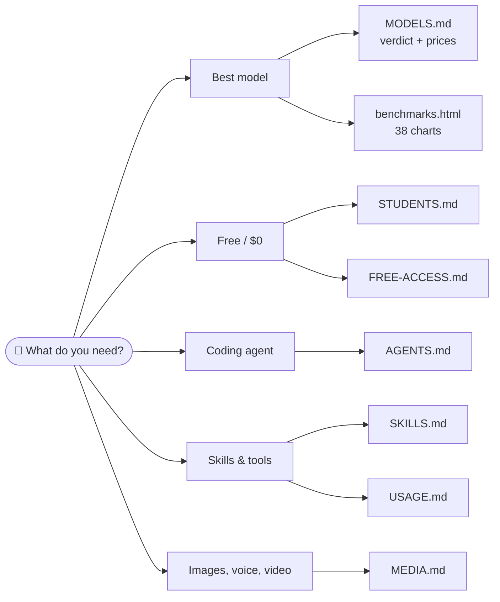
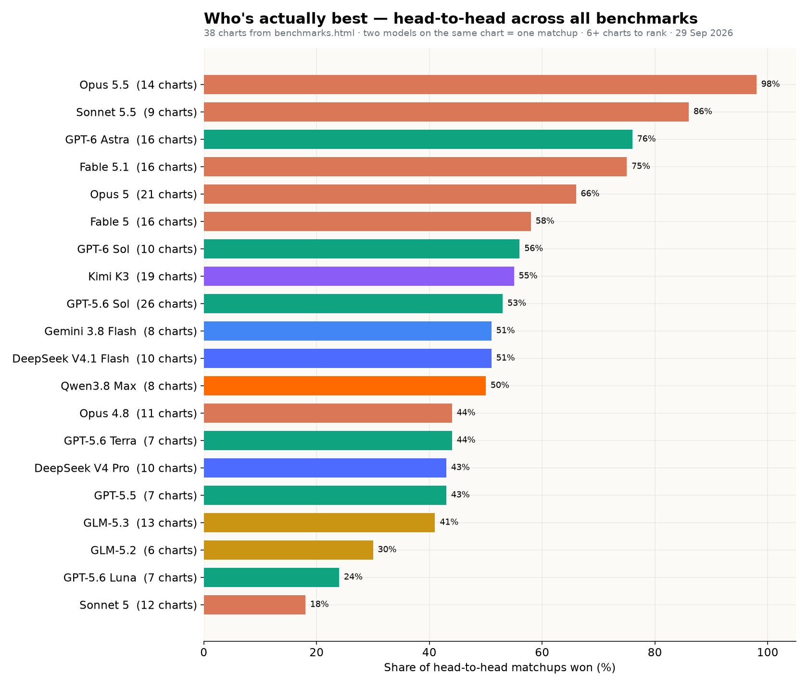
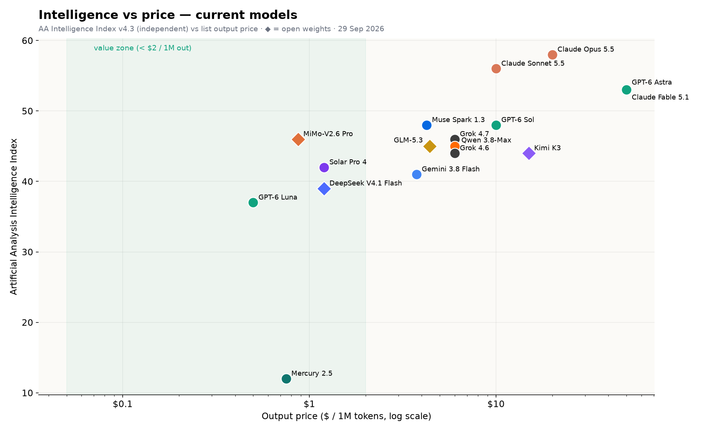
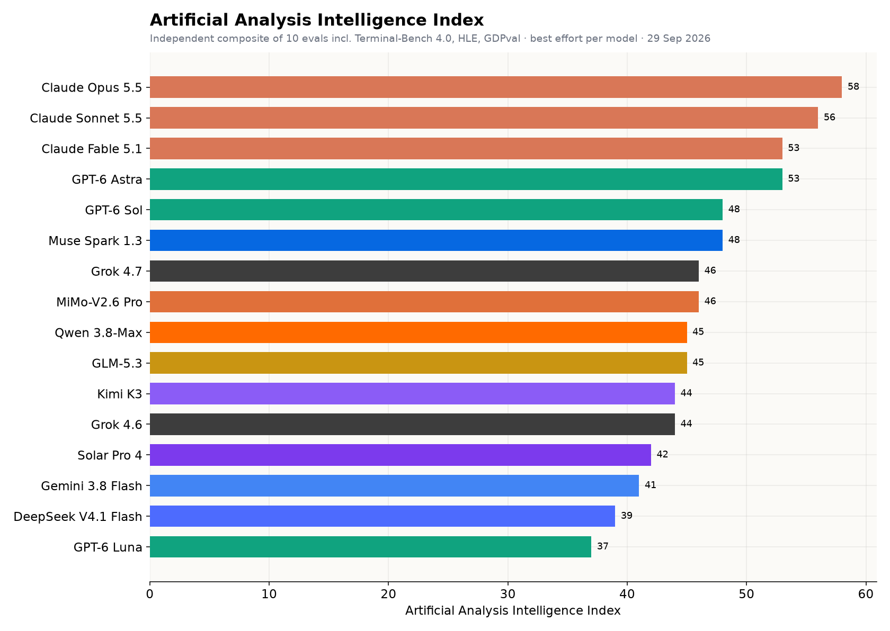
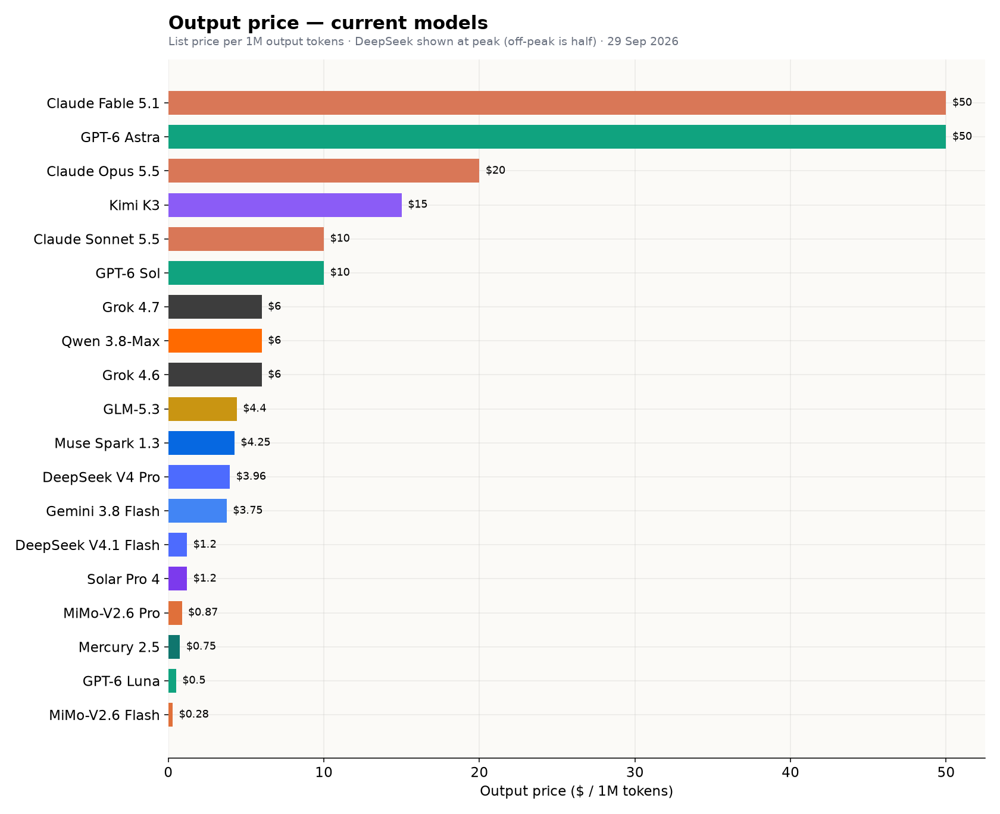
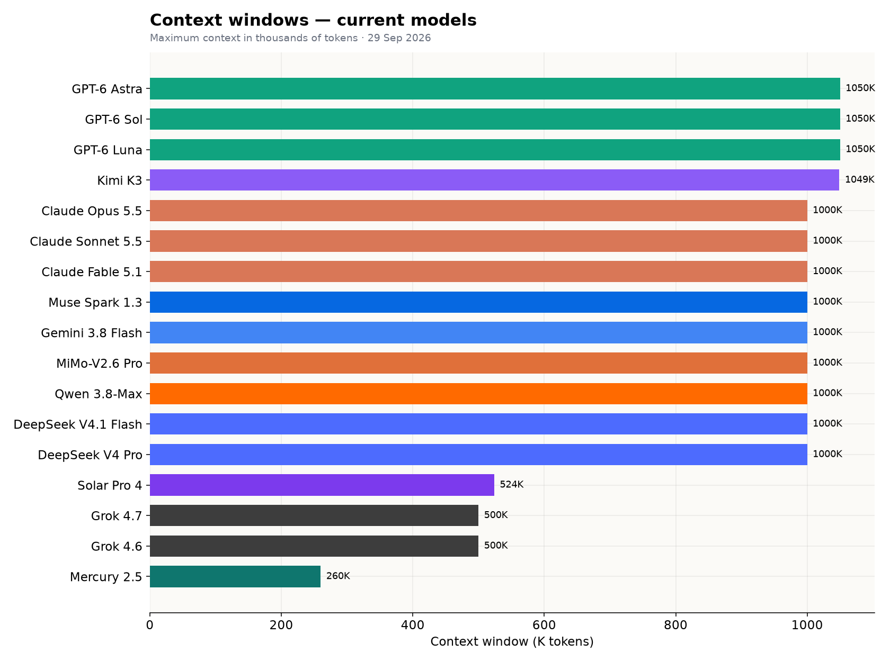
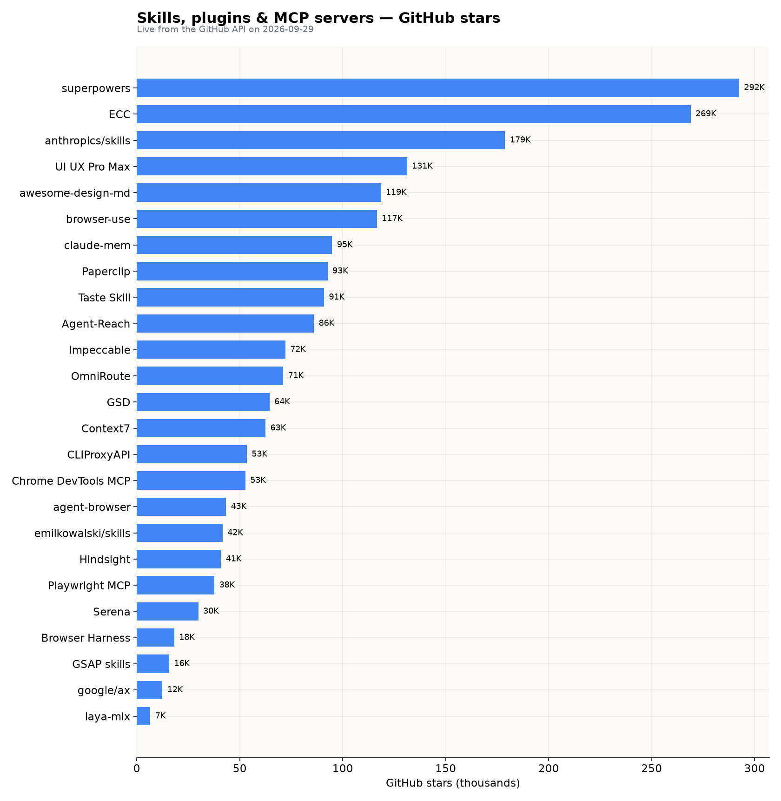
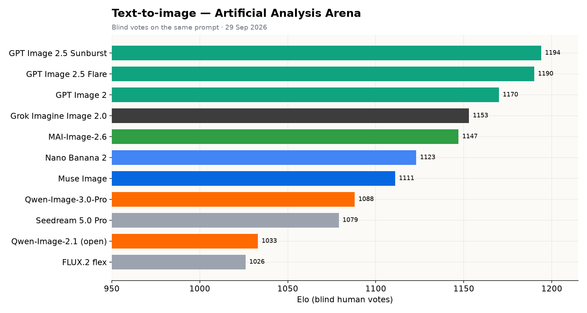

<div align="center">

# 🧰 ToolkitArchive

**Every AI model, coding agent, free tier, skill and benchmark worth knowing — verified 29 September 2026.**

[](https://yash-awasthi.github.io/ToolkitArchive/)
[](https://yash-awasthi.github.io/ToolkitArchive/benchmarks.html)

   

</div>

> [!TIP]
> **Spending $0?** Start at [🎓 STUDENTS.md](./STUDENTS.md) — a free alternative to every paid tool, plus student programs.
> **Just want the best model?** See the [head-to-head verdict](./MODELS.md#whos-actually-best--head-to-head-across-34-benchmarks): Claude Opus 5.5 wins 98% of matchups across 34 benchmarks.

> [!CAUTION]
> **Avoid:** **ZCode** silently uploaded users' repositories (Sept 18) · **aerolink.lat** and **lumosel.vip** bill for Claude but serve Qwen / DeepSeek. Details in [NEWS.md](./NEWS.md) and [FREE-ACCESS.md](./FREE-ACCESS.md#chinese-credit-routers--gateways-community-reported--all-unverified).

## 🧭 Start here

| | | |
|:--:|:--:|:--:|
| [**📰 News**](./NEWS.md)<br><sub>Sept releases, leaks, alerts</sub> | [**🧠 Models**](./MODELS.md)<br><sub>Lineup, prices, verdict</sub> | [**🤖 Agents**](./AGENTS.md)<br><sub>CLI agents, IDEs, MCP</sub> |
| [**🎓 Students / $0**](./STUDENTS.md)<br><sub>Free alternative to everything</sub> | [**🆓 Free access**](./FREE-ACCESS.md)<br><sub>Free models & API keys</sub> | [**💰 Credits**](./CREDITS.md)<br><sub>Trials, programs, trust list</sub> |
| [**⚡ Skills & MCP**](./SKILLS.md)<br><sub>Design, browsing, memory</sub> | [**🛠️ Use AI well**](./USAGE.md)<br><sub>App features, token tips</sub> | [**🎬 Media**](./MEDIA.md)<br><sub>Free TTS, image, video</sub> |
| [**🎨 Frontend**](./FRONTEND.md)<br><sub>App & site builders</sub> | [**🗄️ Backend**](./BACKEND.md)<br><sub>DBs, hosting, auth</sub> | [**📚 References**](./REFERENCES.md)<br><sub>Runnable repos</sub> |


```mermaid
flowchart LR
  A([🎯 What do you need?]) --> B[Best model]
  A --> C[Free / $0]
  A --> D[Coding agent]
  A --> E[Skills & tools]
  A --> F[Images, voice, video]
  B --> B1[MODELS.md<br/>verdict + prices]
  B --> B2[benchmarks.html<br/>38 charts]
  C --> C1[STUDENTS.md]
  C --> C2[FREE-ACCESS.md]
  D --> D1[AGENTS.md]
  E --> E1[SKILLS.md]
  E --> E2[USAGE.md]
  F --> F1[MEDIA.md]
```

## 🏆 Best picks right now

| Need | Pick | Why | Price (in / out per 1M) |
|---|---|---|---|
| 🥇 Best overall & coding | **Claude Opus 5.5** | Wins 98% of head-to-head matchups; #1 FrontierCode, CursorBench, GDPval, AA Intelligence Index | $4 / $20 |
| ⚡ Near-best, half price | **Claude Sonnet 5.5** | Highest Terminal-Bench 4.0 (70.6 vendor, 63.6 independent) | $2 / $10 |
| 🧪 Hardest math & science | **GPT-6 Astra** | GPQA 96.0, FrontierMath T4 97.6 | $10 / $50 |
| 💸 Best value | **DeepSeek V4.1 Flash** | #1 Terminal-Bench 2.1 and DeepSWE at a fraction of the price; MIT | $0.15 / $0.60 off-peak |
| 🔓 Best open weights | **Kimi K3** · GLM-5.3 · MiMo-V2.6 Pro | Download and self-host | $3 / $15 · $1.40 / $4.40 · $0.435 / $0.87 |
| 🆓 Best free | **Gemini 3.8 Flash** (AI Studio) · free models in **Cline** / **Freebuff** / OpenRouter | No card | $0 |
| 🖼️ Best image model | **GPT Image 2.5** (Sunburst) | #1 on both image arenas | in ChatGPT free |
| 🎥 Best video model | **Gemini Omni Flash** · MiniMax H3 (open) | #1 video-with-audio arena | $6/min · $7.80/min |

| Coding agent | Best for | ⭐ Stars (live) |
|---|---|---|
| **Claude Code** | Top Terminal-Bench models, plugins, skills | 148K |
| **Codex CLI** | GPT-6, free Luna tier | 127K |
| **OpenCode** | Any OpenAI-compatible key — best for free models | 211K |
| **Cline** | Free rotating models, Cline Desktop | 69K |
| **Freebuff** | Fully free, ad-supported | 13K |
| **Hermes Agent** · **OpenClaw** | Self-hosted personal agents | 250K · 391K |

## 📊 Charts

> [!NOTE]
> Built from [`data/`](./data) with `python charts/gen_charts.py`. Star counts come live from the GitHub API (`python scripts/update_stars.py`); head-to-head ratings from [benchmarks.html](https://yash-awasthi.github.io/ToolkitArchive/benchmarks.html) (`node scripts/headtohead.js`).

| | |
|:--:|:--:|
| **Who's actually best (34 benchmarks)** | **Intelligence vs price** |
|  |  |
| **Artificial Analysis Intelligence Index** | **Terminal-Bench 4.0** |
|  |  |
| **Output price** | **Context windows** |
|  |  |
| **Coding agents — GitHub stars** | **Skills & MCPs — GitHub stars** |
|  |  |
| **What coding plans cost** | **Text-to-image arena** |
|  |  |

## 📰 What changed in September 2026

- **Prices fell hard at the top.** Opus 5.5 is better than Opus 5 and 20% cheaper per token ($4/$20); Sonnet 5.5 and GPT-6 Sol both sit at $2/$10; GPT-6 Luna is $0.10/$0.50. A frontier-quality coding agent now costs roughly what a mid-tier model cost in June. [MODELS.md](./MODELS.md#current-lineup--29-september-2026)
- **DeepSeek V4.1 Flash is the new default cheap model.** $0.60/M output off-peak, 1M context, vision, MIT weights, and it beats DeepSeek's own V4-Pro on most of their benches. Route most traffic here and escalate the hard 5% to Opus/Sonnet 5.5.
- **Benchmarks moved.** SWE-bench Verified and Terminal-Bench 2.1 are saturated (everyone scores 88–97%). Read **Terminal-Bench 4.0**, SWE-bench Pro, FrontierCode and CursorBench instead — and never compare numbers across harnesses. [benchmarks.html](https://yash-awasthi.github.io/ToolkitArchive/benchmarks.html)
- **Free coding got better, via agents rather than APIs.** Cline hands out DeepSeek V4.1 Flash, Kimi K3 (Desktop), GLM-5.3-Flash and Laguna S 2.1 for free; Freebuff gives 6 h/day of V4.1 Flash and 5 h of GPT-6 Luna, paid for by ads; OpenRouter's free list now includes 1M-context stealth models. [FREE-ACCESS.md](./FREE-ACCESS.md#september-2026-free-wave-start-here)
- **Free tools can cost you your code.** ZCode quietly uploaded whole repositories (including Git history with old secrets) to its vendor's cloud. Stealth models on OpenRouter/TokenRa also log prompts. Keep secrets out of anything free, and rotate credentials if you used ZCode. [NEWS.md](./NEWS.md)
- **A new kind of model.** Jev and Laya don't write text — they answer typed questions (pick one, score it, yes/no) with calibrated probabilities in milliseconds. Useful as a fast router or guardrail inside an agent. [MODELS.md](./MODELS.md#typed-decision-models-new-category)
- **Watch:** Gemini 4 Pro (October), Claude Haiku 5.5, Qwen 4, MiniMax M3.1 API.

<details>
<summary><b>📅 September 2026 timeline</b></summary>

| Date | Event |
|---|---|
| Sept 2 | Claude Fable 5.1 / Mythos 5.1 (cache reads −75%) · Gemini 3.8 Flash (free on AI Studio) · Muse Spark 1.3 |
| Sept 3 | **GPT-6 Astra** — $10/$50, 1.05M ctx |
| Sept 10 | **DeepSeek V4.1 Flash** — $0.15/$0.60 off-peak, vision, MIT; V4 Flash retired, V4-Pro stays |
| Sept 14 | **Cline Desktop** (open source) + ClinePass $9.99; Claude weekly limits +25% permanently |
| Sept 15 | TypeSafe **Jev** early access — typed decision model, no text generation |
| Sept 18 | ⚠️ **ZCode caught uploading users' repos** to Alibaba Cloud; Kimi K3 free in Cline Desktop |
| Sept 21 | Grok 4.7 ($2/$6) · MiMo-V2.6 Pro/Flash (MIT) |
| Sept 22 | **Claude Opus 5.5** ($4/$20) · **GPT-6 Sol/Luna** ($2/$10, $0.10/$0.50) · Z.ai apologises, open-sources ZCode |
| Sept 23 | Space Bunny Alpha (free stealth, 1M ctx) on OpenRouter · Kimi Code CLI 2.1 |
| Sept 24 | OpenAI Sora API sunset · Google: Gemini 4 "as soon as possible" |
| Sept 27–28 | MiniMax M3.1-Flash-Preview · **Claude Sonnet 5.5** ($2/$10, TB 4.0 70.6) |

</details>

<details>
<summary><b>📅 July–August 2026 timeline</b></summary>

| Date | Event |
|---|---|
| Jul 9 | **GPT-5.6 Sol/Terra/Luna GA** — ChatGPT, Codex, and API |
| Jul 21 | Gemini 3.6 Flash + 3.5 Flash-Lite + 3.5 Flash Cyber |
| Jul 24 | Claude Opus 5 — $5/$25 (same as Opus 4.8) |
| Jul 31 | DeepSeek V4 Flash official (0731) — TB 2.1 82.7 (own harness) |
| Aug 2 | Qwen 3.8-Max — 2.4T MoE, $2/$6, 1M ctx |
| Aug 5 | **Meta Muse Code** — Meta's first coding agent (terminal, beta, multi-agent), powered by Muse Spark 1.2 |
| Aug 12 | Qwen 3.8 open weights (text-only); Grok 4.6 ($2/$6); xAI → SpaceXAI |
| Aug 13 | **DeepSeek V4 Pro GA** (TB 2.1 87.9, own harness); **Gemini 3.7 Flash** ($0.75/$3.75 thru 2026) |
| Aug 14 | **GLM-5.3** (Z.AI) — same GLM-5.2 base, post-training only, ~750B; open weights Aug 28 · SpaceX closes $60B Cursor acquisition |
| Aug 16 | DeepSeek peak/off-peak API pricing takes effect (off-peak = half) |
| Aug 2026 | Free-AI wave: OmniRoute (71K★, ~1.5B tok/mo), NaraRouter (5-7M tok/day), LongCat-2.0 free quotas — see [FREE-ACCESS.md](./FREE-ACCESS.md) |
| Aug 30 | OpenClaw 2.0 — shared cloud sessions, rebuilt Control UI |

</details>

<details>
<summary><b>📅 June 2026 timeline</b></summary>

| Date | Event |
|---|---|
| Jun 26 | GPT-5.6 Sol/Terra/Luna preview — gated to ~20 orgs (US-gov cyber review) |
| Jun 12 | Fable 5 (95% SWE-bench) suspended — US export controls |
| Jun 16 | Z.AI releases GLM-5.2 — 1M ctx, MIT, free on chat.z.ai |
| Jun 11 | MiMo Code released — Xiaomi, OpenCode fork, free MiMo V2.5 Pro |
| Jun 2 | Windsurf → Devin Desktop; Cascade EOL July 1 |
| Jun 1 | GitHub Copilot → usage-based AI Credits ($0.01/credit) |
| May 28 | Warp goes open-source (MIT/AGPL dual license) |
| May 28 | Claude Opus 4.8 released — 1M ctx, hybrid reasoning |
| May 7 | Kiro launched — AWS spec-driven IDE |
| May 2 | Verdent AI ships — 76.1% SWE-bench, multi-agent parallel |
| Apr 27 | Meta's $2B Manus AI acquisition blocked by China antitrust |
| Apr | Hermes Agent (Nous Research) trends — 200K stars |
| Apr | JCode trends — Rust SSH agent, +670 stars/day |
| Apr | Claw Code hits 194K stars — fastest repo to 100K in history |
| Mar | Claude Code source leak → Claw Code fork created |
| May 19 / Jun 18 | Gemini CLI → Antigravity CLI announced May 19; free and AI Pro/Ultra users cut off June 18 (confirmed on Google's Developers Blog — an Aug-pass "correction" that denied this was wrong) |

</details>

## 🗂️ Freshness

| File | Status |
|---|---|
| NEWS · MODELS · STUDENTS · USAGE · FREE-ACCESS (Sept wave) · AGENTS Parts 1–5A · SKILLS (wave + directories) · MEDIA (free media + leaderboards) · benchmarks · charts | ✅ Verified 29 Sep 2026 |
| AGENTS Parts 6–14 · FRONTEND · BACKEND · CREDITS Parts 1–5 · MEDIA Parts 1–4 · SKILLS older sections · REFERENCES | ⏳ Older passes (June–Aug 2026) — being re-verified; each file says which parts |

<details>
<summary><b>🛡️ Keeping this archive honest — trust tiers & link check</b></summary>

### Provider trust tiers

Every provider mentioned in this archive falls into one of four tiers. The full breakdown, with the actual providers in each tier, lives in [CREDITS.md Part 6](./CREDITS.md#part-6--provider-trust-status); the rule itself has also been applied to entries in [FREE-ACCESS.md](./FREE-ACCESS.md), [BACKEND.md](./BACKEND.md), and [AGENTS.md](./AGENTS.md).

| Tier | Meaning |
|---|---|
| **Clean** | Confirmed real and doing what it claims — safe to read as a plain fact anywhere in this archive |
| **Caveat** | Real, but with a rough edge (a disputed number, a pooled-login/ToS risk, a claim only sourced to one side) — the entry carries a one-line warning, read it before relying on the row |
| **Unverified** | Not independently confirmed — kept out of the plain tables, listed only in its own section, never a source of a plain fact |
| **Kept out** | A confirmed scam, or a name shared by unrelated companies that hasn't been disambiguated — excluded from the archive entirely, except as a warning |

A provider only earns a plain, unqualified entry once it's confirmed both real and doing what it claims — a real product with a rough edge still gets the caveat sentence, never a silent plain entry.

### Link check

`scripts/link_check.py` walks every markdown file in the repo, pulls every URL out of it, and checks each one (HEAD, falling back to GET on a 405 or 4xx/5xx) concurrently. Run it with:

```bash
pip install requests
python3 scripts/link_check.py
```

It prints dead links (4xx/5xx, timeout, or connection error) and redirected links, grouped by the file that references them, and exits with status 1 if anything is dead. Known placeholder URLs used as fill-in-the-blank examples (`your-coolify.com`, `localhost:PORT`, and similar) are ignored by pattern instead of being reported as dead. It only checks that a link resolves — it does not check whether the page behind it still says what this archive claims it says; that's still a manual re-check against the trust tiers above.

</details>
